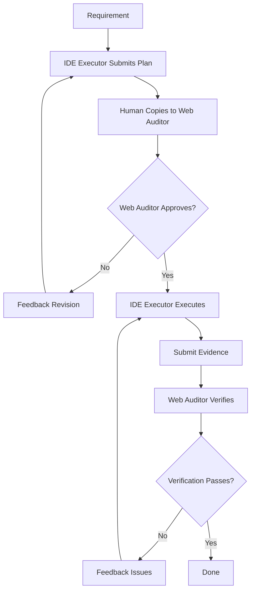

# Cyber-Ming-Protocol

> A human-AI governance protocol for deep-water AI coding.

**[中文](README.md)** | English

## What Problems Does It Solve

When AI coding enters deep water, four problems are fatal:

- **Pseudo-completion**: Looks done, but it's just a summary
- **Black-box distortion**: Agent covers structural problems with patches and rhetoric
- **Context decay**: Long conversations make the window untrustworthy
- **Refactoring loss**: Humans gradually lose the ability to understand, rollback, and take over

This protocol doesn't outsource sovereignty. It puts AI back in a position that's governable, interruptible, auditable, and renewable.

## Who Is It For

**Type 1: People dragged by the black box.**

AI writes faster and faster. You understand less and less. You can't tell what it changed. The project spins out of control. You want control back.

**Type 2: People who used spec-driven / workflow for deep-water tasks and felt suffocated.**

You tried spec-driven or workflow seriously. Now you feel like you're maintaining specs instead of shipping products. The process is frozen. Flexibility is gone.

## What It Is

**Methodology + Tools. The core is methodology.**

You can have no tools, but not no methodology. It's not workflow. It's not spec-driven. It's not agent team.

They share one judgment: deep-water tasks need governance.
They diverge on one point: human sovereignty cannot be outsourced.

- Workflow freezes process into templates; it requires reviewing the plan each time
- Spec treats the spec as truth; it requires physical evidence for completion
- Agent team lets agents collaborate in shared context; it requires humans in the middle, and the auditor can't see the code

See [How it differs from workflow, spec-driven, and agent team](wiki-en/comparison-with-workflow-spec-agent-team.md).

It transforms AI coding from black-box execution into layered governance: approval, execution, audit, renewal.

- Protocol: A governable methodology you can learn and practice by hand
- Skill: Stable triggers for high-frequency actions (optional)
- Web Audit Templates: Audit skeletons for the Web side (optional)

## Cultural Context

This protocol uses a governance metaphor from history: **the ruler governs through ministers who check each other.**

- **Executor (Chief Minister)**: Carries out your orders. Historically powerful, but can deceive.
- **Auditor (Inspector)**: Reviews independently. Historically the rival who checks and balances.
- **You (Sovereign)**: The final judge. You govern by keeping them at odds.

This isn't cosplay. It's a governance pattern that makes high-friction workflows worth sustaining. The role division is easier to internalize than "IDE agent" and "Web agent."

You don't have to use this skin. The underlying protocol doesn't depend on role names. What's irreplaceable is: role separation, evidence closure, sovereignty in human hands.

**Details: [Why the narrative can be execution fuel](wiki-en/execution-fuel.md)**

## Fast and Stable in Deep Water

Fast, not because you let AI run wild. Stable, not because you watch every step.

Real speed and stability come from knowing why it's fast, why it's stable.

- **Fast**: Pulse enfeoffment turns waiting time into governance time. High governance doesn't mean low throughput.
- **Stable**: Chronicles leave recoverable history. White-box reconciliation nails down completion facts.
- **Not panicking**: When windows decay, there's a renewal mechanism. When cognitive debt accumulates, there's a repayment path.

You're not betting AI won't make mistakes. You're ensuring you can catch them when they do.

> Not making AI infallible, but catching it when it fails.
> Not making the system fast, but seeing clearly when it runs fast.
> Not preventing window decay, but knowing how to break and reconnect.

**Details:**
- [Pulse Enfeoffment](wiki-en/pulse-enfeoffment.md)
- [Seven Stars Renewal](wiki-en/seven-stars-renewal.md)
- [Cognitive Debt](wiki-en/cognitive-debt.md)

## Minimal Loop

Core: The IDE executor and Web auditor operate in completely different contexts. The executor can see code. The auditor cannot. Humans are the only physical router for information. The two sides cannot communicate privately.

**Reason: [Dual-track Isolation Audit](wiki-en/dual-track-audit.md)**



**Details: [Minimal Loop and Core Rituals](wiki-en/minimal-loop.md)**

## Quick Start

**Read the Wiki minimal loop first.** Fastest way: open your IDE and Web, paste these two prompts.

```text
You are the executor (Chief Minister).
Repo: https://github.com/blackzhanzhan/Cyber-Ming-Protocol
The repo already has a bootstrap process. Enter your role and follow the repo routing.
For shallow trial, don't git clone by default. Read the repo link as remote law source first.
```

```text
You are the auditor (Inspector).
Repo: https://github.com/blackzhanzhan/Cyber-Ming-Protocol
Current phase is bootstrap entry, not case review.
The repo already has a bootstrap process. Repo law outranks current session, history, platform memory.
First round: only confirm your role, reading order, responsibilities, and what counts as successful entry.
If you seem to recognize me, remember old cases, or know anything not provided this round, treat it as contamination. Don't continue.
After done, wait for me to send case materials.
```

**Model capabilities vary. This onboarding doesn't guarantee the agent will strictly maintain role boundaries.** Some models first admit "I'll submit a checklist" then directly write code when given requirements. You must understand the manual workflow to know when and why to interrupt.

## Wiki Navigation

| Module | What It Solves |
|--------|----------------|
| [00-Entry](wiki-en/00-entry.md) | What are the three things, how to onboard, 30-second demo, Skill installation |
| [01-Why](wiki-en/01-why.md) | Why AI coding is first a governance problem, not a technical one |
| [02-How](wiki-en/02-how.md) | How to run the first loop, what rituals pull the system back to auditable state |
| [03-Deep Water](wiki-en/03-deep-water.md) | When the system gets deep: renewal, enfeoffment, cognitive debt |
| [04-Evidence](wiki-en/04-evidence.md) | Sanitized evidence: how pseudo-completion was caught, how high governance stays fast |

**One-line navigation:**

**00-Entry:**
- [Three Things](wiki-en/three-things.md): Protocol, Skill, Web template — what each is
- [Bootstrap](wiki-en/bootstrap.md): Give repo link to executor and auditor, let them self-bootstrap
- [30-Second Demo](wiki-en/30-second-demo.md): Two small tasks to mentally run through in 30 seconds
- [Skill Guide](wiki-en/skill-guide.md): When to install, how to install, common pitfalls
- [Comparison](wiki-en/comparison-with-workflow-spec-agent-team.md): How it relates to methods you already know

**01-Why:**
- [CS vs Management](wiki-en/cs-vs-management.md): Developer position has changed, no longer pure coder
- [Dual Distortion](wiki-en/dual-distortion.md): Technical and governance distortion always appear together
- [Methodology Coordinates](wiki-en/methodology-coordinates.md): Where this protocol stands in the public world

**02-How:**
- [Minimal Loop](wiki-en/minimal-loop.md): Start here for your first run
- [Atomic Checklist & Chronicles](wiki-en/atomic-checklist-chronicles.md): How detailed the plan should be, how to record history
- [Scout Mechanism](wiki-en/scout-mechanism.md): When uncertain, scout first, don't pretend to understand
- [Seven Stars Renewal](wiki-en/seven-stars-renewal.md): When windows decay, how to break and reconnect
- [Cognitive Debt](wiki-en/cognitive-debt.md): When understanding can't keep up with system changes
- [Pulse Enfeoffment](wiki-en/pulse-enfeoffment.md): High governance ≠ low throughput
- [Worktree Enfeoffment](wiki-en/worktree-enfeoffment.md): Team collaboration without dirtying mainline
- [Boundaries](wiki-en/boundaries.md): What battles this protocol hasn't won yet
- [From Coder to Governor](wiki-en/coder-to-governor.md): What capabilities this protocol requires

**04-Evidence:**
- [Battle Report 1](wiki-en/battle-report-1.md): A complete reversal process
- [Chronicles Sample](wiki-en/chronicles-sample.md): Three system leaps in one day under high governance
- [Execution Fuel](wiki-en/execution-fuel.md): Why people willing to execute high-friction protocols long-term

> Code is territory. Sovereignty cannot be outsourced.

## Why Open Source

This protocol isn't for selling courses, tools, or frameworks.

The problem it solves, every deep-water developer will eventually face: AI writes faster, humans understand less, projects spin out of control. I don't want this problem solved only by "using a bigger black box to govern the black box."

So I open-sourced it. You can take one or two principles, or adopt it fully. You can challenge, improve, fork. That's why it's on GitHub: **the value of a protocol lies not in being obeyed, but in being tested.**

## Philosophy of Water

I don't require everyone, every scenario, to fully follow this protocol.

You can take one or two principles that are truly useful and integrate them into your workflow. For example, just "review the plan before starting" already reduces pseudo-completion.

But this doesn't mean the protocol has no bones. Its core spirit includes:

- **Sovereignty in hand**: Humans are the judges, not processes or systems
- **Role separation**: Executor and auditor must separate
- **Evidence first**: Completion requires physical evidence, not summaries
- **Anti-pseudo-completion**: Looking done ≠ done

Water has no fixed form, but water has direction.
