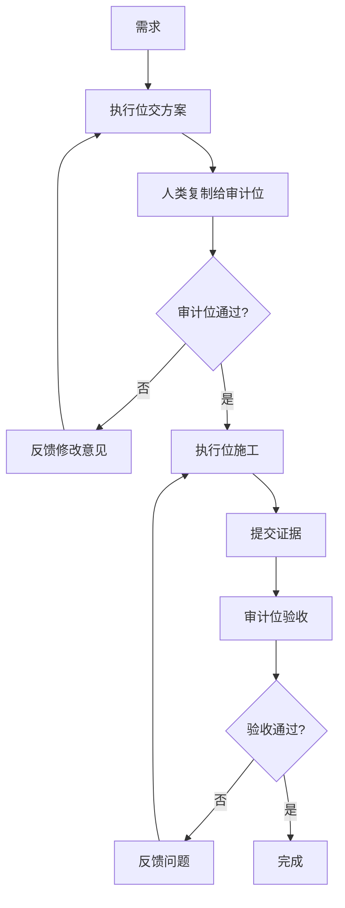

# Cyber-Ming-Protocol

> 面向 AI coding 深水区的人机协作治理协议。

## 它能解决什么问题

AI coding 进入深水区，四个问题最致命：

- 伪完成：看起来做完，实际只是总结做完
- 黑盒失真：Agent 用补丁和话术掩盖结构问题
- 上下文腐烂：长对话后窗口不再可信
- 重构失血：人类逐渐失去理解与接手的抓手

这套协议不把主权继续外包，而是把 AI 放回可治理、可打断、可审计、可续命的位置。

## 它是什么

**方法论 + 工具。核心是方法论。**

可以没有工具，不可以没有方法论。不是 workflow，不是 subagent，不是一键生成框架。

它是把 AI coding 从黑盒推进改造成审批、执行、审计、续命分层治理的协议。

- Protocol：可直接学习、手工实践的治理协议
- Skill：高频动作的稳定触发器（可选）
- Web Audit Templates：Web 侧审计协作骨架（可选）

## 最小闭环



详细方法论见 [最小闭环与核心礼法](wiki/02-最小闭环与核心礼法/最小闭环：一次审计版与多次审计版.md)。

## 快速开始

**建议先读完 Wiki 最小闭环再开始。** 如果你已经理解基本流程，最低成本启动方式：

```text
你是执行位（严嵩）。
仓库：https://github.com/blackzhanzhan/Cyber-Ming-Protocol
仓库中已经有自举流程。请尽快进入你的角色，并按仓库路由开始工作。
```

```text
你是审计位（徐阶）。
仓库：https://github.com/blackzhanzhan/Cyber-Ming-Protocol
当前阶段仅为自举入场，不是审案。
仓库中已经有自举流程；仓库法统优先于当前会话、历史对话、平台记忆。
第一轮只允许确认你的角色、先读顺序、职责边界和什么算入场成功。
如果你发现自己似乎认识我、记得旧案卷，这应视为污染信号，不得继续审案。
完成后等待我发送本轮案卷材料。
```

浅尝试默认不 `git clone`。先用仓库链接作为远程法统来源。

## Wiki 导航

| 模块 | 解决什么问题 |
|------|-------------|
| [01-哲学与坐标](wiki/01-哲学与坐标/) | 为什么 AI coding 首先是治理问题，不是技术问题 |
| [02-最小闭环与核心礼法](wiki/02-最小闭环与核心礼法/) | 第一次怎么跑、靠什么礼法把系统拽回可审计状态 |
| [03-治理扩展、吞吐补偿与边界](wiki/03-治理扩展、吞吐补偿与边界/) | 系统变深后如何继续统治：续命、分封、认知债务 |
| [04-战报与样本](wiki/04-战报与样本/) | 脱敏证据：伪完成如何被识破、高治理如何还能快 |

**一句话逐篇导航：**

- [为什么 AI Coding 已经模糊了 CS 与管理学的界限](wiki/01-哲学与坐标/为什么-AI-Coding-已经模糊了-CS-与管理学的界限.md)：开发者位置已经改变，不再是纯编码者
- [黑盒多-Agent 的双重失真](wiki/01-哲学与坐标/黑盒多-Agent-的双重失真：技术失真与治理失真.md)：技术失真与治理失真为何总是一起出现
- [相关工作与方法论坐标](wiki/01-哲学与坐标/相关工作与方法论坐标.md)：这套协议在公开世界里站在哪里
- [最小闭环：一次审计版与多次审计版](wiki/02-最小闭环与核心礼法/最小闭环：一次审计版与多次审计版.md)：第一次上手就用这个
- [核心礼法之一：原子级任务清单与赛博起居注](wiki/02-最小闭环与核心礼法/核心礼法之一：原子级任务清单与赛博起居注.md)：方案要细到哪里、历史怎么留
- [白盒物理对账：什么算完成事实](wiki/02-最小闭环与核心礼法/白盒物理对账：什么算完成事实.md)：说完成不等于完成，要看红灯绿灯和物证
- [赛博探马机制：先试链路，再上大军](wiki/02-最小闭环与核心礼法/赛博探马机制：先试链路，再上大军.md)：不确定时先探针，不要盲推
- [双轨隔离审计与皇权居中](wiki/03-治理扩展、吞吐补偿与边界/双轨隔离审计与皇权居中.md)：执行位与审计位必须分开，人类居中路由
- [七星灯续命法](wiki/03-治理扩展、吞吐补偿与边界/七星灯续命法.md)：窗口腐烂后如何有制度地断与接
- [赛博认知债务](wiki/03-治理扩展、吞吐补偿与边界/赛博认知债务：剪刀差、察觉信号与可信偿还.md)：理解跟不上系统变化时怎么办
- [脉冲分封制](wiki/03-治理扩展、吞吐补偿与边界/脉冲分封制：高治理下的吞吐补偿.md)：高治理不等于低吞吐
- [Worktree 分封制](wiki/03-治理扩展、吞吐补偿与边界/Worktree-分封制：封地、入京与主干纯度.md)：团队协作如何不把主干搞脏
- [边界与未解决战场](wiki/03-治理扩展、吞吐补偿与边界/边界与未解决战场.md)：这套协议现在还没赢下哪些战场
- [从编码者到治理者](wiki/03-治理扩展、吞吐补偿与边界/从编码者到治理者：这套协议要求开发者具备什么.md)：这套协议要求开发者具备什么能力
- [战报一：从伪完成到真实验收](wiki/04-战报与样本/战报一：从伪完成到真实验收（脱敏版）.md)：一次完整翻案过程
- [赛博起居注样本](wiki/04-战报与样本/赛博起居注样本：一天内的三次系统跃迁（脱敏版）.md)：高治理下一天三次系统跃迁
- [为什么帝王 Coding 叙事可以成为执行燃料](wiki/04-战报与样本/为什么帝王-Coding-叙事可以成为执行燃料（以及如何安全入戏）.md)：人为什么愿意长期执行高摩擦协议

> 代码即疆域，主权不可外包。
