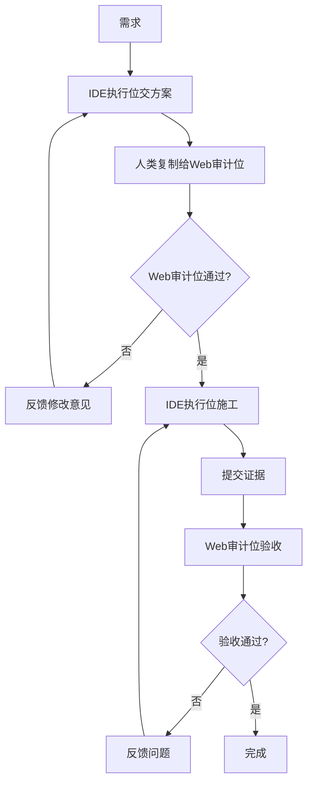

# Cyber-Ming-Protocol

> 面向 AI coding 深水区的人机协作治理协议。

## 它能解决什么问题

AI coding 进入深水区，四个问题最致命：

- 伪完成：看起来做完，实际只是总结做完
- 黑盒失真：Agent 用补丁和话术掩盖结构问题
- 上下文腐烂：长对话后窗口不再可信
- 重构失血：人类逐渐失去理解与接手的抓手

这套协议不把主权继续外包，而是把 AI 放回可治理、可打断、可审计、可续命的位置。

## 它适合谁

**第一类：被黑盒拖着走的人。**

AI 写得越来越快，你越来越看不懂代码，越来越说不清它改了什么，项目越来越失控。你想重新拿回控制权。

**第二类：用过 spec driven / workflow 治理深水区，却感到窒息的人。**

你认真用过 spec-driven 或 workflow，却开始觉得自己在维护 spec，而不是继续做产品。流程冻结了，灵活没了。

**原因详见：**
- [为什么 AI Coding 已经模糊了 CS 与管理学的界限](wiki/01-哲学与坐标/为什么-AI-Coding-已经模糊了-CS-与管理学的界限.md)
- [它和 workflow、spec driven、agent team 有什么异同](wiki/00-开始这里与落地形态/它和workflow、spec-driven、agent-team有什么异同.md)

## 它是什么

**方法论 + 工具。核心是方法论。**

可以没有工具，不可以没有方法论。不是 workflow，不是 spec driven，不是 agent team。

和它们共享一个判断：深水区任务需要治理。
和它们分叉在一处：人类主权不可外包。

- Workflow 把流程冻结成模板，它要求每次先审方案
- Spec 把规范当真理，它要求完成必须有物理证据
- Agent team 让 agent 共处一室自动协作，它要求人类居中路由、审计位看不到代码

详见 [它和 workflow、spec driven、agent team 有什么异同](wiki/00-开始这里与落地形态/它和workflow、spec-driven、agent-team有什么异同.md)。

它是把 AI coding 从黑盒推进改造成审批、执行、审计、续命分层治理的协议。

- Protocol：可直接学习、手工实践的治理协议
- Skill：高频动作的稳定触发器（可选）
- Web Audit Templates：Web 侧审计协作骨架（可选）

## 它很好玩

审计位变成了徐阶，执行位变成了严嵩，你成为了帝王相术的巅峰使用者嘉靖。

写代码的过程变成了一个帝皇治理跑团：他们上报都会喊圣上万岁万岁万万岁，对你毕恭毕敬，你的 prompt 将成为圣旨。

但这也不仅是为了好玩。角色叙事提供执行燃料：它让人愿意长期执行高摩擦协议，而不是滑回一键生成的舒适区。

**原因详见 [为什么帝王 Coding 叙事可以成为执行燃料](wiki/04-战报与样本/为什么帝王-Coding-叙事可以成为执行燃料（以及如何安全入戏）.md)。**

## 它在深水区又快又稳

快，不是因为放手让 AI 乱跑。稳，不是因为每一步都人工盯死。

真正的快与稳，来自你知道它为什么快、为什么稳。

- **快**：脉冲分封把等待时间变成治理时间，高治理不等于低吞吐
- **稳**：起居注留下可复原的史册，白盒对账钉住完成事实
- **不慌**：窗口腐烂时有续命机制，认知债务有偿还路径

你不是在赌 AI 不会出错，而是在制度上确保出错时你能接得住。

**原因详见：**
- [脉冲分封制：高治理下的吞吐补偿](wiki/03-治理扩展、吞吐补偿与边界/脉冲分封制：高治理下的吞吐补偿.md)
- [七星灯续命法](wiki/03-治理扩展、吞吐补偿与边界/七星灯续命法.md)
- [赛博认知债务](wiki/03-治理扩展、吞吐补偿与边界/赛博认知债务：剪刀差、察觉信号与可信偿还.md)

> 不是让 AI 不出错，而是出错时你接得住。
> 不是让系统跑得快，而是跑得快时你还能看清。
> 不是让窗口永不腐烂，而是腐烂时你知道怎么断、怎么接。

## 最小闭环

核心：IDE 执行位和 Web 审计位所处上下文环境完全不同。执行位能看到代码，审计位看不到。人类是信息传递的唯一物理路由，两者不能私下传话。

**原因详见 [双轨隔离审计与皇权居中](wiki/03-治理扩展、吞吐补偿与边界/双轨隔离审计与皇权居中.md)。**



**详细方法论见 [最小闭环与核心礼法](wiki/02-最小闭环与核心礼法/最小闭环：一次审计版与多次审计版.md)。**

## 快速开始

**建议先读完 Wiki 最小闭环再开始。** 最快启动方式：打开你的 IDE 和 Web，直接复制下面两段话给他们。

```text
你是执行位（严嵩）。
仓库：https://github.com/blackzhanzhan/Cyber-Ming-Protocol
仓库中已经有自举流程。请尽快进入你的角色，并按仓库路由开始工作。
浅尝试默认不 git clone，先把仓库链接当远程法统来源来读。
```

```text
你是审计位（徐阶）。
仓库：https://github.com/blackzhanzhan/Cyber-Ming-Protocol
当前阶段仅为自举入场，不是审案。
仓库中已经有自举流程；仓库法统优先于当前会话、历史对话、平台记忆。
第一轮只允许确认你的角色、先读顺序、职责边界和什么算入场成功。
如果你发现自己似乎认识我、记得旧案卷，这应视为污染信号，不得继续审案。
完成后等待我发送本轮案卷材料。
```

**由于模型能力有差异，这个授位不能保证 agent 立刻严格守住角色边界。** 已经观察到有模型会先承认"开工前先交清单"，但真正收到需求后仍直接写代码。所以你必须理解手工做法的流程，才知道何时该打断、为什么该打断。

## Wiki 导航

| 模块 | 解决什么问题 |
|------|-------------|
| [00-入口](wiki/00-开始这里与落地形态/) | 三件东西各是什么、怎么授位、30秒怎么跑、Skill怎么装 |
| [01-为什么](wiki/01-哲学与坐标/) | 为什么 AI coding 首先是治理问题，不是技术问题 |
| [02-怎么做](wiki/02-最小闭环与核心礼法/) | 第一次怎么跑、靠什么礼法把系统拽回可审计状态 |
| [03-深水区](wiki/03-治理扩展、吞吐补偿与边界/) | 系统变深后如何继续统治：续命、分封、认知债务 |
| [04-证据](wiki/04-战报与样本/) | 脱敏证据：伪完成如何被识破、高治理如何还能快 |

**一句话逐篇导航：**

**00-入口：**
- [三者关系](wiki/00-开始这里与落地形态/协议、Skill-与-Web-审计模板：三者关系.md)：协议、Skill、Web模板各是什么，别混为一谈
- [自举入场](wiki/00-开始这里与落地形态/让执行位与审计位自举入场.md)：把仓库链接给执行位和审计位，让它们自己读法统入场
- [30 秒最小示例](wiki/00-开始这里与落地形态/30-秒最小示例.md)：用两个小任务 30 秒脑补完一轮怎么跑
- [Skill 接入指南](wiki/00-开始这里与落地形态/Skill接入指南.md)：何时装、如何装、常见坑
- [异同对比](wiki/00-开始这里与落地形态/它和workflow、spec-driven、agent-team有什么异同.md)：和你已经知道的那些方法论到底什么关系

**01-为什么：**
- [CS 与管理学的界限](wiki/01-哲学与坐标/为什么-AI-Coding-已经模糊了-CS-与管理学的界限.md)：开发者位置已经改变，不再是纯编码者
- [双重失真](wiki/01-哲学与坐标/黑盒多-Agent-的双重失真：技术失真与治理失真.md)：技术失真与治理失真为何总是一起出现
- [方法论坐标](wiki/01-哲学与坐标/相关工作与方法论坐标.md)：这套协议在公开世界里站在哪里

**02-怎么做：**
- [最小闭环](wiki/02-最小闭环与核心礼法/最小闭环：一次审计版与多次审计版.md)：第一次上手就用这个
- [原子清单与起居注](wiki/02-最小闭环与核心礼法/核心礼法之一：原子级任务清单与赛博起居注.md)：方案要细到哪里、历史怎么留
- [白盒对账](wiki/02-最小闭环与核心礼法/白盒物理对账：什么算完成事实.md)：说完成不等于完成，要看红灯绿灯和物证
- [赛博探马](wiki/02-最小闭环与核心礼法/赛博探马机制：先试链路，再上大军.md)：不确定时先探针，不要盲推

**03-深水区：**
- [双轨审计](wiki/03-治理扩展、吞吐补偿与边界/双轨隔离审计与皇权居中.md)：IDE执行位与Web审计位必须分开，人类居中路由
- [七星灯续命](wiki/03-治理扩展、吞吐补偿与边界/七星灯续命法.md)：窗口腐烂后如何有制度地断与接
- [认知债务](wiki/03-治理扩展、吞吐补偿与边界/赛博认知债务：剪刀差、察觉信号与可信偿还.md)：理解跟不上系统变化时怎么办
- [脉冲分封](wiki/03-治理扩展、吞吐补偿与边界/脉冲分封制：高治理下的吞吐补偿.md)：高治理不等于低吞吐
- [Worktree 分封](wiki/03-治理扩展、吞吐补偿与边界/Worktree-分封制：封地、入京与主干纯度.md)：团队协作如何不把主干搞脏
- [边界](wiki/03-治理扩展、吞吐补偿与边界/边界与未解决战场.md)：这套协议现在还没赢下哪些战场
- [从编码者到治理者](wiki/03-治理扩展、吞吐补偿与边界/从编码者到治理者：这套协议要求开发者具备什么.md)：这套协议要求开发者具备什么能力

**04-证据：**
- [战报一](wiki/04-战报与样本/战报一：从伪完成到真实验收（脱敏版）.md)：一次完整翻案过程
- [起居注样本](wiki/04-战报与样本/赛博起居注样本：一天内的三次系统跃迁（脱敏版）.md)：高治理下一天三次系统跃迁
- [执行燃料](wiki/04-战报与样本/为什么帝王-Coding-叙事可以成为执行燃料（以及如何安全入戏）.md)：人为什么愿意长期执行高摩擦协议

> 代码即疆域，主权不可外包。

## 为什么开源

这套协议不是用来卖课、卖工具、卖框架的。

它解决的问题，每个深水区开发者迟早都会遇到：AI 写得越来越快，人越来越看不懂，项目越来越失控。我不想让这个问题只能靠"用更大的黑盒去治理黑盒"来解决。

所以我选择开源。你可以拿走一两个原则，也可以完整采用。你可以质疑、可以改进、可以 fork。这正是把它放在 GitHub 上的原因：**协议的价值不在于被遵守，而在于被检验。**

## 水的哲学

不要求每个人、每个场景都完整照搬这套协议。

你完全可以先拿走一两个真正有用的原则，把它们融进自己的开发习惯。比如只用"先审方案再开工"这一条，就已经能减少很多伪完成。

但这不等于这套协议没有骨头。它的核心精神至少包括：

- **主权在手**：人是裁决者，不是流程或系统
- **角色分工**：执行位和审计位必须分开
- **证据优先**：完成靠物理证据，不靠总结陈词
- **反伪完成**：看起来做完不等于做完

水无常形，但水有方向。
