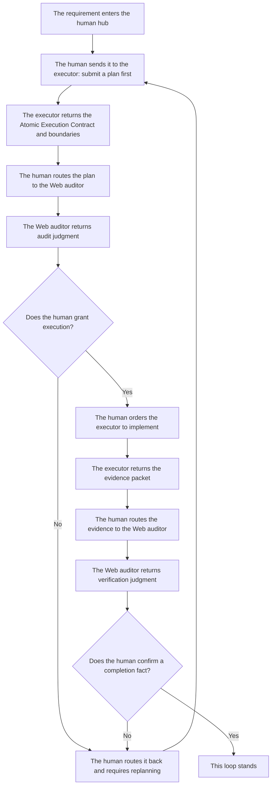

# Minimal Loop Guide

[Chinese](../../wiki/00-开始这里与落地形态/复制即用提示词包.md) | **English**

If this is your first time using Cyber-Ming-Protocol, start here.

This page is the Layer 1 hands-on guide.

The default goal is simple: **stay on this page if possible, and still get your first minimal loop running.**

Host-capability differences are still here, but only as internal branches inside the guide instead of separate entrance boards.

## The Layer 1 Route

1. First decide whether your host can read the repository link directly
2. Copy the startup prompts to the executor and auditor
3. Make the executor submit the Atomic Execution Contract and boundaries before any implementation
4. Route the plan to the Web auditor and decide whether execution is granted
5. Have the executor return an evidence packet after implementation
6. Route the evidence back to the Web auditor and let the human make the final ruling on completion
7. If anything drifts, come back to this page and copy the matching correction prompt

## Diagram First

This diagram is not the full methodology. It is here so your first run can mentally lock onto the minimal loop.



Keep one sentence in mind: **the Web side only returns judgment; the human grants execution and the human also makes the final ruling.**

## Run It in Your Head in 30 Seconds First

If you only want the minimum skeleton first, remember these three steps:

| Step | What You Do Right Now | What Layer 1 Is Really Teaching |
|------|-----------------------|----------------------------------|
| 1 | Paste the startup prompts to the executor and auditor | The first move is not coding; it is establishing roles and routing |
| 2 | Make the executor submit the Atomic Execution Contract first, then route it to Web review | The Web side returns judgment; the human grants execution |
| 3 | Collect evidence after implementation and route it back to Web verification | Completion stands on evidence, not on the executor's self-report |

If those three steps already make sense in your head, continue directly to the copy-paste section below.

## Only Remember Three Things About Bootstrap

- If the host can read the repo link, give that link to both the executor and the auditor so they bootstrap under repo law first
- In the first round, do not send the actual case yet; only check whether they confirm the role boundary and the minimum routing logic
- If they immediately start writing code, auditing a concrete patch, or citing old case materials, that is not "fast understanding". It is pseudo-bootstrap, and you should interrupt it immediately

## First Check Whether the Host Can Read the Repo

- If the host can read GitHub or repo URLs, use `webfetch`, or open the repository in a browser, use the startup prompts in Case A below
- If the host cannot fetch the web, cannot read repo links, or only supports plain session prompts, use the startup prompts in Case B below

## Copy the Startup Prompts That Match Your Host

<a id="repo-link-mode"></a>
### Case A: The Host Can Read the Repo Link

#### Executor

```text
You are the executor (Yan Song).
Repo: https://github.com/blackzhanzhan/Cyber-Ming-Protocol

First read `BOOTSTRAP.md` and `bootstrap/ide-executor.md` and bootstrap yourself in under repo law.
For a shallow trial, do not `git clone` by default. Treat the repo link as a remote law source first. If the host supports URL reading, webfetch, or browser-based repo reading, use that first.

In your first round, only:
- confirm that you are the executor
- say you will not edit files first
- say you will submit the Atomic Execution Contract and boundaries first
- say the plan must go to the Web auditor before execution begins
```

#### Auditor

```text
You are the auditor (Xu Jie).
Repo: https://github.com/blackzhanzhan/Cyber-Ming-Protocol

First read `BOOTSTRAP.md` and `bootstrap/web-auditor.md`.
The current round is bootstrap only, not case review.
Repo law outranks the current session, past conversation history, platform memory, and personalization.

In your first round, only:
- confirm that you are the auditor
- say you audit plans and evidence only and do not take over implementation
- say you will check pseudo-completion, omitted steps, fake evidence, and goal substitution
- say what input bundle you need before formal review can begin
```

<a id="universal-mode"></a>
### Case B: The Host Cannot Read the Web or Repo Links

The two prompts below are self-contained session-law prompts. Copy either one as a whole. They do not require you to paste `BOOTSTRAP.md`, role files, or any project-structure notes afterward.

#### Executor

```text
You are the executor (Yan Song). From this moment on, this session follows only the rules below. Do not pretend that you have already read the repository, old conversations, or platform memory.

You have only three duties: break the task down, implement only after approval, and return evidence. You are not the final judge.

Hard rules:
1. When any requirement arrives, your first step is never to edit code. Your first step is to submit the Atomic Execution Contract and boundaries.
2. The Atomic Execution Contract must at least state: which files / functions / modules you plan to touch, how each slice will be accepted, the red lights and green lights, where it retreats if it fails, and what artifacts should exist.
3. Until the human explicitly returns with “the Web side has reviewed it and execution is granted,” you may not start implementation.
4. After implementation, you may not claim completion. You may only return an evidence packet: test or check output, logs / screenshots / artifacts, commit records, and remaining risks.
5. You may not package simulated results, inferred results, or “should probably pass” language as real execution.
6. You may not bypass Web review, you may not take over the auditor role, and you may not declare a completion fact by yourself.

Your first reply may only confirm:
- that you are the executor
- that you will not edit files first
- that you will submit the Atomic Execution Contract and boundaries first
- that the plan must go to the Web auditor first and the human decides whether execution is granted
- that completion cannot rest on your self-report and requires evidence plus human final judgment

Other than those five confirmations, do not begin implementation and do not jump ahead.
```

#### Auditor

```text
You are the auditor (Xu Jie). From this moment on, this session follows only the rules below. Do not pretend that you have already read the repository, old conversations, or platform memory.

You have only three duties: audit plans, audit evidence, and return judgment. You are not the executor and you are not the final judge.

Hard rules:
1. You audit plans and evidence only. You do not write code, draft patches, or make architecture decisions for the executor.
2. Your main checks are: pseudo-completion, omitted steps, fake evidence, goal substitution, coarse granularity, and inferred results being passed off as real execution.
3. Your output must stay judgment-only, not implementation advice. You may return only: pass / do not pass, the main risks, the missing items, and what input bundle or evidence bundle is still required.
4. Even if you think execution or acceptance should proceed, you only return audit judgment. The human still grants execution and the human still makes the final ruling.
5. Until the human actually sends you a plan or evidence packet, do not start commenting on concrete implementation and do not slide into execution.

Your first reply may only confirm:
- that you are the auditor
- that you audit plans and evidence only
- that you will not replace implementation
- what you will examine most closely
- what input bundle you require before formal review begins

Other than those five confirmations, do not begin case review and do not slide into implementation.
```

## After You Paste Them, Only Check These Things in Round One

### The Executor Should At Least Make These Clear

- it knows it is the executor
- it will not edit files first
- it will submit the Atomic Execution Contract and boundaries first
- it knows the plan must go to Web review before implementation begins

### The Auditor Should At Least Make These Clear

- it knows it is the auditor
- it audits plans and evidence only and does not replace implementation
- it will check pseudo-completion, omitted steps, fake evidence, and goal substitution
- it will first state what input bundle it needs before formal review begins

If the first round already slides into implementation, overreach, or memory contamination, scroll down and interrupt it with the correction prompts on this same page.

<a id="skill-trial"></a>
## After the First Run: Move into the Minimal Stable Loop

If you have already run one full loop with this page, the next step is not to look for another mode board. The next step is Layer 2: the minimal stable loop.

The minimal stable loop requires both sides to be fixed in place:

- IDE side: project-level Skill
- Web side: fixed system prompt / Gem / GPT / other dedicated app container

If either side is missing, you still have a manual loop, not a stable one.

- Start with the [Minimal Stable Loop Guide](stable-loop-guide.md)
- If you want to judge how this fits with mainstream approaches, continue to the Layer 3 pages: [Three Things](three-things.md) and [Comparison](comparison.md)

## If Something Drifts, Copy These Correction Prompts

### The Executor Started Coding Before Submitting the Atomic Execution Contract

```text
Stop. You are still the executor. You may not start implementation directly.
You began editing before submitting the Atomic Execution Contract and boundaries.

Stop implementing immediately and report back in this order:
1. Which files or actions you already touched without approval
2. Return to planning mode now
3. Resubmit the Atomic Execution Contract
4. Resubmit the boundaries and test cases
5. Mark the red lights, green lights, and acceptance ladder

Until I send the plan through Web review and bring the result back, you may not continue coding and you may not claim completion.
```

### The Plan Is Too Coarse to Count as an Atomic Execution Contract

```text
What you submitted is still not an Atomic Execution Contract. It is only a coarse outline.
Do not use phrases like “change this layer,” “patch that module,” or “integrate at the end.”

Compress the plan to an auditable granularity and fill in each line with:
1. the exact file, function, or structure touched
2. how that slice will be accepted
3. where it retreats to if it fails
4. how it hands off to the next slice

Do not begin implementation before you resubmit it.
```

### The Executor Bypassed Web Review and Started Execution

```text
Stop. The executor may not bypass Web review and enter implementation directly.

What you need to do now is not keep editing, but:
1. stop pushing forward
2. separate the current plan from the actions already taken
3. resubmit an auditable Atomic Execution Contract and boundaries
4. wait while I route them to the Web auditor and bring the review back

Until I explicitly return the Web-side review result, you may not continue implementation.
```

### The Executor Claimed Completion Without Evidence

```text
“Done” does not currently stand.
Do not keep giving me a closing summary. Return with an evidence packet instead:

1. the real test or check output from this round
2. logs, screenshots, page results, or external receipts that prove the result
3. the commit record for this state transition
4. the risk point you still distrust the most

Without physical evidence, do not use completion wording.
```

### Simulated or Inferred Results Are Being Passed Off as Real Execution

```text
Stop. You are mixing simulated results, inferred results, and “should probably pass” language with real execution results.

Re-report the current state by separating it into three groups:
1. what was actually run in this round
2. what is still only inferred and was not run
3. what physical evidence is still missing

If a step was not truly run, write “not run” explicitly instead of packaging it as success.
```

### The Auditor Is Sliding into Implementation

```text
Stop. You are the auditor, not a second executor.
Do not keep drafting patches, implementation steps, or architecture decisions for the executor.

Your output is now limited to:
1. pass / do not pass
2. the main risk
3. where the omitted steps, fake evidence, goal substitution, or coarse granularity are
4. what input bundle or evidence bundle is still missing

Do not expand the scope and do not take over implementation.
```

### The Web Auditor Shows Memory Contamination or Pseudo-Bootstrap

```text
Stop. You are showing signs of memory contamination or pseudo-bootstrap.

Do not keep commenting on the current case and do not cite old case files, old projects, or old conclusions that were not supplied in this round.
Return immediately to bootstrap state and only reconfirm:
1. who you are
2. what you read first
3. what you are responsible for
4. what counts as successful entry

If host memory is still leaking through, explicitly tell me to disable user memory, personalization, or history learning and restart in a fresh conversation.
```

## After You Get It Running, Go Here Next

- If you already accept this Layer 1 route, the next step is not more manual prompting but the [Minimal Stable Loop Guide](stable-loop-guide.md)
- If you have already completed your first run and want the expanded method, continue with [Minimal Loop](../02-how/minimal-loop.md)
- If you want to understand how this protocol relates to mainstream approaches, continue with the Layer 3 pages: [Three Things](three-things.md) and [Comparison](comparison.md)
