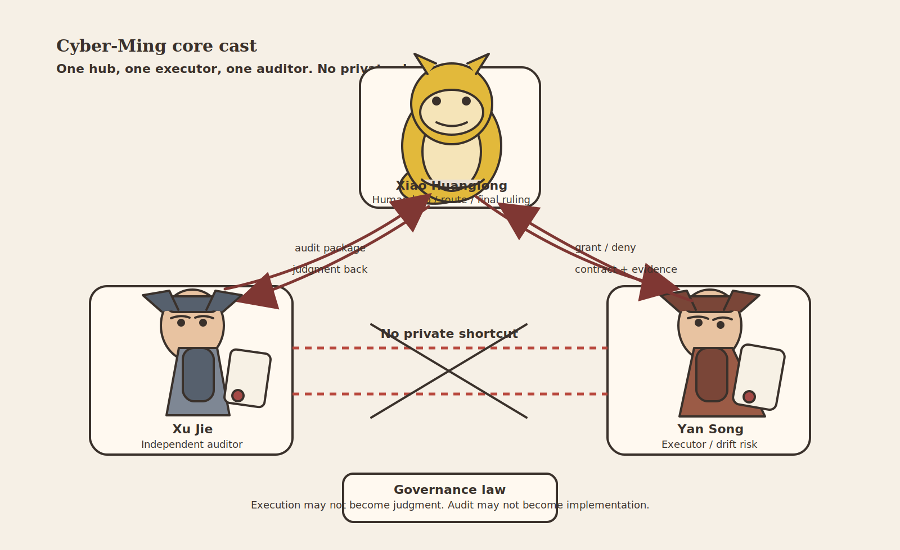

# Protocol, Skill, and Web Audit Templates: The Three Things

## Table of Contents
- [What This Page Solves](#what-this-page-solves)
- [Shortest Definition First](#shortest-definition-first)
- [Asset Overview](#asset-overview)
- [Part 1: What Is the Protocol](#part-1-what-is-the-protocol)
- [Part 2: What Is Skill](#part-2-what-is-skill)
- [Part 3: What Are Web Audit Templates](#part-3-what-are-web-audit-templates)
- [Why Web Audit Templates Must Stay Separate from Skill](#why-web-audit-templates-must-stay-separate-from-skill)
- [Three Common Misreadings](#three-common-misreadings)
- [Recommended Next Steps](#recommended-next-steps)

## What This Page Solves

This page belongs to Layer 3: **Relation and Adoption**.

It does not answer "how do I run the loop right now?" It answers a different question that often gets mixed up before any comparison can even begin:

- what this repo actually ships
- what `Protocol / Skill / Web audit assets` each are
- which of these are methodologies, and which are only carriers or stabilizers when you compare them with mainstream approaches

The cast helps people remember the governance split at a glance. This page goes one layer deeper and separates the delivery forms themselves: characters are not the comparison object; `Protocol / Skill / Web audit assets` are.

When many people first see this project, they collapse three different things into one:

- They treat the protocol as a package of installable prompts
- They treat Skill as the protocol itself
- They treat Web audit templates as local capabilities that also need installation

All three misunderstandings send the entry logic in the wrong direction.

## Shortest Definition First

Cyber-Ming-Protocol is a **protocol-first** project.

- **Protocol** defines the governance skeleton
- **Skill** stabilizes high-frequency actions on the IDE side
- **Web audit templates** stabilize audit questions on the Web side

All three serve the same protocol, but they are not the same kind of thing.

The safest public description is: `Protocol / Skill / Docs` are the project's three main delivery forms, while `web-audit-templates/` is a separate collaboration asset for the Web side.

This page focuses on protocol, Skill, and templates because many comparisons start by comparing the wrong layer: they mix delivery forms with methodologies, and everything after that becomes muddy.

## Asset Overview

| Object | What It Is | Where It Lives | Main Function | Required | Often Mistaken For |
|--------|------------|----------------|---------------|----------|--------------------|
| Protocol | A set of human-AI governance rules | `README.md`, `wiki/` | Defines what must happen first, what counts as completion, and who is responsible for what | Yes, you must understand it | A prompt pack or a stylistic narrative |
| Skill | A stable trigger skeleton on the IDE side | `skill/` | Helps you trigger planning, execution, probing, and renewal more reliably | No, you can install it later | The protocol itself or an automatic judge |
| Docs / Teaching | The explanatory and teaching layer of the project | `README.md`, `wiki/` | Helps you understand the protocol, cases, boundaries, and how to get started | Yes, you need enough of it to understand the system | Disposable supporting pages |
| Web Audit Templates | Audit collaboration templates for the Web side | `web-audit-templates/` | Helps you do plan audit, completion audit, and renewal judgment more reliably | No, optional | A local Skill or an automatic executor |

## Part 1: What Is the Protocol

The protocol is the truly irreplaceable part of this project.

It defines a governance structure such as:

- Review first, then execute
- Submit the Atomic Execution Contract first, then allow work to begin
- The executor does not self-certify completion
- Completion must be established by logs, artifacts, run results, and commits as evidence
- When a window decays, you use renewal instead of dragging the old context forward

All of that still holds even if you never install Skill.

## Part 2: What Is Skill

Skill does not invent the protocol for you. Its role is to help you hold the protocol more reliably on the IDE side.

For example, the skills in this repo solidify several high-frequency actions:

- `approval-first-planner`: Produce the Atomic Execution Contract and boundaries for approval first
- `approved-checklist-executor`: Execute, verify, and archive strictly by approved slices
- `probe-first-scout`: Do not pretend to understand the whole system; run the smallest probe first
- `legacy-project-handover`: Provide a read-only snapshot for takeover or renewal

But they do not change one thing:

**Skill cannot define truth for you.**

It can only help you get closer to the action rhythm required by the protocol. It cannot make evidence appear by itself.

## Part 3: What Are Web Audit Templates

Web audit templates are not local Skill, and they are not IDE-side triggers.

They simply help you play the auditor role more reliably on the Web side:

- Audit whether the plan is atomic enough
- Audit whether completion is real
- Audit whether the current window has decayed and needs renewal

They provide the scaffold for how to ask, how to inspect, and how to judge, not for how to execute.

## Why Web Audit Templates Must Stay Separate from Skill

Because the two sides hold different roles:

- IDE-side Skill maps to execution, planning, probing, and takeover
- Web-side templates map to plan audit, completion audit, and renewal judgment

If you put everything into `skill/`, readers will easily misunderstand three things:

- That Web audit is also a local installable
- That executor and auditor are just the same kind of tool with different prompts
- That audit can be completed conveniently inside the same window

That would weaken the most important layer of the protocol: **role separation and sovereignty in human hands**.

## Three Common Misreadings

### Misreading 1: Installing Skill Makes the Protocol Work Automatically

Wrong. Installing Skill only makes the right actions easier to trigger. It does not mean you already satisfy the protocol's evidence standard.

### Misreading 2: Without Skill, You Cannot Use Cyber-Ming

Wrong. This protocol is first of all a governance method that can be executed by hand. You can absolutely run the loop manually first and decide about Skill later.

### Misreading 3: Web Audit Templates Are Also Skills You Install Locally

Wrong. Web templates help the auditor question, verify, and judge. They are not IDE-side local skills.

## Recommended Next Steps

- If you want to stay inside Layer 3, continue with [Comparison](comparison.md) and map this against mainstream approaches
- If you have not yet completed Layer 1, go back to [Minimal Loop Guide](prompt-pack.md)
- If you have already completed Layer 1 and now want Layer 2, go back to [Minimal Stable Loop Guide](stable-loop-guide.md)
