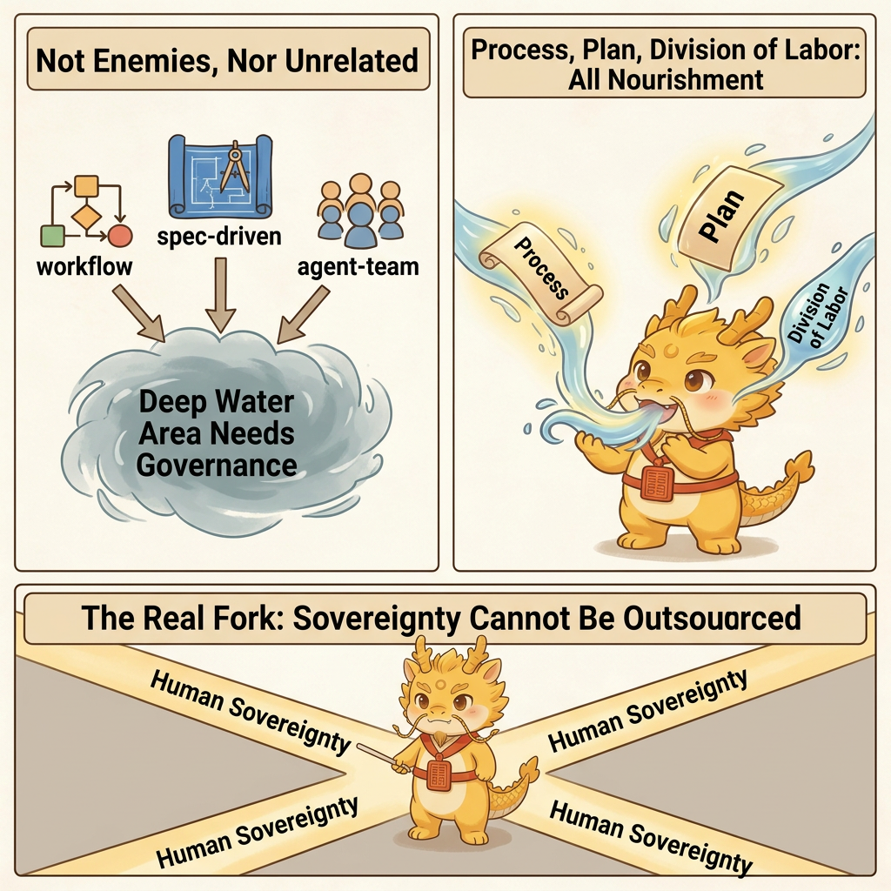
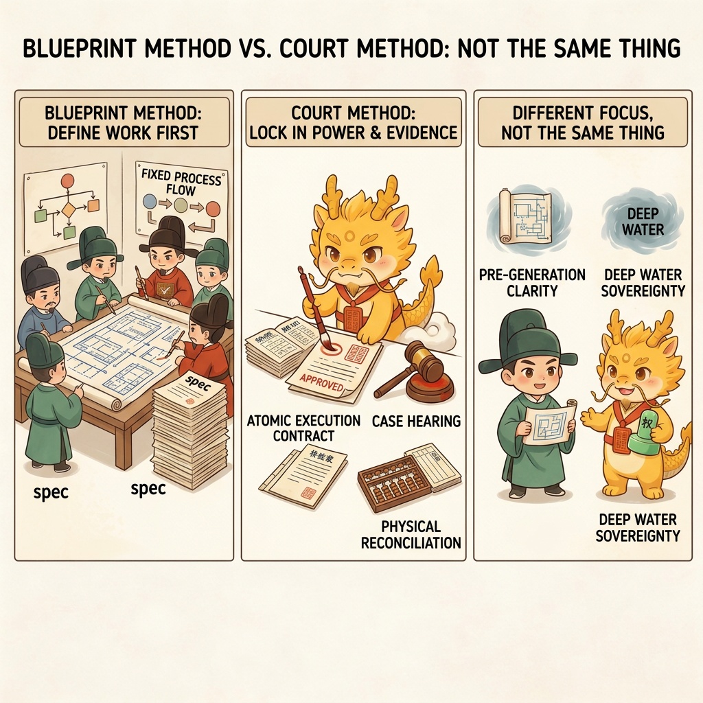
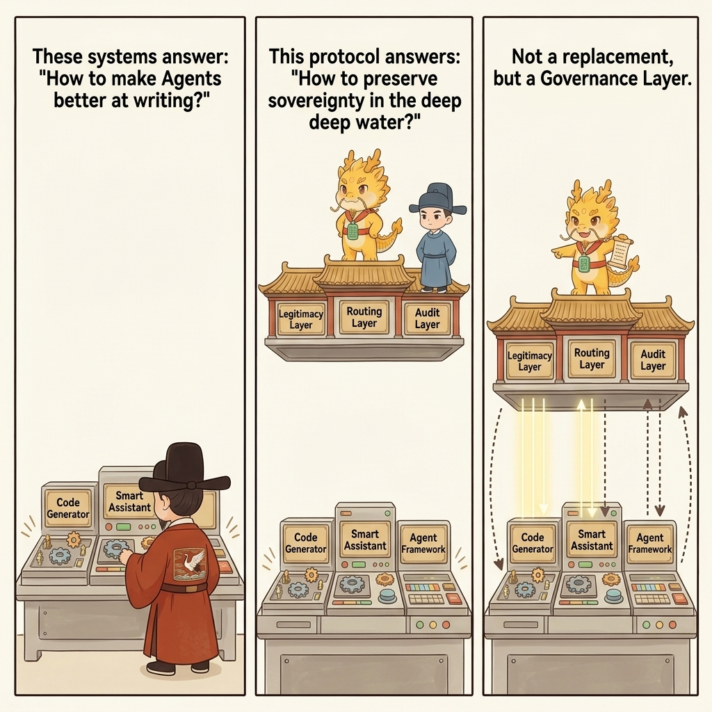

# Related Work and Methodology Coordinates

## Table of Contents
- [What This Page Solves](#what-this-page-solves)
- [What Foundations Cyber-Ming-Protocol Shares with the Public Landscape](#what-foundations-cyber-ming-protocol-shares-with-the-public-landscape)
- [70% to 90% Similar: The Long-Running Agent Harness Line](#70-to-90-similar-the-long-running-agent-harness-line)
- [50% to 70% Similar: The Spec-Driven / Workflow-Driven Line](#50-to-70-similar-the-spec-driven--workflow-driven-line)
- [Lower-Level Shared Concepts: HITL, Context Engineering, and Artifact Thinking](#lower-level-shared-concepts-hitl-context-engineering-and-artifact-thinking)
- [What This Protocol Actually Adds](#what-this-protocol-actually-adds)
- [Our Coordinates: Not a Replacement, but a Governance Layer](#our-coordinates-not-a-replacement-but-a-governance-layer)
- [Related Pages](#related-pages)

## What This Page Solves

Cyber-Ming-Protocol did not appear out of nowhere. In the public landscape, people have already tried to constrain AI coding through spec-driven, workflow-driven, harness-driven, human-in-the-loop, and context-engineering approaches. This page is not trying to argue that everyone else failed. It is answering three more important questions:

- What foundations this protocol shares with existing approaches
- Where it truly diverges
- Why it is not a replacement for Codex or Claude Code, but a governance layer on top of them

To avoid sounding baseless, this page links to official public docs and engineering articles wherever possible. The main verified anchors at the moment are Anthropic's [Building effective agents](https://www.anthropic.com/engineering/building-effective-agents), [Claude Code overview](https://docs.anthropic.com/en/docs/claude-code/overview), and [Create custom subagents](https://docs.anthropic.com/en/docs/claude-code/sub-agents), along with OpenAI's [Agents overview](https://developers.openai.com/api/docs/guides/agents), [Codex overview](https://developers.openai.com/codex/overview), and [Codex subagents](https://developers.openai.com/codex/subagents).

For third-party frameworks such as GSD, OpenSpec, and Spec Kit, if repo links are added to the public edition later, they should be verified one by one before being hardcoded into the public edition.

## What Foundations Cyber-Ming-Protocol Shares with the Public Landscape

You only get a meaningful coordinate system if you admit the overlaps first. Cyber-Ming-Protocol shares at least these judgments with many public approaches:

- Context decays; long-chain work cannot be held together by a single chat window alone
- Requirements, progress, artifacts, and Git history cannot live only inside conversation logs
- Humans should not fully withdraw from complex software development
- Long-running tasks need stronger engineering scaffolding than direct chat plus immediate generation

Those insights are not unique to this protocol. What makes Cyber-Ming-Protocol diverge is not that it notices these problems, but that it moves the problem center from "how to make agents work more reliably" to "how to preserve human sovereignty in deep water while suppressing pseudo-completion, mainline pollution, and refactoring loss."

## 70% to 90% Similar: The Long-Running Agent Harness Line

Based on the public material available now, the closest line of thinking is the engineering approach around long-running agent harnesses. Anthropic's [Building effective agents](https://www.anthropic.com/engineering/building-effective-agents) and [Claude Code overview](https://docs.anthropic.com/en/docs/claude-code/overview) already make many of these realities explicit. They clearly recognize that:

- Long-running agents forget, distort, and drift
- They often try to do too much in one shot and muddy the chain
- Feature lists, artifacts, progress files, and Git history are needed to preserve continuity
- External scaffolding is more reliable than a single conversation window

That is genuinely close to Cyber-Ming-Protocol's chronicles, artifact hub, and rotating renewal.

But the divergence is also clear:

- Those approaches are mainly asking how to make long-running agents more reliable
- This protocol asks a further question: in deep water, who keeps execution rights, who keeps judgment rights, and who defines what counts as completion
- They usually do not develop an explicit dual-track institution for the executor and auditor
- They also do not elevate role narrative into the execution psychology layer of a high-friction protocol

So the similarity in problem awareness is high, but there is still a visible difference in institutional completeness and governance center.

## 50% to 70% Similar: The Spec-Driven / Workflow-Driven Line

This layer includes GSD, OpenSpec, Spec Kit, and the broader plan-first or workflow-first line. OpenAI's [Agents overview](https://developers.openai.com/api/docs/guides/agents), [Codex overview](https://developers.openai.com/codex/overview), and [Codex subagents](https://developers.openai.com/codex/subagents) also provide a public reference point that leans more toward workflow and orchestration. Their common features are:

- They emphasize the importance of specs, task breakdown, and context structure
- They reject the idea that requirements should live only in chat history
- They try to make AI coding more orderly through specs, tasks, and plans

That aligns with Cyber-Ming-Protocol on one important point: AI coding cannot rely only on direct chat and immediate generation.

But the deeper difference is this:

- They mostly solve how to write things clearly before generation
- This protocol mostly solves how not to lose control after the work enters deep water
- They are closer to blueprint methods
- This protocol is closer to court governance

In other words, the spec-driven line mainly governs clarity before generation. Cyber-Ming-Protocol mainly governs sovereignty, distortion, refactoring handles, and completion facts during and after generation.

## Lower-Level Shared Concepts: HITL, Context Engineering, and Artifact Thinking

Below the framework level, there are also several concepts that are clearly related to this protocol without fully amounting to a comparable system:

- Human-in-the-loop software development agents
- Context engineering
- Artifacts, Git history, and progress files
- Approval and review gates

These directions share some basic judgments with the protocol:

- Humans cannot fully withdraw from complex development
- Chat history cannot serve as the only source of truth
- Long-chain tasks need artifacts and chronological handles

But they usually remain at the concept level, the paper level, or the local workflow level. They have not yet been integrated into a full institution centered on deep-water sovereignty that simultaneously covers the executor, the auditor, physical routing, human judgment, chronicles, renewal, and execution fuel.

## What This Protocol Actually Adds

Strictly speaking, not every component of Cyber-Ming-Protocol is unprecedented. What is actually new is the way those components are assembled and where the institutional center sits:

- It takes deep-water governance, not shallow-water efficiency, as the core problem
- It takes retained sovereignty, not stronger generation, as the institutional center
- It explicitly separates the executor and auditor and requires physical isolation between them
- It insists that humans retain the cross-system physical routing right
- It integrates Git chronicles, Worktree enfeoffment, dual-end renewal, and pulse enfeoffment into one coherent system
- It elevates role narrative into an execution psychology device and a durable fuel source for a high-friction protocol

That is also why the easiest part of this protocol to misread is not the technical skeleton but the theatrical outer layer. The imperial narrative is not the whole protocol, but neither is it disposable packaging. Here it functions as an execution psychology device: the protocol protects truth and falsity, while the narrative helps people stay willing to keep executing a high-friction governance method instead of sliding back into one-click generation out of fatigue.

## Our Coordinates: Not a Replacement, but a Governance Layer

Public tools such as Codex, Claude Code, and other agent frameworks have already done substantial work on parallel delegation, log evidence, sandbox execution, hooks, subagents, and checkpoints. Relevant public entry points include [Claude Code overview](https://docs.anthropic.com/en/docs/claude-code/overview), [Create custom subagents](https://docs.anthropic.com/en/docs/claude-code/sub-agents), [Agents overview](https://developers.openai.com/api/docs/guides/agents), and [Codex overview](https://developers.openai.com/codex/overview). Cyber-Ming-Protocol is not trying to throw all of that away, and it is not claiming to be better at automatically writing code.

It is answering a different layer of question:

If mainstream frameworks are mostly answering "how do we make agents write more," then this protocol is answering:

**Once a project enters deep water, how do we keep the human as the sovereign instead of gradually turning them into a clerk who cleans up after agents?**

That is why it is best understood as a governance-layer protocol. It does not replace Codex or Claude Code. It makes those executors less likely to lie, less likely to pollute mainline, easier to interrupt, and easier to take over and refactor in deep water.

## Related Pages

- [Why AI Coding Has Already Blurred the Boundary Between CS and Management](cs-vs-management.md)
- [The Dual Distortion of Black-Box Multi-Agent: Technical Distortion and Governance Distortion](dual-distortion.md)
- [Dual-track Isolation Audit and Sovereign Routing](../03-deep-water/dual-track-audit.md)
- [Atomic Execution Contract and Chronicles](../02-how/atomic-execution-contract-chronicles.md)
