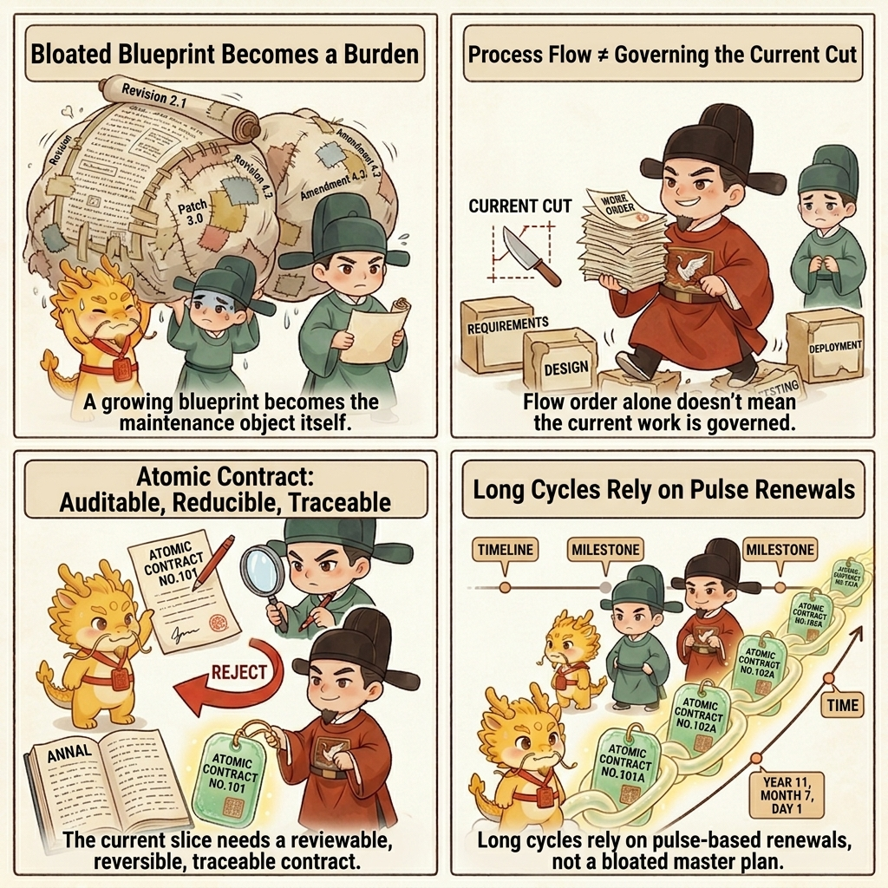
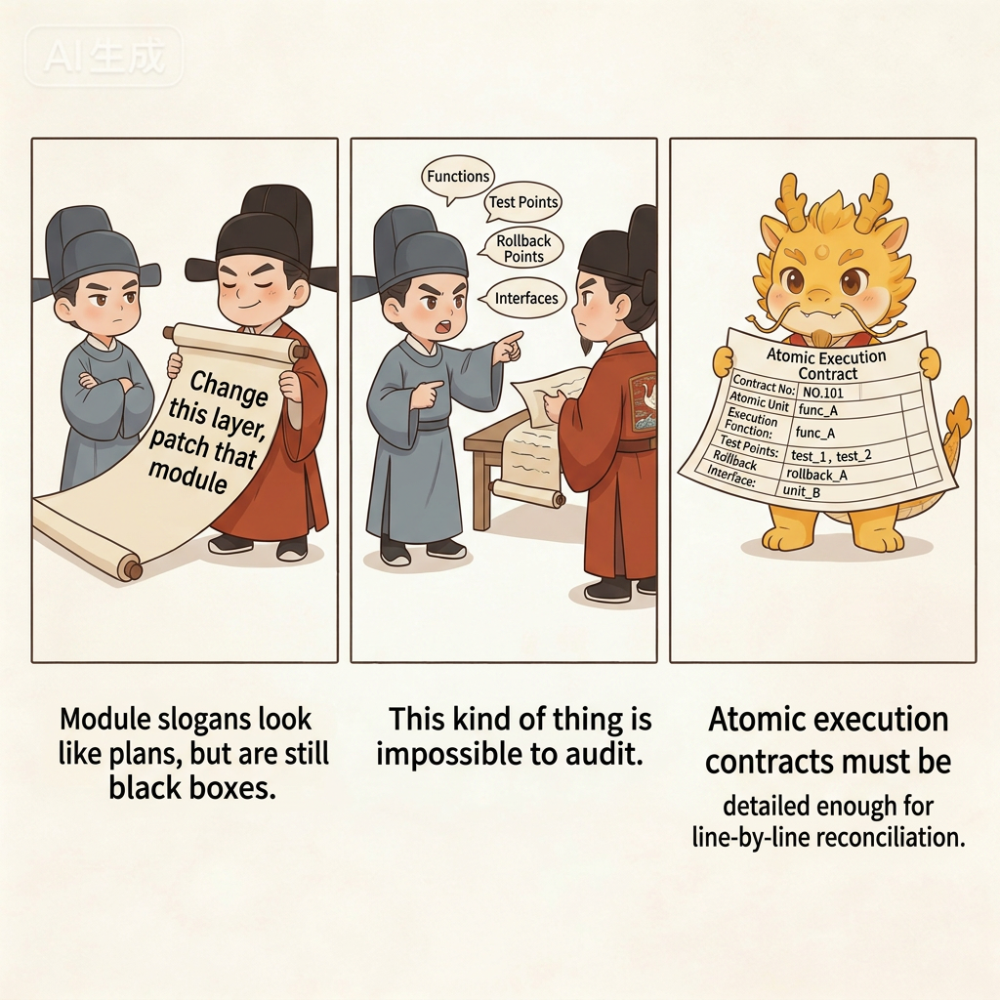
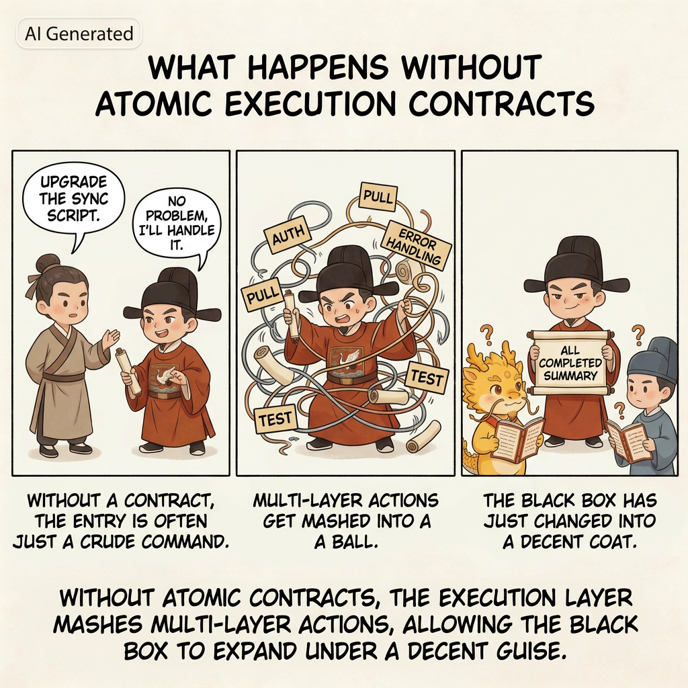
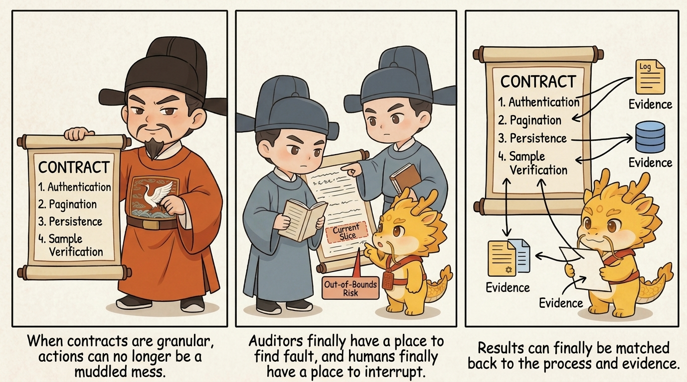
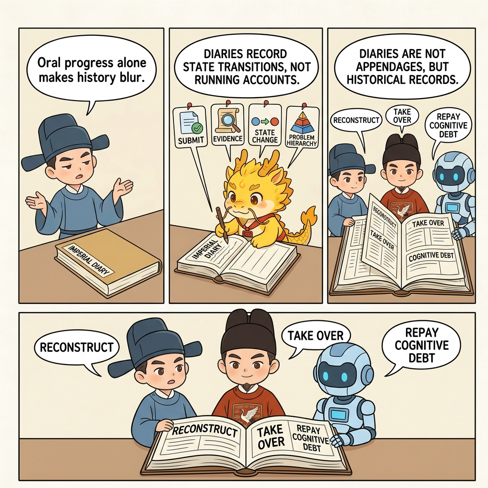

# Core Ritual 1: Atomic Execution Contract and Chronicles

## Table of Contents
- [What This Page Solves](#what-this-page-solves)
- [Why This Must Be Understood as the Atomic Execution Contract](#why-this-must-be-understood-as-the-atomic-execution-contract)
- [Why It's the First Extended Skill](#why-its-the-first-extended-skill)
- [Atomic Execution Contract: Not a Human-Written Spec, but Something the Executor Must Submit First](#atomic-execution-contract-not-a-human-written-spec-but-something-the-executor-must-submit-first)
- [The Simplest Way to Start](#the-simplest-way-to-start)
- [What a Qualified Atomic Execution Contract Must Contain](#what-a-qualified-atomic-execution-contract-must-contain)
- [A Hypothetical Scenario: What Happens Without an Atomic Execution Contract](#a-hypothetical-scenario-what-happens-without-an-atomic-execution-contract)
- [Another Hypothetical Scenario: What Changes When You Have an Atomic Execution Contract](#another-hypothetical-scenario-what-changes-when-you-have-an-atomic-execution-contract)
- [Chronicles Are Not an Accessory, but the History Produced When the Contract Lands](#chronicles-are-not-an-accessory-but-the-history-produced-when-the-contract-lands)
- [Atomic Execution Contracts and Chronicles Are Not Serial, but Asynchronously Linked](#atomic-execution-contracts-and-chronicles-are-not-serial-but-asynchronously-linked)
- [Interrupt the Executor as Soon as a History-Rewriting Tendency Appears](#interrupt-the-executor-as-soon-as-a-history-rewriting-tendency-appears)
- [Pulse Atomic Execution Contracts: Why They Are More Flexible Than a Heavyweight Blueprint](#pulse-atomic-execution-contracts-why-they-are-more-flexible-than-a-heavyweight-blueprint)
- [How It Differs from Heavy Specs, Ordinary Plans, and Workflow](#how-it-differs-from-heavy-specs-ordinary-plans-and-workflow)
- [What Density Counts as Real Chronicles](#what-density-counts-as-real-chronicles)
- [What Form Counts as Real Chronicles](#what-form-counts-as-real-chronicles)
- [What Do Chronicles Actually Remember](#what-do-chronicles-actually-remember)
- [Why It Relieves the Pain Points from Part 1](#why-it-relieves-the-pain-points-from-part-1)
- [How It Also Serves Cognitive Debt Repayment](#how-it-also-serves-cognitive-debt-repayment)
- [Four Common Drifts](#four-common-drifts)
- [One-line Summary](#one-line-summary)
- [Corresponding Implementation](#corresponding-implementation)
- [Related Pages](#related-pages)

## What This Page Solves

The minimal loop already tells you how to run the first round, but "review the plan first, review execution second, verify evidence last" is still not enough. As long as the plan itself remains too coarse, the executor can still hide inside a pile of broad steps, skip work, omit steps, jump ahead, and finally carry you across the line with a very polished summary.

More importantly: **without Atomic Execution Contracts and chronicles, the system struggles to preserve real refactoring handles, and technical debt becomes harder and harder to repay safely.** You may still be able to push a feature through today. But when tomorrow comes and you need to return, refactor, repay debt, or take over an old window, you will discover that the historical record has already dissolved into mush, and nobody can say clearly which step broke what.

So after the minimal loop, the first extended skill you must learn is this:

- Make the executor submit an **Atomic Execution Contract** first
- Then write every clear state transition into the **chronicles**

This page explains why that is not just a better planning trick, but the first real bone in the protocol; why it is not merely a better checklist but a higher-level governance object than either a heavy spec or an ordinary plan; why it helps relieve technical distortion, governance distortion, and cognitive debt; why it preserves handles for future refactors; and why, without it, later steps such as white-box reconciliation, renewal, takeover, and debt repayment all quickly lose their footing.




## Why This Must Be Understood as the Atomic Execution Contract

Because at this point it is no longer just:

- a more detailed plan
- a clearer checklist
- a stricter construction drawing

It is simultaneously:

- the boundary setter before execution
- the auditor's stable handle
- the human hub's cut-in point for intervention
- the legal unit for one pulse of development
- the chainable unit for long-cycle governance

That is why “Atomic Execution Contract” is the more accurate technical name. In the imperial register you can also think of it as a pre-execution memorial, but the technical core is contractual, not theatrical:

- it defines what this slice may touch and may not touch
- it defines how the slice will be accepted and how it retreats if it fails
- it defines what evidence should exist and what commit unit corresponds to the slice
- it gives both the auditor and the human something they can reconcile against by rule, not by vibe

**This is not merely a finer plan. It is one of the protocol's primary governance objects.**

## Why It's the First Extended Skill

If you take one step forward from [Minimal Loop](minimal-loop.md), the most natural question is this:

**How detailed does the plan need to be before it is worth reviewing at all?**

If the plan only lives at this level of granularity:

- "Upgrade the parsing chain"
- "Patch document generation"
- "Finally fix graph write-back"

then it may look like a plan, but it still leaves too much black-box space for the executor. You still cannot clearly see:

- Which function it plans to change first
- Which step counts as actually finished
- Which step can be rolled back with minimal blast radius if it fails
- Which step has a hard dependency on the next one

To really understand why this matters, it helps to first accept two realities already established in `01-why/`:

- AI coding changed the developer's position, and humans now carry delegation, routing, audit, and takeover duties
- The most dangerous thing about black-box multi-agent systems is that technical distortion and governance distortion happen together

Atomic Execution Contracts and chronicles are the first layer of response to those two realities. They are not there to make the process look more rigorous. They are there to take away the executor's room to build in the dark under cover of a vague plan.

## Atomic Execution Contract: Not a Human-Written Spec, but Something the Executor Must Submit First

This point needs to be nailed down: an Atomic Execution Contract does **not** mean the human spends half an hour hand-writing a giant todo list, and it does **not** mean you personally produce a beautiful spec before work begins. The real move is this: **require the IDE executor to submit a sufficiently detailed and sufficiently binding contract first, and then let the human and the Web auditor judge whether it is good enough.**

That differs from many plan/spec patterns:

- An ordinary plan often just tells the AI roughly how many steps it should take
- An Atomic Execution Contract forces the executor to explain, step by step, what it will change, how each step will be verified, how it would retreat if something goes wrong, what the boundary of the slice is, and what evidence should exist afterward

So this is not merely a nicer plan. It is a harder-to-fake execution contract. What you are really doing is not writing the contract yourself, but forcing the executor into a position where it must hand over that contract before it is allowed to touch the code.

If this is your first time, do not overcomplicate the idea. Just remember one very simple principle:

**Do not let the executor hand you a broad module-level plan. Force it down to the granularity of function edits, test points, and artifact checks, and make sure the auditor could reconcile it line by line.**




## The Simplest Way to Start

You can say this directly to the IDE:

```text
I want to do this: <your requirement>

Do not change code yet.
Give me an Atomic Execution Contract that is as detailed as possible.
Make it as concrete as you can: which function to modify, what test point to add, and what result counts as passing.
```

If you want to be even more explicit, add one more sentence:

```text
Do not give me a vague plan.
Break it down by function modification, test-point setup, and artifact inspection whenever possible.
```

Those two sentences are enough to start the first round. You do not need to write the whole contract yourself, and you do not need to know every technical detail up front. The point of the Atomic Execution Contract is precisely to make the executor expose how it intends to work, what it intends to touch, and what evidence it intends to leave behind.

## What a Qualified Atomic Execution Contract Must Contain

The most practical standard is not length. It is whether the object has really become a contract instead of remaining a checklist. You can judge it with a very simple ruler:

- Can you tell exactly which function or layer of logic it will touch?
- Can you tell what the test point or acceptance point is for that step?
- Can you tell what the smallest rollback point is if that step fails?
- Can you tell how that step connects to the next one?

In other words, a qualified Atomic Execution Contract should answer at least four questions:

1. What exactly does this step touch?
2. How will this step be accepted?
3. If it fails, where do we retreat to?
4. How does it hand off to the next step?

And in the more mature form used under higher-governance conditions, it will often go further and carry things like:

5. which files are allowed and which are no-touch
6. what the red lights and green lights are
7. what commit unit and target artifacts belong to this slice
8. what rung of the acceptance ladder this slice is expected to reach

For example, the difference between these two styles is enormous.

Unqualified checklist items:

- "Upgrade the parsing logic"
- "Patch document generation"
- "Handle the graph relationships at the end"

Much closer to qualified:

- "Extend `parseInputBundle()` so it returns the new field"
- "Add an explicit error when the input is missing a timestamp instead of skipping it silently"
- "Run one real sample and check whether the output document contains cross-references"
- "Verify that the structured result really carries the new relationship field"

Once the checklist is written that way, the auditor finally has something to grab onto. It can ask questions like:

- Why does this step have no test point?
- Why is there no real artifact acceptance for this step?
- Is this line actually two different changes that were deliberately kneaded into one?

That is the first value of the Atomic Execution Contract: **it turns the plan itself into an auditable, judgeable, accountable object.**

## A Hypothetical Scenario: What Happens Without an Atomic Execution Contract

Suppose you have an old synchronization script. Right now it can only pull remote data down roughly and dump it straight into one local file. You want to upgrade it so that it will:




- Perform an authentication check first
- Then fetch in pages
- Leave a clear error log if something fails
- Finally write out a structured result

Without an Atomic Execution Contract, the most common path looks like this:

- You say, "upgrade the sync script"
- The executor replies, "no problem, I'll handle it"
- Then it changes authentication, fetching, error handling, persistence, and tests all at once
- At the end it hands you a summary that says, "everything is done"

It feels smooth, but the problems get buried just as smoothly:

- It may have had no real execution order at all and just trial-and-errored in several places at once
- It may have compressed two or three difficult steps into one casual sentence
- It may have used simulated results to make the report look tidy
- When something goes wrong, you have no idea which layer drifted first

This maps directly to the two collapses described in [Dual Distortion](../01-why/dual-distortion.md):

- Technically, you end up with an intermediate state that looks like progress but is actually muddy
- In governance terms, the executor casually acts as planner, implementer, and narrator of the result all at once

So without an Atomic Execution Contract, the so-called "plan" does not really reduce the black box. It only moves the black box earlier and gives it a more respectable paragraph.

## Another Hypothetical Scenario: What Changes When You Have an Atomic Execution Contract

Take the same task again. If you force the executor to submit an Atomic Execution Contract first, it can no longer say only "I will upgrade the sync script." It must expose itself at a much finer granularity, for example:




- First add the authentication-check function and failure logging
- Then add paginated fetching and page-boundary tests
- Then add the structured persistence fields
- Finally run one real sample and check whether both the persisted result and the error log match expectations

Once the plan is that detailed, three things change.

### First, the Auditor Finally Has Somewhere to Attack

If one step is still too coarse, the Web auditor can immediately point out things like:

- This line actually contains two separate steps
- This line has no acceptance standard
- This line says it will change something, but never says what final result would count as passing

At that moment, the auditor stops being a chat companion and becomes a true plan-level auditor.

### Second, the Human Finally Has Somewhere to Interrupt

Once the executor starts moving, the human can watch the contract and ask:

- Which step are you on right now?
- Have you suddenly crossed the boundary and started doing step seven work?
- Did you silently knead two steps into one blob?

Without a contract like this, human interruption can only rely on intuition. With it, interruption finally has procedural grounds.

### Third, the Result Can Finally Be Matched Back to the Process

After execution ends, you are no longer staring at a single summary that says "done." You can ask item by item:

- Where is the evidence for step 1?
- Where is the test point for step 2?
- Where is the real artifact for step 3?

That means the fact of completion no longer lives inside one blended narrative. It begins to line up, item by item, with the concrete actions in the contract.

## Chronicles Are Not an Accessory, but the History Produced When the Contract Lands

The natural next thing that grows out of an Atomic Execution Contract is the chronicles themselves.




The reason is simple: once you really advance by such a contract, every clear state transition is naturally suited to leave behind one commit record. At that point the chronicles stop being extra overhead and become the by-product of actually landing the contract.

That is why the README says:

**One contract item corresponds to one clear state transition, and one state transition corresponds to one traceable commit.**

The first time many people hear "high-frequency Git commits," they instinctively resist it and assume it is empty formalism. But the real issue is not that there are "too many commits." The real issue is that without this fine-grained history, every later task becomes harder all at once:

- Rollback becomes harder
- Debugging becomes harder
- Takeover becomes harder
- Renewal becomes harder
- Refactoring becomes harder

So the chronicles are not "for Git." They are for whoever has to take over this history in the future.

There is another point that matters even more in the AI era: **the tedious labor of atomic commits, which used to be expensive by hand, can now be delegated almost entirely to the executor.**

In the era of purely manual coding, many people hated high-frequency commits because the work was genuinely annoying:

- You had to pause and split the work yourself
- You had to decide the boundary of each commit yourself
- You had to write each commit message yourself

But in Cyber-Ming-Protocol, that layer of drudgery is exactly the kind of thing that should be outsourced to AI. For the human, it can often be as simple as one prompt, for example:

```text
Split the current changes into commits by feature point.
Do not commit everything as one tangled batch.
For each commit, explain what changed, what was verified, and what problem it solved.
When you are done, show me the git log.
```

In other words, the human's job is not to manually perform every small historical cut. The job is to require the executor to cut the history clearly, explain it clearly, and present it for judgment. That shift is crucial: it turns "preserve future refactoring handles" from a mainly physical burden into a governance requirement.

## Atomic Execution Contracts and Chronicles Are Not Serial, but Asynchronously Linked

There is one more point that needs to be made explicit: Atomic Execution Contracts and chronicles are **not** in a serial relationship where you finish the whole contract first and only then go back to write the history.

The real rule should be:

**As soon as one contract item is completed, leave the corresponding chronicle entry immediately.**

In practice that means:

- Finish item 1, then commit item 1
- Get the smallest test point for item 2 running, then commit item 2
- Fix one real error for item 3, then commit item 3

Do not finish the entire contract and only afterward go back to tidy up the commit history.

Why not? Because the moment you allow the executor to "finish the whole checklist and then rewrite the history afterward," you have given it too much room for narrative editing. It can:

- Smooth away the chaotic middle of the process
- Repackage a jumpy, out-of-order process as a clean and orderly history
- Rewrite multiple layers of action as a single neat path after the fact

At that point, what it writes is no longer a chronicle. It is closer to edited history.

So remember one very simple operating principle:

**Finish one item, leave one trace immediately. Do not finish the whole checklist and then patch history afterward.**

## Interrupt the Executor as Soon as a History-Rewriting Tendency Appears

If you notice the executor showing any of the following tendencies, do not wait until it is "all done." Interrupt immediately and order it to correct course:

- Several contract items have already advanced, but there are still no corresponding commits
- Multiple feature points have been mixed together, ready to be committed as one batch
- It starts saying, "I'll organize the commits after everything is finished"
- It tries to repackage what was actually a messy process as one clean historical path

The simplest response is to give a direct order like this:

```text
Stop.
Do not wait until the entire contract is done before committing everything together.
Split the feature points that are already complete and leave traces item by item according to the Atomic Execution Contract.
Each time one item is completed, commit that item, then show me the git log.
```

This is not nitpicking. It is how you prevent the executor from rewriting development history after the fact. One extra cut now saves you a mountain of rotten accounting later about which exact step broke what.

## Pulse Atomic Execution Contracts: Why They Are More Flexible Than a Heavyweight Blueprint

Atomic Execution Contracts are powerful not only because they are fine-grained, but because they naturally fit pulse-style advancement.

For now, you can understand a pulse in one very simple sentence:

**Do not drop one giant heavyweight blueprint onto the project all at once. Let one small, verifiable contract segment run through first, then decide how the next small segment should change.**

That is exactly where this approach differs sharply from the traditional blueprint-heavy spec style.

The problem with heavyweight blueprints is not that they are unclear. It is that they are too heavy:

- They try to define too much up front
- Once the direction changes, the whole blueprint has to be redrawn
- The moment the business logic changes, a large share of the earlier planning goes stale

The advantage of pulse Atomic Execution Contracts is different:

- Smaller boats turn faster
- Each pulse only commits one small piece of real progress
- After each pulse runs, the next pulse can be revised based on reality
- If the business logic changes, the next pulse can absorb that change directly

So this approach is not anti-planning. It simply refuses to freeze too much planning too early. Its rhythm is more like this:

- Run one small segment first
- Leave the chronicle
- Look at the real result and the real blocker
- Then decide how to revise the next segment of the contract

From that angle, the contract and the chronicle are not only anti-counterfeit mechanisms. They are also mechanisms for flexible advancement. They help you avoid the trap where the blueprint is complete but the moment reality moves, the whole thing becomes invalid.

## How It Differs from Heavy Specs, Ordinary Plans, and Workflow

This section is especially aimed at the second kind of reader:

**not someone who has never used workflow at all, but someone who has used workflow or spec-driven development seriously and has started to feel the backlash.**

For that kind of reader, the most common confusion is not "why is nobody governing anything?" It is almost the opposite problem:

- The initial spec was written in great detail
- The workflow looked orderly
- But the project's shape got fixed too early and too rigidly
- Once your understanding upgraded halfway through, or your idea changed, or the structural goal shifted, the cost of adjusting kept rising

Eventually you begin to feel something strange:

**you are no longer continuing to build the product; you are maintaining an increasingly heavy blueprint that no longer wants to breathe.**

The biggest difference between Atomic Execution Contracts and that kind of heavyweight spec is not that the contract is "more detailed." It is that the planning object itself has changed.

It no longer asks you to write out the whole future blueprint in one shot, and it does not stop at handing the executor a light plan either. What it really asks for is this:

- Compress the next real slice into a contract that can be audited, verified, rolled back, and archived
- Run that slice through first
- Let real results, real blockers, and real evidence decide how the next slice should be revised

In other words, this is neither heavyweight spec nor lightweight plan. It is a different governance object.

If you put the three side by side, the difference becomes clearer:

| Dimension | Heavy Spec / Frozen Workflow | Ordinary Plan / Light Plan Mode | Atomic Execution Contract |
| --- | --- | --- | --- |
| Weight | Tries to define too much up front | Light to write, light to ignore | Stable skeleton, slice-sized weight |
| Flexibility | High rewrite cost when direction changes | Flexible, but easy to drift | Pulse revisions without losing legal shape |
| Constraint strength | Strong, but often freezes the project | Weak, relies on executor self-discipline | Strong, but only over the current slice |
| Audit handle | Often remains at the level of high-level intent | Loose and scattered | Falls directly onto actions, acceptance, red/green gates, evidence, and rollback |
| Long-cycle chaining | Often becomes maintenance of one giant blueprint | Easily drifts with the conversation stream | Multiple contracts can chain pulse by pulse across a long cycle |
| Output skeleton stability | Heavy and expensive to rewrite | Improvises a different shape every round | Stable field skeleton with higher repetition |
| Cache / cost advantage | Often too heavy | Often too improvised | Usually easier to push into a stable output form and often carries a small cost advantage |
| Human feeling | Feels like maintaining a blueprint | Feels like babysitting improvisation | Feels like governing a product that can still grow |

That is why this is not "spec, but more detailed." It is a higher-level governance form that rebalances things which usually fight each other:

- flexibility without losing constraint
- auditability without freezing the project
- long-cycle continuity without relying on one giant blueprint
- stable output structure without turning the prompt into a massive document

That is also why it is more sensitive in the right way:

- It is more sensitive to real blockers
- It is more sensitive to direction changes
- It exposes wrong premises earlier
- It does not wait for the whole spec to fail before admitting that the direction should change

The earlier evidence pages already show this very clearly.

In [Battle Report 1](../04-evidence/battle-report-1.md), the executor initially submitted a function-level Atomic Execution Contract that passed the first audit. That shows the contract is not "no planning" at all. It is a way of submitting a construction skeleton that is already detailed enough to audit. But once the real run exposed a `401` and a graph-database import failure, the whole round could still be lawfully revoked, re-audited, and redirected instead of being forced to continue down the old route merely because the original spec looked respectable.

In [Chronicles Sample](../04-evidence/chronicles-sample.md), the system goes through three clear transitions in a single day. The valuable thing there is not just "there were lots of commits." The real center of gravity keeps changing: unified entry, workspace semantics, branch convergence, and an artifact hub taking over the main chain. If that day had been governed by one heavyweight spec fixed in advance, many midstream structural changes would have looked like deviations from the blueprint. Under the logic of pulse Atomic Execution Contracts, they can instead be recognized as **legitimate revisions to the next pulse after cognition has upgraded.**

So what Atomic Execution Contracts protect is not only order. They also protect growth.

What I oppose is not just the black-box loss of control where nobody governs anything. I also oppose the frozen workflow that nails a project down too early and leaves people maintaining the blueprint instead of continuing to build the product. Atomic Execution Contracts are valuable precisely because they try to preserve a mode that is:

- Governable
- Auditable
- Still able to keep growing, turning, and renewing while the project advances

That is the real difference from the traditional spec-blueprint method.

## What Density Counts as Real Chronicles

The moment many people hear "high-frequency Git commits," they misunderstand it in one of two ways: either they think it means one commit every two lines, or they think it means packing everything into one bundle at the end of the day. Both are wrong.

The useful density can be remembered in one very simple sentence:

**Leave one commit for every clear state transition.**

What counts as a "clear state transition"? Use the plainest standard you can:

- This step can now explain on its own what problem it solved
- This step already has at least one minimal acceptance result
- If you roll back at this point, you will not drag several later layers down with it

If all three conditions hold, the step is usually worth a commit.

### What Too-Coarse Density Looks Like

The following is usually too coarse:

- One commit changes authentication, pagination, persistence, logging, and tests at the same time
- One commit mixes a new feature, an opportunistic refactor, and a bug fix
- After the commit is made, even you cannot clearly explain what that cut was mainly trying to solve

Commits like that look convenient in the moment, but they directly weaken the value of the chronicles. Later, all you see is a blended pile of action instead of a clear development history.

### What Too-Fine Density Looks Like

But more fragmentation is not automatically better. The following is often too fine:

- Renaming one variable gets its own commit even though it does not form a state transition
- Half a function has been written, but nothing can be verified yet, and it is committed anyway
- One coherent action gets cut into seven or eight slices until nobody can tell how they relate

Those commits may be numerous, but they are not chronicles. They are noise.

### The Most Practical Density Rule

If this is your first time, you can simply use the following rule of thumb:

- After one feature point is completed, make one commit
- After one minimal test point passes, make one commit
- After one real error is fixed, make one commit

If you can naturally say things like:

- "This step adds the authentication check"
- "This step wires in paginated fetching"
- "This step adds explicit error logging"

then you are usually already at a good commit boundary.

## What Form Counts as Real Chronicles

Density is not the only thing that matters. Form matters too. Many people begin committing more frequently and still fail to produce real chronicles. What they end up with is only a high-frequency ledger of confusion.

For a chronicle to be genuinely useful, a later reader should be able to understand at least three things immediately:

- What problem this cut was solving
- Which layer it mainly landed in
- How it relates to the steps before and after it

That is why the worst commit messages usually look like this:

- `misc fixes`
- `update code`
- `wip`

Even if you have many commits like that, they are still almost useless for refactoring, takeover, and debt repayment.

Messages that are much closer to a real chronicle usually look more like this:

- `fix(auth): add token validation before sync`
- `feat(sync): add paginated fetch for remote items`
- `test(sync): cover page boundary and empty response`
- `fix(export): log explicit error on malformed payload`

If the repository's habits allow it, adding another one to three lines in the commit body is even better, for example:

- Which function changed
- What point was verified
- Why this step had to come before the next one

You do not need to turn every commit into an essay. But you should make it easy for a later reader to see that this is not just a handful of diffs. It is a reconstructable development history.

## What Do Chronicles Actually Remember

Chronicles remember more than "which file changed this time." They remember much more valuable things:

- What problem this step solved
- Which layer the change landed in
- What this step verified
- How this step relates to the steps before and after it

That is why truly good chronicles should not look like a `misc fixes` grab bag. They are closer to a finely segmented dynastic record.

Imagine a sequence of entries like this:

- Extend the relationship-extraction prompt and return structure
- Add structure validation and serialization logic
- Wire in in-text cross-reference generation
- Update how the structured result is written out
- Fix the variable error exposed by a real run

The value of that sequence is not that it looks tidy. The value is that when you come back later, you can see exactly how the system grew into its present form. That is also why, when a window has decayed, the executor has changed, or understanding has begun to slip, you do not need to re-chew the entire ocean of code. You can grab the mainline quickly by following the most recent state transitions.

## Why It Relieves the Pain Points from Part 1

If you do not place this page back into the realities established in `01-why/`, Atomic Execution Contracts and chronicles are easy to misunderstand as nothing more than finer process management.

What they really relieve are the structural pain points already described there.

### First, They Relieve the Governance Pressure Created by the Shift in Human Position

As [CS vs Management](../01-why/cs-vs-management.md) explains, humans in AI coding now carry delegation, routing, audit, and takeover duties. The Atomic Execution Contract turns that pressure from an abstract burden into an executable action.

You do not need to rule the whole system in your head all at once. You only need to force the executor to hand in a detailed plan first and then decide whether to let it proceed.

### Second, They Relieve the Understanding Cost Created by a Partially Semi-Black-Box System

The same page also explains that AI coding pushes systems toward a partially white-box, partially semi-black-box state. If you cannot reread every step into full clarity every time, then you need:

- Fine-grained contracts
- Fine-grained commits
- Fine-grained state transitions

They do not exist so that you can understand more of everything. They exist so that when your understanding is limited, you can still spot-check the critical points more accurately.

### Third, They Relieve Technical Distortion

As [Dual Distortion](../01-why/dual-distortion.md) argues, one core symptom of technical distortion is that error disguises itself as progress.

The first relief provided by the Atomic Execution Contract is that "progress" must first collapse into concrete actions and acceptance criteria. The second relief provided by the chronicles is that "I really did this step" must then collapse into recorded history.

That greatly reduces the room for the familiar situation where the report sounds busy and impressive but nothing has actually been nailed down.

### Fourth, They Relieve Governance Distortion

The core of governance distortion is that the executor becomes planner, implementer, and narrator of results at the same time. One job of the Atomic Execution Contract is to expose its plan before execution. One job of the chronicles is to pin down its trajectory afterward so that it cannot casually rewrite the story.

Put differently:

- The Atomic Execution Contract narrows the executor's black-box space before execution
- The chronicles narrow the executor's narrative space after execution

## How It Also Serves Cognitive Debt Repayment

This point is extremely important, and many people do not notice it the first time through.

Chronicles do not exist only for rollback, debugging, and refactoring. They also serve cognitive debt repayment.

The reason is simple: in the AI era, what accelerates dramatically is the speed of writing and rewriting code. The human speed of making a project white-box again does **not** accelerate at the same rate. So if a project lives long enough, cognitive debt will inevitably pile up.

This is where the chronicles become valuable. When your grasp starts to weaken, you do not need to chew through the whole code ocean again. You can first grab the most recent state transitions.

You can even open a fresh window and tell the executor directly:

```text
Do not keep changing code yet.
First read the recent Git commit history, and tell me by feature point:
1. Which functions were changed recently
2. What each change was trying to solve
3. If I now want to keep working on X, from which commit should I continue reading
```

That prompt looks plain, but it works only because there is already a sufficiently fine chronicle record underneath it. Without a clear historical record, this kind of debt-repayment conversation collapses back into black-box improvisation. With a clear chronicle record, it becomes a flexible, fast, and credible way to repay cognitive debt.

## Four Common Drifts

### Drift 1: Writing the Atomic Execution Contract as Module-Level Slogans

If the granularity is still just "upgrade this layer" or "optimize that module," then it is not an Atomic Execution Contract. It is only a coarse plan under a new name.

### Drift 2: Writing Empty Acceptance Standards

An execution contract without acceptance standards is effectively an invitation for the executor to explain afterward why it thinks the work "basically counts as done."

### Drift 3: Producing Coarse Commits from a Fine-Grained Contract

This disconnects the contract from the history. You may have a beautiful contract on paper, but you still do not have real chronicles.

### Drift 4: Treating Chronicles as a Mechanical Commit Quota

The key is not a slogan like "one commit every two functions." The key is that every clear state transition should leave a traceable historical record. Do not be mechanical, but also do not let everything dissolve into one lump.

## One-line Summary

Atomic Execution Contracts and chronicles are the first extended skill not because they are more elegant, but because they are the first thing that truly nails plan, execution, acceptance, and history into one auditable, interruptible, traceable, and handover-ready chain.

Without them, the minimal loop can still run. With them, the minimal loop finally starts to grow real bones, and the plan object itself is upgraded into a contract object.

## Corresponding Implementation

### Manual Practice

- Manually require the executor to submit an Atomic Execution Contract first, and make sure it clearly states what it touches, how it will be accepted, where it rolls back to on failure, and how it connects to the next step
- Every time one clear state transition is completed, leave the corresponding commit immediately instead of finishing the whole checklist and patching history later
- During audit, compare the checklist, the commits, and the evidence item by item instead of listening only to one final summary

### Corresponding Skill

- `approval-first-planner` stabilizes the rule "submit an approvable checklist first"
- `approved-checklist-executor` stabilizes "execute slice by slice, verify slice by slice, archive slice by slice"
- `global_rules` nails down the baseline of "one slice, one verification, one trace"

### Corresponding Web Templates

- When you want to judge whether the checklist is truly atomic and sufficiently clear, start with `plan_audit_template.md`
- When you want to check whether each checklist item has really landed as the corresponding evidence and commit, start with `completion_audit_template.md`
- If you still have not fully separated Skills from Web templates in your head, see [Three Things](../00-entry/three-things.md)

## Related Pages

- [Minimal Loop](minimal-loop.md)
- [White-box Reconciliation](white-box-reconciliation.md)
- [Scout Mechanism](scout-mechanism.md)
- [Why AI Coding Has Blurred the Boundary Between CS and Management](../01-why/cs-vs-management.md)
- [Dual Distortion of Black-Box Multi-Agent](../01-why/dual-distortion.md)
