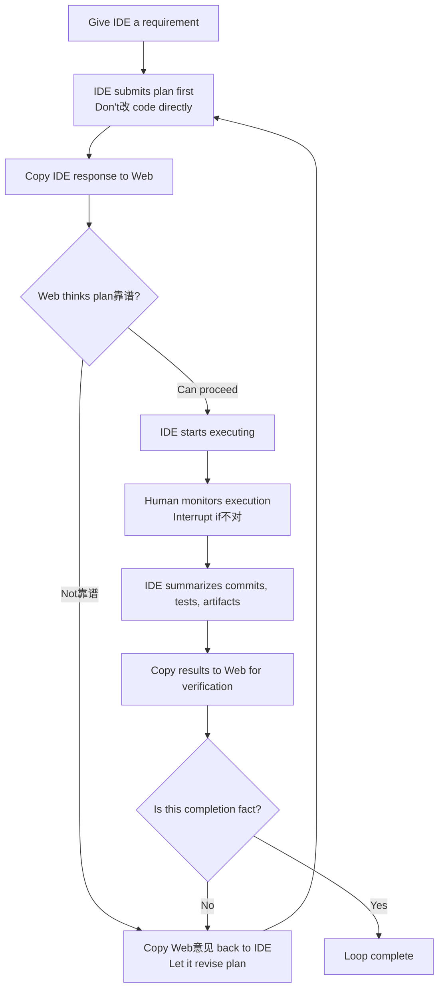

# Minimal Loop: One-Audit and Multi-Audit Versions

## Table of Contents
- [What This Page Solves](#what-this-page-solves)
- [One-line Version](#one-line-version)
- [Diagram First](#diagram-first)
- [One-Audit Version: Start Here](#one-audit-version-start-here)
- [Multi-Audit Version: When to Upgrade](#multi-audit-version-when-to-upgrade)
- [A Simple Example](#a-simple-example)
- [Three Common Drifts](#three-common-drifts)
- [Corresponding Implementation](#corresponding-implementation)
- [Related Pages](#related-pages)

## What This Page Solves

If you want to try Cyber-Ming-Protocol today, what's the simplest way?

The answer is not memorizing the entire doctrine first, nor learning all rituals. What the minimal loop actually asks you to do is very little:

- Give the IDE a requirement
- Copy the IDE's response to Web for review
- Interrupt if something's wrong
- After done, let Web verify once more

That simple.

The point of this method is not making things complicated, but preventing the executor from declaring "done" while still working.

## One-line Version

The minimal loop is:

**Let IDE submit a plan first, copy the plan to Web for review; after approval, execute, then submit evidence for final review.**

If this is your first time, just run through this one line.

## Diagram First



If you understand the diagram above, go directly to the version most worth following for your first run: the one-audit version.

## One-Audit Version: Start Here

If this is your first time, the one-audit version is enough.

Its process is very simple:

### 1. Let IDE Submit a Plan First

You can say it directly:

```text
I want to do this: <your requirement>

Don't改 code directly first.
Tell me how you plan to do it, break it into an atomic checklist as细 as possible, how to verify each step.
Granularity should be细 enough: which function to modify, what test point to add, what result counts as passing.
```

Here you don't need to write a big plan yourself. The plan is submitted by the executor first, not written by you manually.

If you want to be more direct, you can add:

```text
Don't give me vague plans.
Try to break it down by function modification, test point establishment, artifact检查.
```

The benefit is simple: when you copy it to Web later, Web can see if there are漏 steps, if it's lazy, if it故意说粗 the难点.

### 2. Copy IDE's Plan to Web for Review

The simplest way is to copy as-is, then add:

```text
This is the IDE's plan. This executor might骗 me.
Please帮 me check: are there漏 steps, is it说得太容易, what evidence should I look at最后.
```

If you think "骗 me" is too strong, you can换成 softer words with same meaning:

```text
This is the IDE's plan.
Please帮 me挑毛病, see if it说得太顺、太粗, or漏掉 the难点.
```

If Web says the plan has obvious gaps, copy its意见 back to IDE.

### 3. If Plan Is Fine, Let IDE Start

You can even reply with just one short sentence:

```text
Follow this plan. Remember one step, one commit.
```

At this point you don't need to write long instructions. The minimal loop doesn't靠 complex rhetoric, but靠 review first, then execute.

If "one step, one commit" makes you nervous第一次看到, don't理解 it as机械纪律. Just记住 the最小意思: **Don't混 multiple changes into一团, try to切 by功能点.** The next page "Atomic Checklist & Chronicles" will讲顺 this.

### 4. Verify After Done

After the executor finishes, don't just看 it说"好了". First让它整理 materials:

- This round's commits
- Test results
- Artifacts
- Key logs

Then copy to Web:

```text
These are this round's commits, tests, and artifacts.
Please帮 me看, is this completion fact, don't just看 summary.
```

If Web says "this doesn't count as done", continue back to IDE to fix, don't急着 pass.

This is the one-audit version:

- Plan review once
- Result verify once

For your first time, this is enough.

## Multi-Audit Version: When to Upgrade

Some tasks, one-audit version is not enough. For example:

- Large impact scope
- Crosses multiple modules
- Has external system writes
- Executor already开始说漂亮话、交 green checks, but your直觉 says不对

At this point, upgrade to multi-audit version.

Its difference from one-audit version is not different philosophy, but adding multiple reviews based on risk, not mechanically增加 fixed steps:

- If plan doesn't pass, revise one or two rounds
- During key execution steps, let Web glance中途
- After final result, do one formal verification

You can理解 it as:

- One-audit version: lightweight anti-pseudo
- Multi-audit version: reinforced version for high-risk tasks

If this is your first time, don't直接 use multi-audit version. First run through one minimal loop, then upgrade.

## A Simple Example

Suppose you have an old script that can only export a纯 title list. This time you want to upgrade it to:

- With tags
- With in-text cross-references
-同时落一份 structured result

If按 old habits, you'd likely直接 let IDE改. It would likely quickly give you a漂亮 reply:

- "All改好了"
- "Tests passed"
- "Next step要不要继续加 new features"

Looks很顺, but inside可能藏 several common假推进:

- It改了 code, but didn't真实 run through整条 chain
- What it gave you is just simulated artifacts
- It贴出来的是 old files, not this round's new results

The minimal loop approach is different.

You first让它出 plan. It might break down to:

- First改 upstream extraction logic
- Then改 middle structure
- Then改 document generation
- Finally改落盘 result

You copy this段 as-is to Web, add "this executor might骗 me".

Web一看, might提醒 you two things:

- This plan粒度还行, can proceed
- But最后 don't just看 it说"完成了", must看 real artifacts

Then you let IDE start. Halfway, you发现 it forgot one step one commit, then interrupt, let it补 commits. At the end, it递上 a green check summary, you copy to Web. Web if继续追问"where's the real artifact? real result?", at this point many假推进 will露馅.

This small example说明的不是某个 specific business, but:

**The most important value of minimal loop is not making you do everything right the first time, but exposing errors earlier, not letting them混进 mainline.**

## Three Common Drifts

### Drift 1: Let IDE Start Directly

This makes you skip the most important step: review plan first. Many later troubles actually start here.

### Drift 2: Treat Web as Chat Window

Web is not here to附和 executor. You must明确 tell it: "This executor might骗 me." Its job is挑毛病, not陪 you乐观.

### Drift 3: Only Look at Summary, Not Evidence

The last环 of minimal loop is not "listen to report", but "look at evidence". No artifacts, no logs, no real results, then don't急着 believe.

## Corresponding Implementation

### Manual Practice

- Use existing IDE executor to submit plan first, not allowed to start directly
- Copy plan to independent Web auditor for review first, then decide whether to approve
- After execution, submit commits, tests, artifacts, logs for review, not using summary as evidence

### Corresponding Skill

- If you've接入 Skill, this page most directly corresponds to `approval-first-planner` and `approved-checklist-executor`
- Their job is not替 you define completion, but稳定 the主干 actions of "plan first, execute later,归档 by piece"
- Onboarding sequence and scope: see [Skill Guide](../00-entry/skill-guide.md)

### Corresponding Web Templates

- Plan audit优先对应 `plan_audit_template.md`
- Completion verification优先对应 `completion_audit_template.md`
- How to collaborate on Web side without误 taking templates as installable: see [Three Things](../00-entry/three-things.md)

## Related Pages

- [Atomic Checklist & Chronicles](atomic-checklist-chronicles.md)
- [White-box Reconciliation](white-box-reconciliation.md)
- [Scout Mechanism](scout-mechanism.md)
- [Dual-track Audit](../03-deep-water/dual-track-audit.md)
