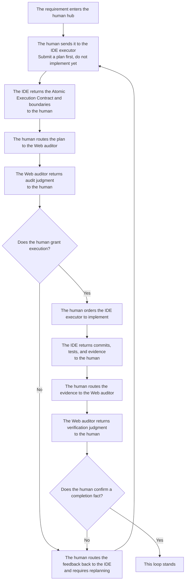

# Minimal Loop: One-Audit and Multi-Audit Versions

## Table of Contents
- [What This Page Solves](#what-this-page-solves)
- [One-line Version](#one-line-version)
- [Diagram First](#diagram-first)
- [One-Audit Version: Start Here](#one-audit-version-start-here)
- [Multi-Audit Version: When to Upgrade](#multi-audit-version-when-to-upgrade)
- [A Simple Example](#a-simple-example)
- [Three Common Drifts](#three-common-drifts)
- [Corresponding Implementation](#corresponding-implementation)
- [Related Pages](#related-pages)

## What This Page Solves

If this is your first time entering the repo, do not start with this page.

Start with the [First-Time Guide](../00-entry/prompt-pack.md) instead. That page now carries the first-run manual: the minimal route, the minimal loop diagram, the recommended mode, the universal mode, the correction prompts, and the Skill trial all live there.

This page is now the better place to return to after your first run, when you want the expanded methodology and the difference between the one-audit and multi-audit versions.

If you want to try Cyber-Ming-Protocol today, what is the simplest possible way to do it?

The answer is not to memorize the whole doctrine first, and not to master every ritual before you begin. The minimal loop actually asks you to do very little:

- Give the IDE a requirement
- Copy the IDE's response to the Web side for review
- Interrupt if something looks wrong
- When the work is done, let the Web side verify it one more time

That is all.

The point of this method is not to make work complicated. The point is to stop the executor from working and declaring completion at the same time.

## One-line Version

The minimal loop is:

**First make the IDE hand its plan to the human, then let the human route that plan to the Web side for review; the auditor only returns judgment, the human decides whether execution is granted, and the human also decides whether a completion fact stands.**

If this is your first time, getting this single line running is enough.

## Diagram First

This is not an agent-team collaboration diagram. It is a dual-track governance diagram centered on the human.



If that diagram already makes sense to you, jump straight to the version that is best for a first attempt: the one-audit version. The most important thing to keep in mind is not “the Web side passed it,” but “the Web side only returns judgment; the human still grants execution and the human still rules on completion.”

## One-Audit Version: Start Here

If this is your first time trying the protocol, the one-audit version is enough.

Its flow is very simple:

### 1. Have the IDE Submit a Plan First

You can say it directly like this:

```text
I want to do this: <your requirement>

Do not modify code yet.
First tell me how you plan to do it. Break it into an Atomic Execution Contract as detailed as possible, and tell me how each step will be verified.
Make the granularity as fine as possible: which function to modify, what test point to add, and what result counts as passing.
```

You do not need to write a big plan yourself here. The point is to make the executor hand in the plan first, not to make you draft it manually.

If you want to make it even more explicit, add one more sentence:

```text
Do not give me a vague plan.
Break it down by function modification, test-point setup, and artifact inspection whenever possible.
```

The benefit is simple: when you later copy the plan to the Web side, the reviewer can see whether steps are missing, whether the plan is evasive, and whether the hard parts were deliberately blurred.

### 2. Copy the IDE's Plan to the Web Side for Review

The simplest method is to copy it as-is and add a short instruction:

```text
This is the IDE's plan. This executor may deceive me.
Please check whether any steps are missing, whether it makes the task sound too easy, and what evidence I should demand at the end.
```

If "deceive me" feels too strong, you can soften it without changing the meaning:

```text
This is the IDE's plan.
Please help me find problems: is it too smooth, too vague, or missing the difficult parts?
```

If the Web side says the plan has obvious gaps, copy that feedback back to the IDE unchanged.

### 3. If the Plan Is Acceptable, Let the IDE Start

At this point, your reply can be extremely short:

```text
Follow this plan. Remember: one step, one commit.
```

You do not need long rhetoric here. The minimal loop does not stand on ornate prompting. It stands on a simple order: review first, execute second.

If "one step, one commit" makes you tense the first time you hear it, do not interpret it as mechanical ritualism. Just hold on to its minimal meaning: **do not lump several steps into one change blob; split them by feature point whenever possible.** The next page, [Atomic Execution Contract & Chronicles](atomic-checklist-chronicles.md), explains why this matters.

### 4. Verify Again After the Work Is Done

When the executor says the work is finished, do not look only at the sentence "done." First ask it to lay out the materials:

- The commits for this round
- Test results
- Artifacts
- Key logs

Then copy them to the Web side:

```text
These are this round's commits, tests, and artifacts.
Please tell me whether this counts as a completion fact. Do not judge from the summary alone.
```

If the Web side says "this does not count as done," send it back to the IDE for another round of repair. Do not rush to pass it.

That is the one-audit version:

- Review the plan once
- Verify the result once

For a first run, that is enough.

## Multi-Audit Version: When to Upgrade

Some tasks are too risky for the one-audit version. For example:

- The impact radius is large
- The work crosses multiple modules
- It writes to an external system
- The executor has started talking smoothly and handing over green checks, but your instincts say something is off

That is when you upgrade to the multi-audit version.

Its difference from the one-audit version is not a different philosophy. It simply inserts more reviews based on risk instead of adding fixed steps mechanically:

- If the plan does not pass, send it back one or two more times
- If execution reaches a critical step, let the Web side take a look midstream
- After the final result appears, run one formal verification pass

You can think of the two versions like this:

- One-audit version: lightweight anti-pseudo-completion
- Multi-audit version: reinforced mode for higher-risk tasks

If this is your first time, do not start with the multi-audit version. Run one minimal loop first, then upgrade when needed.

## A Simple Example

Suppose you have an old script that can only export a plain list of titles. This time you want to upgrade it so that it:

- Includes tags
- Includes in-text cross-references
- Also writes out a structured result

If you follow old habits, you will probably just tell the IDE to start modifying code. It will probably answer quickly with something tidy and reassuring:

- "Everything is done"
- "The tests passed"
- "Should we keep going and add more features next?"

It sounds smooth, but several very common forms of fake progress may be hidden inside:

- It changed code, but never actually ran the full chain end to end
- The artifacts it showed you may only be simulated output
- The files it pasted may be old files, not the fresh results from this round

The minimal loop works differently.

First, you make it submit a plan. It might break the work down like this:

- First update the upstream extraction logic
- Then change the middle-layer structure
- Then update document generation
- Finally update the persisted output result

You copy that paragraph to the Web side as-is and add, "This executor may deceive me."

The Web side may then remind you of two things:

- The granularity of the plan is acceptable, so the work can begin
- But at the end, do not look only at the sentence "done"; you must inspect real artifacts

Then you let the IDE start. Halfway through, you notice it forgot the one-step-one-commit rule, so you interrupt and make it split the history properly. At the end, it hands you a neat green-check summary, and you copy that to the Web side as well. If the Web side keeps asking, "Where is the real artifact? Where is the real result?" then many fake advances will be exposed on the spot.

This example is not about that particular business case. It illustrates something more important:

**The real value of the minimal loop is not that you get everything right on the first try. It is that errors surface earlier instead of slipping into the mainline unnoticed.**

## Three Common Drifts

### Drift 1: Let the IDE Start Directly

This skips the most important step: reviewing the plan first. A great deal of later trouble starts right here.

### Drift 2: Treat the Web Side Like a Chat Companion

The Web side is not there to reassure the executor. You must tell it clearly: "This executor may deceive me." Its job is to find problems, not to be optimistic on your behalf.

### Drift 3: Look Only at the Summary, Not the Evidence

The final step in the minimal loop is not "listen to the report." It is "inspect the evidence." No artifacts, no logs, no real results: then do not be in a hurry to believe it.

## Corresponding Implementation

### Manual Practice

- Use your existing IDE executor, but require it to submit a plan before any code changes begin
- Copy the plan to an independent Web auditor for review before deciding whether to approve it
- After execution, send commits, tests, artifacts, and logs for review instead of treating the summary as evidence

### Corresponding Skill

- If you have already connected Skills, this page maps most directly to `approval-first-planner` and `approved-checklist-executor`
- Their job is not to define completion for you, but to stabilize the mainline rhythm of "plan first, execute later, archive slice by slice"
- For onboarding order and scope, see [Skill Guide](../00-entry/skill-guide.md)

### Corresponding Web Templates

- Plan review maps most directly to `plan_audit_template.md`
- Completion verification maps most directly to `completion_audit_template.md`
- For how Web-side collaboration works without mistaking templates for installable local tools, see [Three Things](../00-entry/three-things.md)

## Related Pages

- [Atomic Execution Contract & Chronicles](atomic-checklist-chronicles.md)
- [White-box Reconciliation](white-box-reconciliation.md)
- [Scout Mechanism](scout-mechanism.md)
- [Dual-track Audit](../03-deep-water/dual-track-audit.md)
