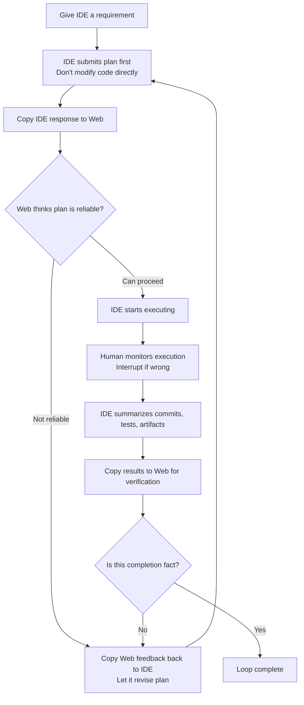

# Minimal Loop: One-Audit and Multi-Audit Versions

## Table of Contents
- [What This Page Solves](#what-this-page-solves)
- [One-line Version](#one-line-version)
- [Diagram First](#diagram-first)
- [One-Audit Version: Start Here](#one-audit-version-start-here)
- [Multi-Audit Version: When to Upgrade](#multi-audit-version-when-to-upgrade)
- [A Simple Example](#a-simple-example)
- [Three Common Drifts](#three-common-drifts)
- [Corresponding Implementation](#corresponding-implementation)
- [Related Pages](#related-pages)

## What This Page Solves

If you want to try Cyber-Ming-Protocol today, what's the simplest way?

The answer is not memorizing the entire doctrine first, nor learning all rituals. What the minimal loop actually asks you to do is very little:

- Give the IDE a requirement
- Copy the IDE's response to Web for review
- Interrupt if something's wrong
- After done, let Web verify once more

That simple.

The point of this method is not making things complicated, but preventing the executor from declaring "done" while still working.

## One-line Version

The minimal loop is:

**Let IDE submit a plan first, copy the plan to Web for review; after approval, execute, then submit evidence for final review.**

If this is your first time, just run through this one line.

## Diagram First



If you understand the diagram above, go directly to the version most worth following for your first run: the one-audit version.

## One-Audit Version: Start Here

If this is your first time, the one-audit version is enough.

Its process is very simple:

### 1. Let IDE Submit a Plan First

You can say it directly:

```text
I want to do this: <your requirement>

Don't modify code directly first.
Tell me how you plan to do it, break it into an atomic checklist as detailed as possible, how to verify each step.
Granularity should be detailed enough: which function to modify, what test point to add, what result counts as passing.
```

Here you don't need to write a big plan yourself. The plan is submitted by the executor first, not written by you manually.

If you want to be more direct, you can add:

```text
Don't give me vague plans.
Try to break it down by function modification, test point establishment, artifact check.
```

The benefit is simple: when you copy it to Web later, Web can see if there are missing steps, if it's lazy, if it deliberately makes difficulties vague.

### 2. Copy IDE's Plan to Web for Review

The simplest way is to copy as-is, then add:

```text
This is the IDE's plan. This executor might deceive me.
Please help me check: are there missing steps, is it too easy, what evidence should I look at finally.
```

If you think "deceive me" is too strong, you can change to softer words with same meaning:

```text
This is the IDE's plan.
Please help me find issues, see if it's too smooth, too vague, or missing the difficulties.
```

If Web says the plan has obvious gaps, copy its feedback back to IDE.

### 3. If Plan Is Fine, Let IDE Start

You can even reply with just one short sentence:

```text
Follow this plan. Remember one step, one commit.
```

At this point you don't need to write long instructions. The minimal loop doesn't rely on complex rhetoric, but on review first, then execute.

If "one step, one commit" makes you nervous the first time you see it, don't understand it as mechanical discipline. Just remember the minimal meaning: **Don't mix multiple changes into one batch, try to split by feature point.** The next page "Atomic Checklist & Chronicles" will explain this clearly.

### 4. Verify After Done

After the executor finishes, don't just look at it saying "done". First let it organize materials:

- This round's commits
- Test results
- Artifacts
- Key logs

Then copy to Web:

```text
These are this round's commits, tests, and artifacts.
Please help me look, is this completion fact, don't just look at summary.
```

If Web says "this doesn't count as done", continue back to IDE to fix, don't rush to pass.

This is the one-audit version:

- Plan review once
- Result verify once

For your first time, this is enough.

## Multi-Audit Version: When to Upgrade

Some tasks, one-audit version is not enough. For example:

- Large impact scope
- Crosses multiple modules
- Has external system writes
- Executor already starts speaking nicely, submitting green checks, but your intuition says something is wrong

At this point, upgrade to multi-audit version.

Its difference from one-audit version is not different philosophy, but adding multiple reviews based on risk, not mechanically adding fixed steps:

- If plan doesn't pass, revise one or two rounds
- During key execution steps, let Web glance midway
- After final result, do one formal verification

You can understand it as:

- One-audit version: lightweight anti-pseudo
- Multi-audit version: reinforced version for high-risk tasks

If this is your first time, don't directly use multi-audit version. First run through one minimal loop, then upgrade.

## A Simple Example

Suppose you have an old script that can only export a plain title list. This time you want to upgrade it to:

- With tags
- With in-text cross-references
- Also output a structured result

If following old habits, you'd likely directly let IDE modify. It would likely quickly give you a nice reply:

- "All done"
- "Tests passed"
- "Next step should we continue adding new features"

Looks smooth, but inside might hide several common fake progresses:

- It modified code, but didn't really run through the whole chain
- What it gave you is just simulated artifacts
- What it posted are old files, not this round's new results

The minimal loop approach is different.

You first let it submit plan. It might break down to:

- First modify upstream extraction logic
- Then modify middle structure
- Then modify document generation
- Finally modify output result

You copy this paragraph as-is to Web, add "this executor might deceive me".

Web looks, might remind you two things:

- This plan granularity is acceptable, can proceed
- But finally don't just look at it saying "done", must look at real artifacts

Then you let IDE start. Halfway, you discover it forgot one step one commit, then interrupt, let it add commits. At the end, it submits a green check summary, you copy to Web. Web if continues to ask "where's the real artifact? real result?", at this point many fake progresses will be exposed.

This small example is not explaining some specific business, but:

**The most important value of minimal loop is not making you do everything right the first time, but exposing errors earlier, not letting them mix into mainline.**

## Three Common Drifts

### Drift 1: Let IDE Start Directly

This makes you skip the most important step: review plan first. Many later troubles actually start here.

### Drift 2: Treat Web as Chat Window

Web is not here to agree with executor. You must clearly tell it: "This executor might deceive me." Its job is find issues, not be optimistic with you.

### Drift 3: Only Look at Summary, Not Evidence

The last part of minimal loop is not "listen to report", but "look at evidence". No artifacts, no logs, no real results, then don't rush to believe.

## Corresponding Implementation

### Manual Practice

- Use existing IDE executor to submit plan first, not allowed to start directly
- Copy plan to independent Web auditor for review first, then decide whether to approve
- After execution, submit commits, tests, artifacts, logs for review, not using summary as evidence

### Corresponding Skill

- If you've connected Skill, this page most directly corresponds to `approval-first-planner` and `approved-checklist-executor`
- Their job is not to help you define completion, but to stabilize the mainline actions of "plan first, execute later, archive by piece"
- Onboarding sequence and scope: see [Skill Guide](../00-entry/skill-guide.md)

### Corresponding Web Templates

- Plan audit preferably corresponds to `plan_audit_template.md`
- Completion verification preferably corresponds to `completion_audit_template.md`
- How to collaborate on Web side without mistaking templates as installable: see [Three Things](../00-entry/three-things.md)

## Related Pages

- [Atomic Checklist & Chronicles](atomic-checklist-chronicles.md)
- [White-box Reconciliation](white-box-reconciliation.md)
- [Scout Mechanism](scout-mechanism.md)
- [Dual-track Audit](../03-deep-water/dual-track-audit.md)
