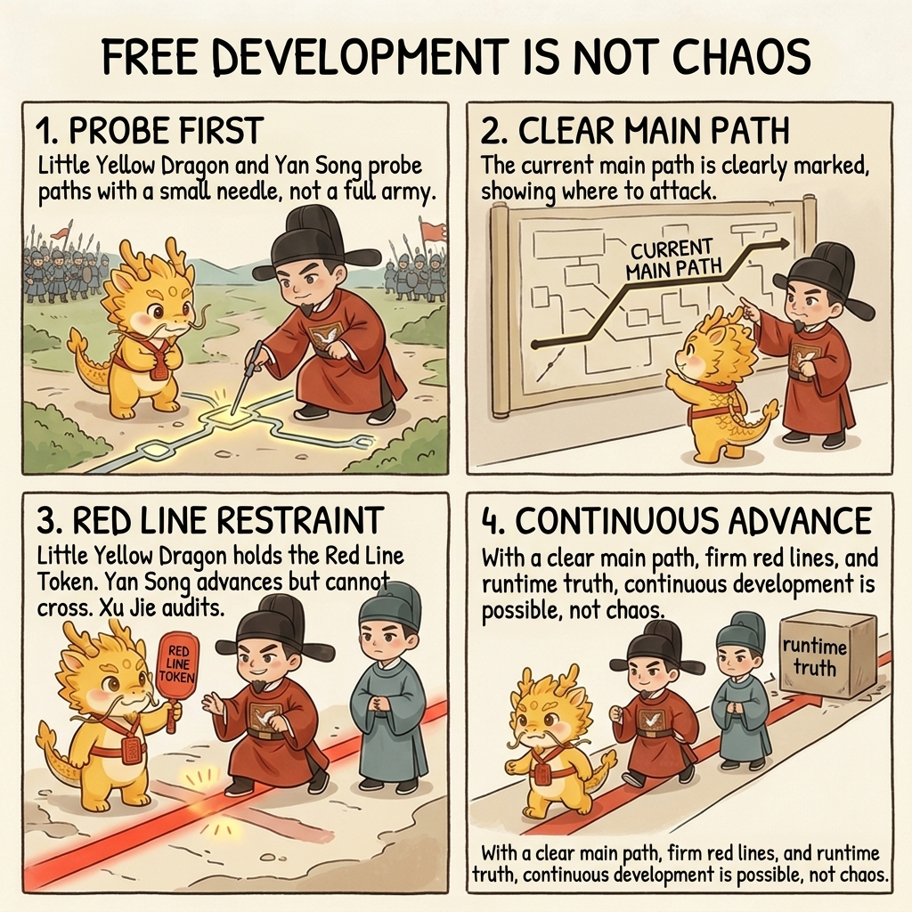
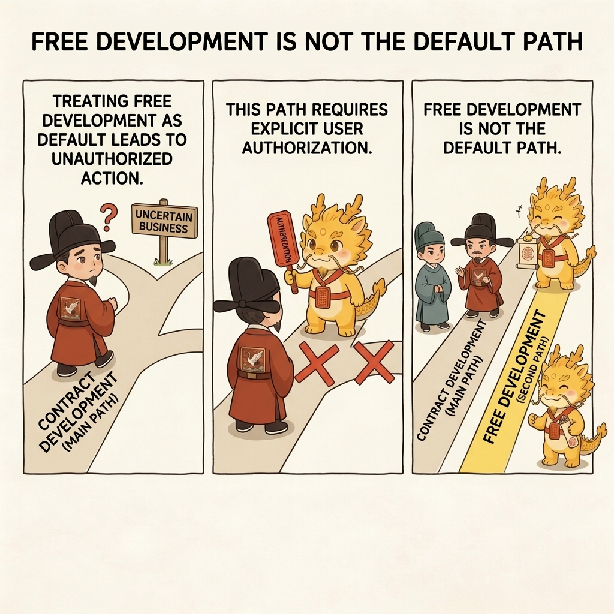
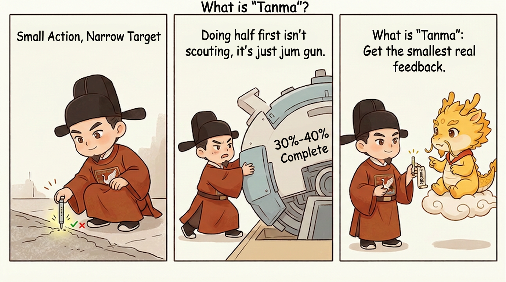
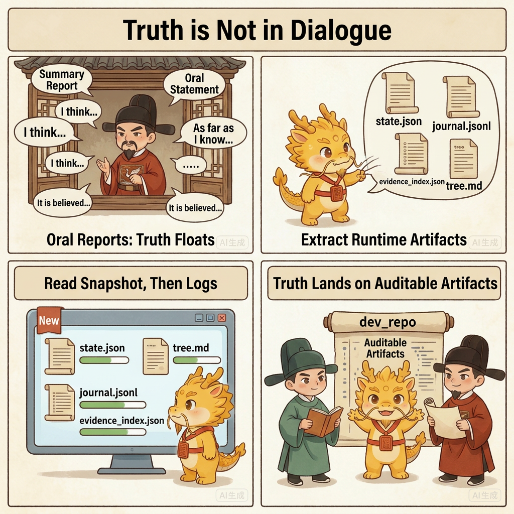
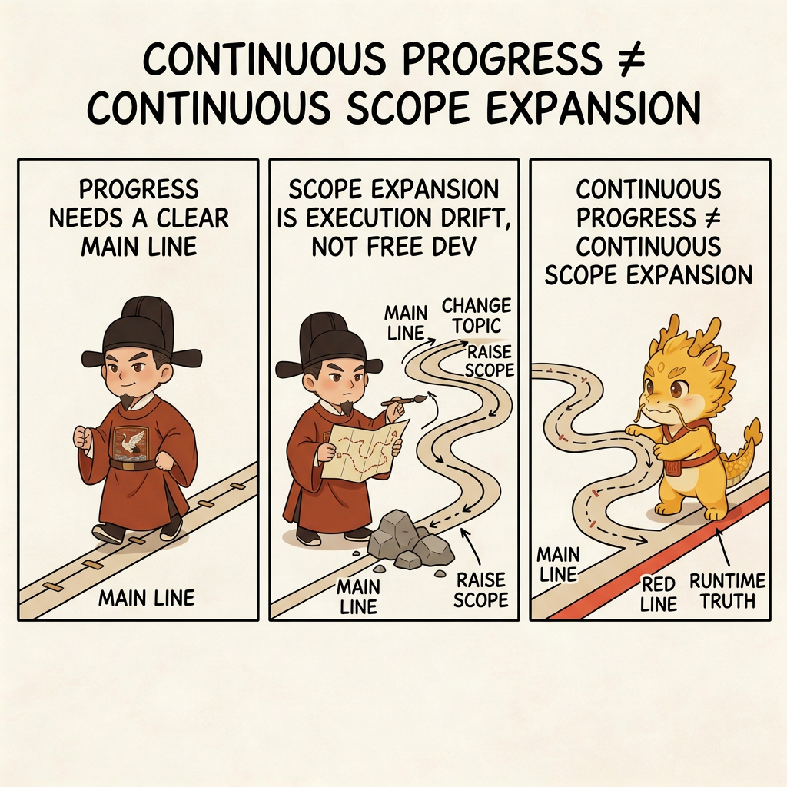

# Free Development Mode: Continue Under Uncertain Business Without Losing Control

## Table of Contents
- [What This Page Solves](#what-this-page-solves)
- [Shortest Definition](#shortest-definition)
- [Why It Is Not the Default Route](#why-it-is-not-the-default-route)
- [How It Relates to Scout](#how-it-relates-to-scout)
- [What It Actually Protects](#what-it-actually-protects)
- [Four Common Drifts](#four-common-drifts)
- [One-Line Conclusion](#one-line-conclusion)
- [Related Pages](#related-pages)

## What This Page Solves

This page answers one question:

**When the business itself still carries large uncertainty, scout is no longer enough, but you still cannot abandon governance, how do you continue long-running advance?**

Many deep-water tasks get stuck exactly here:

- you are no longer totally ignorant of the first truth/falsity layer
- but you are still far from being able to turn every later move into a stable contract
- if you pretend you already know everything, the plan becomes fake certainty
- if you simply let the executor run free, the whole system quickly slides back into black-box chaos

Free Development Mode is the protocol's answer to this middle zone.

## Shortest Definition

Its shortest definition is:

> Under an explicit mainline, explicit red lines, and explicit runtime truth, allow a continuous, controllable, accountable stretch of long-running development.

So it is not "stop asking questions and let me code." It is:

- the mainline is named first
- anti-routes are named first
- fake methods and poison methods are named first
- and only then is continuous advance allowed

## Why It Is Not the Default Route

Free Development Mode is not the default route, and it must not activate automatically.

It becomes active only when the user explicitly authorizes it, for example:

- `enter free development mode`
- `switch into free development`
- `use long-running free development mode`

Without that explicit authorization, the default path is still contract development:

- `approval-first-planner`
- `approved-checklist-executor`

So this mode does not abolish the old route. It formalizes a second execution route for business areas whose uncertainty is too high for fake precision.

## How It Relates to Scout

Free Development Mode is not the opposite of scout. It is a controlled continuation that can grow out of scout.

Scout is responsible for forcing out the first front-line layer of truth.

Only once:

- the frontmost real blocker has been compressed to a small enough size
- the current mainline is clear
- the remaining uncertainty looks more like ongoing business exploration than pure front-line black-box unknowns

does it become honest to shift from scout into free development.

So the more exact relation is:

- scout forces out first-hand truth
- free development keeps advancing continuously on top of that truth

## What It Actually Protects

### First, It Protects the Mainline

Free development does not mean "do whatever comes to mind." It means name the current mainline first, then keep advancing along it.

If a route can no longer answer what mainline it serves, it is no longer free development. It has already become execution drift.

### Second, It Protects Runtime Truth

The longer free development runs, the less acceptable it becomes to preserve truth only in oral form.

So it must keep alive:

- `dev_repo/state.json`
- `dev_repo/journal.jsonl`
- `dev_repo/evidence_index.json`
- `dev_repo/tree.md`

That means free development does not abolish the contract tree. It keeps the tree alive during long-running advance.

### Third, It Protects the Red Lines

Free development may reduce repeated ceremony, but it does not relax red lines.

It still requires things like:

- one step, one commit
- no advance without evidence
- progress updates for long-running commands
- an honest `blocker_class / stop_reason / next_exact_action` whenever execution stops

### Fourth, It Protects Method Discipline

In deep water, the greatest danger is not only slowness. It is accelerating under the wrong method.

So Free Development Mode emphasizes:

- do not let a demo path impersonate the real path
- do not let a successful CLI run impersonate product completion
- do not use wrappers to dodge the real framework
- do not let a local firefight silently replace the mainline

## Four Common Drifts

### Drift 1: Interpreting Free Development as Cancelling Approval

No. What it removes is repeated unnecessary ceremony, not the mainline, not evidence, and not the red lines.

### Drift 2: Interpreting Free Development as Skipping Scout

No. Real free development usually stands exactly on top of a scout phase that has already compressed the first layer of truth.

### Drift 3: Entering Free Development and Then Dropping `dev_repo`

That makes current truth evaporate back into chat and leaves you with a progress-looking narrative instead of a runtime truth container.

### Drift 4: Rewriting Continuous Advance as Continuous Scope Expansion

Free development allows continuous advance. It does not allow you to keep changing the question, switching the route, or inflating scope every time a blockage appears.

## One-Line Conclusion

The thing this mode truly protects is not "finally I do not have to write plans anymore." It is this:

**When the task is already too uncertain for fake omniscience, the mainline must still stay clear, the red lines must still stay hard, runtime truth must still stay externalized, and only then may continuous advance continue.**

It does not abandon governance. It upgrades governance from "re-explain everything every step" to "keep advancing on top of runtime truth."

## Related Pages

- [Scout Mechanism: Test the Path First, Then Deploy the Army](../02-how/scout-mechanism.md)
- [Campaign Runtime Guide](../../dev_repo/README.md)
- [Why a Child Contract Must Not Silently Replace the Parent Contract](parent-contracts.md)
- [Boundaries and Unresolved Battlefields](boundaries.md)
