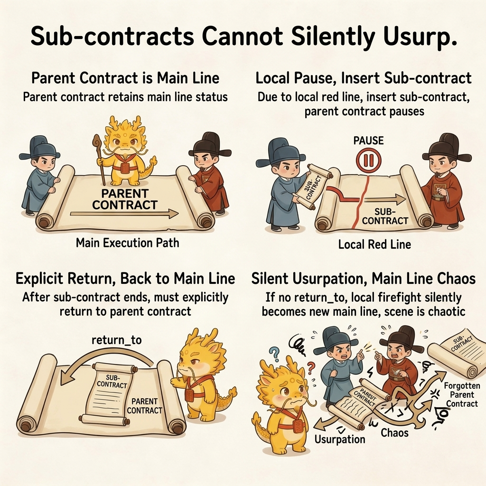
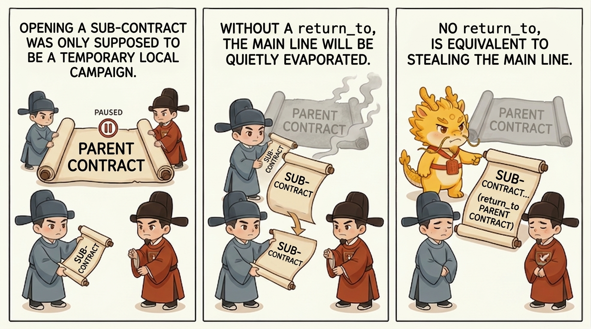
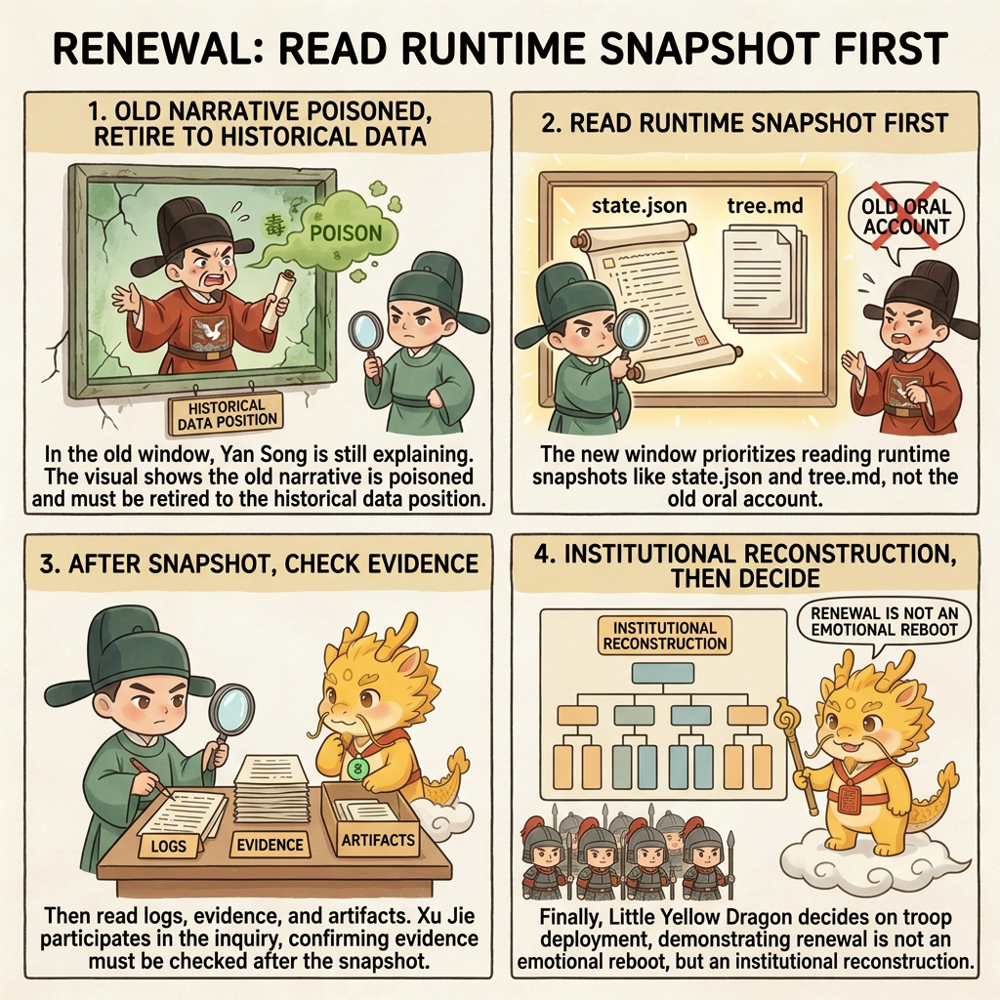
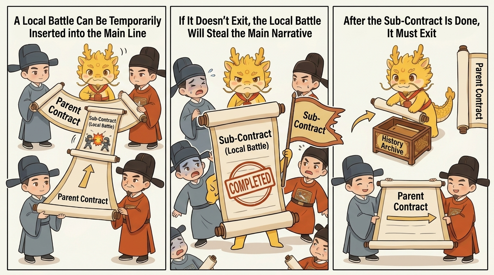

# Why a Child Contract Must Not Silently Replace the Parent Contract

## Table of Contents
- [What This Page Solves](#what-this-page-solves)
- [Shortest Definition](#shortest-definition)
- [Why This Is a Hard Boundary](#why-this-is-a-hard-boundary)
- [What Nested Contracts Actually Protect](#what-nested-contracts-actually-protect)
- [Minimum Runtime Rules](#minimum-runtime-rules)
- [Four Common Drifts](#four-common-drifts)
- [One-Line Conclusion](#one-line-conclusion)
- [Related Pages](#related-pages)

## What This Page Solves

This page answers one question:

**Why a child contract may pause the parent contract, but must never silently replace it.**

Many forms of execution drift do not come from a total absence of planning. They come from a subtler slide:

- the parent contract has not actually ended
- a child contract gets opened to clear a mine, patch a hole, or inspect one chain
- after a while, everyone starts talking only about the child contract
- soon after that, nobody can still say whether the original main line is alive at all

Once that happens, project progress, cognitive debt, renewal, and audit all start blurring together.

## Shortest Definition

The parent/child relation can be compressed into one sentence:

> A child contract may pause the parent contract, but it may not silently usurp it.

That means:

- a child contract is a temporary local campaign
- the parent contract still holds mainline status
- once the child contract closes, execution must explicitly return to the parent, unless the parent has been honestly declared `abandoned`

## Why This Is a Hard Boundary

Without this boundary, three kinds of damage appear very quickly.

### First, the Mainline Evaporates

People naturally drift toward discussing the hottest fire in front of them.

So the system may still look as if it is "advancing," while becoming worse and worse at answering:

- What is the root campaign right now?
- Is this current step part of the mainline, or only a local firefight?
- When this slice ends, where does execution return?

At that point, "project progress" starts degrading into an impression.

### Second, Cognitive Debt Suddenly Steepens

If the child contract silently replaces the parent contract, later readers can no longer tell:

- why the current active contract was opened
- whether it is solving the root problem or only one blocking chain
- why a local repair suddenly became the new main narrative

Then cognitive debt is no longer only about missing details. It becomes state-judgment distortion.

### Third, Renewal and Takeover Both Lose Blood

When renewal becomes necessary, a fresh window most urgently needs to know:

- what war is being fought right now
- whether the parent contract has been paused
- where execution returns after the current child contract is done

If that information has not been externalized, the new window falls straight back into the narrative inertia of old conversation.

## What Nested Contracts Actually Protect

Nested contracts do not mainly protect document neatness. They protect three harder things.

### First, Project-Progress Visibility

As long as the parent/child relation still exists, `dev_repo/state.json` and `dev_repo/tree.md` can keep answering:

- the current mainline
- the current subline
- the pause relation
- `return_to`

That means project progress no longer depends only on human memory.

### Second, Handles for Cognitive-Debt Repayment

Cognitive debt fears not only complexity, but state misjudgment.

Once nested contracts externalize "which layer the system is actually stuck in right now," later debt repayment can begin from runtime truth instead of from polished summaries.

### Third, Sovereignty Recovery During Renewal

An old window may be demoted into historical material, but the parent/child contract tree must not evaporate with it.

As long as the contract tree still stands, renewal is no longer "open another window and hope." It becomes:

- read the current tree first
- read the historical material and evidence second
- then decide whether to return to the parent, continue the child, or honestly open a new root campaign

## Minimum Runtime Rules

Once the system truly enters parent/child nesting, at least the following fields should be externalized into `dev_repo/`:

- `contract_id`
- `parent_contract_id`
- `root_campaign`
- `summary`
- `status`
- `goal`
- `return_to`
- `why_opened`
- `red_line_crossed`

And three hard rules should remain in force:

1. After opening a child contract, the parent contract must be readable as something like `paused_for_child`
2. When the child contract closes, the runtime must explicitly say whether execution:
   - returns to the parent
   - remains blocked
   - or requires a narrower child delta
3. If `return_to` cannot be answered honestly, the contract tree has already deformed

## Four Common Drifts

### Drift 1: Writing an Ordinary Replan as a New Child Contract

Not every replan deserves a new child contract. Open one only when the local campaign is now independent enough that failing to record it would distort the parent.

### Drift 2: Opening a Child Contract but Never Writing `return_to`

This is one of the most dangerous drifts. On the surface it sounds like "let me finish this slice first." In reality it often means the parent is being quietly erased.

### Drift 3: The Child Contract Is Finished, but It Keeps Occupying the Main Narrative

When a local firefight is already done, refusing to return to the parent contract turns "temporary repair" into "the new mainline."

### Drift 4: Treating Numbering as a Contract Tree While Leaving the Summaries Empty

A contract tree that has identifiers but no readable summaries will eventually collapse back into a list that looks formal but says nothing useful.

## One-Line Conclusion

The key thing to nail down is not "plans should look tidier." It is this:

**Local campaigns may insert themselves into the mainline, but they may not steal the mainline.**

Only when parent/child relations, pause relations, and `return_to` are explicitly externalized do project progress, debt repayment, renewal, and takeover regain real handles.

## Related Pages

- [Campaign Runtime Guide](../../dev_repo/README.md)
- [Cyber Cognitive Debt: The Widening Gap, Warning Signals, and Credible Repayment](cognitive-debt.md)
- [Seven Stars Renewal](seven-stars-renewal.md)
- [Free Development Mode: Continue Under Uncertain Business Without Losing Control](free-development-mode.md)
