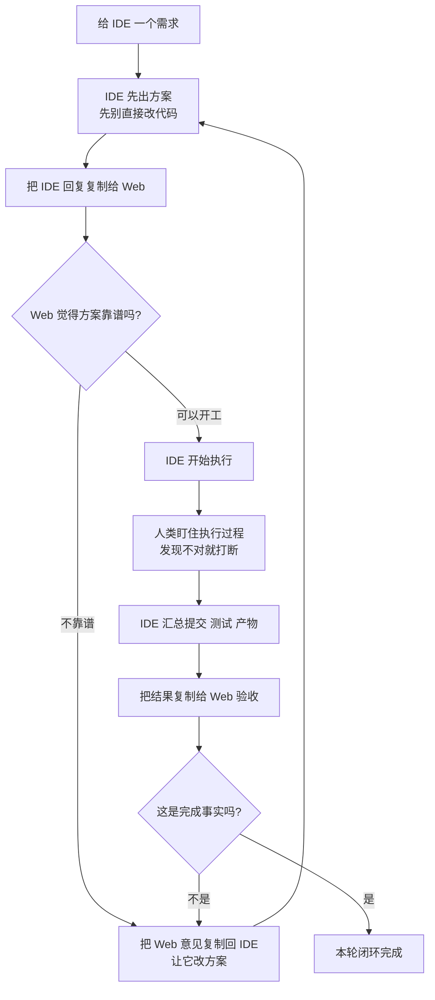

# 最小闭环：一次审计版与多次审计版

## 这一页解决什么问题

如果你今天就想试一次 Cyber-Ming-Protocol，最简单的做法是什么？

答案不是先把整套法统背完，也不是先学会所有礼法。最小闭环真正要你做的事情其实很少：

- 给 IDE 一个需求
- 把 IDE 的回复复制给 Web 审一下
- 觉得不对就打断
- 做完再让 Web 验一次

就这么简单。

这套方法的重点，不是把事情搞复杂，而是别让执行位一边干活，一边自己宣布“已经完成”。

## 一句话版

最小闭环就是：

**先让 IDE 出方案，再把方案复制给 Web 审；通过后再执行，最后拿证据再审一次。**

如果你第一次上手，只要先跑通这一条线就够了。

## 一张图先看懂



如果上面那张图你已经看懂了，下面就直接进入第一次上手最值得照着跑的一版：一次审计版。

## 一次审计版：第一次上手就用这个

如果你是第一次试，直接用一次审计版就够了。

它的流程非常简单：

### 1. 先让 IDE 出方案

你可以直接这样说：

```text
我要做这件事：<你的需求>

先别直接改代码。
先告诉我你准备怎么做，拆成尽可能细的原子清单，每步怎么验收。
颗粒度尽量细到：改哪个函数、加什么测试点、看什么结果算通过。
```

这里不要求你自己先写一大堆计划。计划是让执行位先交上来的，不是让你手工先写完。

如果你想说得再白一点，也可以直接补一句：

```text
不要给我大而化之的计划。
尽量按函数修改、测试点设立、产物检查来拆。
```

这样做的好处很简单：后面你复制给 Web 审的时候，Web 才看得出它有没有漏步、有没有偷懒、有没有把难点故意说粗。

### 2. 把 IDE 的方案复制给 Web 审一下

最简单的做法，就是原样复制，再补一句：

```text
这是 IDE 的方案。这个执行位可能骗我。
请你帮我看：有没有漏步、有没有把事情说得太容易、最后我要看什么证据。
```

如果你觉得“骗我”这三个字太重，也可以换成更软一点但意思不变的说法：

```text
这是 IDE 的方案。
请你帮我挑毛病，看它有没有把事情说得太顺、太粗，或者把难点漏掉。
```

如果 Web 说方案有明显缺口，就把它的意见原样复制回 IDE。

### 3. 方案没问题，再让 IDE 开始做

你甚至可以只回一句很短的话：

```text
按这个改。记得一步一 commit。
```

这时你不用一直写长指令。最小闭环不是靠复杂话术成立，而是靠先审后做。

如果你第一次看到“一步一 commit”有点紧张，先不用把它理解成机械纪律。你只要先记住最小意思就够了：**不要把几步改动混成一团，尽量按功能点切开。** 后面的《核心礼法之一：原子级任务清单与赛博起居注》会把这件事讲顺。

### 4. 做完后再验一次

执行位做完后，不要只看它说“好了”。先让它把材料整理出来：

- 本轮 commit
- 测试结果
- 产物
- 关键日志

然后再复制给 Web：

```text
这是本轮提交、测试和产物。
请帮我看，这是不是完成事实，不要只看总结。
```

如果 Web 说“这还不算完成”，你就继续回到 IDE 修，不要急着过关。

这就是一次审计版：

- 方案审一次
- 结果验一次

第一次上手，用这个就够了。

## 多次审计版：什么时候再升级

有些任务，一次审计版就不够了。比如：

- 影响面很大
- 跨多个模块
- 有外部系统写入
- 执行位已经开始说漂亮话、交绿勾，但你直觉不对

这时候就升级成多次审计版。

它和一次审计版的区别不是理念不同，而是按风险多插几次复审，而不是机械增加固定步骤：

- 方案不过，就来回改一两轮
- 执行到关键步骤时，再让 Web 中途看一眼
- 最终结果出来后，再做一次正式验收

你可以把它理解成：

- 一次审计版：轻量防伪
- 多次审计版：高风险任务的加固版

如果你第一次试，不用直接上多次审计版。先跑通一次最小闭环，再升级。

## 一个简单例子

假设你有一个旧脚本，现在只能导出一份纯标题列表。你这次想把它升级成：

- 带标签
- 带文内交叉引用
- 同时再落一份结构化结果

如果按老习惯，你很可能会直接让 IDE 去改。它也很可能很快给你一份漂亮答复：

- “都改好了”
- “测试通过了”
- “下一步要不要继续加新功能”

看上去很顺，但里面可能藏着几种很常见的假推进：

- 它改了代码，但没真实跑过整条链路
- 它给你的只是模拟产物
- 它贴出来的是旧文件，不是这轮新结果

最小闭环的做法就不一样。

你先让它出方案。它可能会拆成：

- 先改上游提取逻辑
- 再改中间结构
- 再改文档生成
- 最后改落盘结果

你把这段原样复制给 Web，再补一句“这个执行位可能骗我”。

Web 一看，可能会提醒你两件事：

- 这份方案粒度还行，可以做
- 但最后别只看它说“完成了”，一定要看真实产物

然后你让 IDE 开工。做到一半，你发现它忘了一步一 commit，那就打断，让它补提交。做到最后，它递上一份绿勾总结，你再复制给 Web。Web 如果继续追问“真正的产物呢？真实结果呢？”，这时很多假推进就会露馅。

这个小例子要说明的不是某个具体业务，而是：

**最小闭环最重要的价值，不是让你第一次就做对所有事，而是让错误更早暴露，不要混进主干。**

## 最常见的三种跑偏

### 第一种：直接让 IDE 开工

这会让你跳过最重要的一步：先审方案。很多后面的麻烦，其实都从这里开始。

### 第二种：把 Web 当陪聊窗口

Web 不是来附和执行位的。你要明确告诉它：“这个执行位可能骗我。”它的职责是挑毛病，不是陪着乐观。

### 第三种：只看总结，不看证据

最小闭环最后一环不是“听汇报”，而是“看证据”。没有产物、没有日志、没有真实结果，就先别急着相信。

## 对应落地点

### 手工实践方式

- 用现有 IDE 执行位先交方案，不许直接开工
- 把方案复制给独立 Web 审计位先审，再决定是否放行
- 执行后再把提交、测试、产物、日志送审，不以总结代替证据

### 对应 Skill

- 如果你已经接入 Skill，这一页最直接对应的是 `approval-first-planner` 与 `approved-checklist-executor`
- 它们的职责不是替你定义完成，而是把“先规划、后执行、按片归档”的主干动作稳定下来
- 接入顺序与范围可回看 [`../00-开始这里与落地形态/安装与最小使用`](../00-开始这里与落地形态/安装与最小使用.md)

### 对应 Web 模板

- 方案审计优先对应 `plan_audit_template.md`
- 完成验收优先对应 `completion_audit_template.md`
- 如何在 Web 侧协作而不是把模板误当安装物，可回看 [`../00-开始这里与落地形态/Web 审计模板怎么协作：它不是本地 Skill`](../00-开始这里与落地形态/Web-审计模板怎么协作：它不是本地-Skill.md)

## 相关页面

- [核心礼法之一：原子级任务清单与赛博起居注](核心礼法之一：原子级任务清单与赛博起居注.md)
- [白盒物理对账：什么算完成事实](白盒物理对账：什么算完成事实.md)
- [赛博探马机制：先试链路，再上大军](赛博探马机制：先试链路，再上大军.md)
- [双轨隔离审计与皇权居中](../03-治理扩展、吞吐补偿与边界/双轨隔离审计与皇权居中.md)
