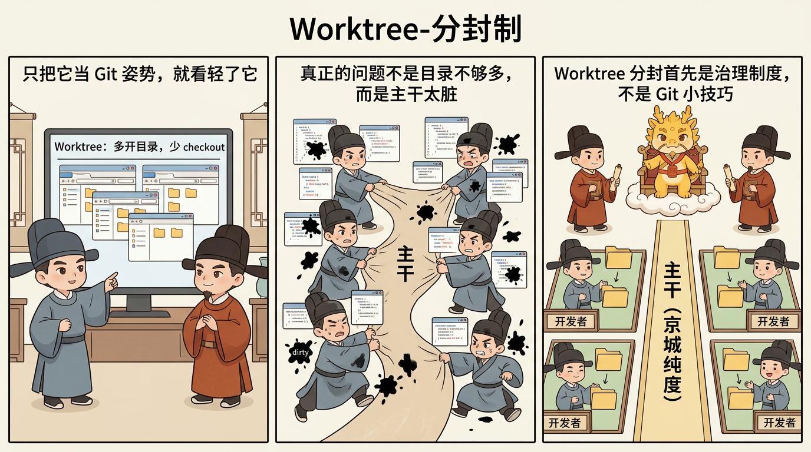

# Worktree-分封制：封地、入京与主干纯度

## 目录
- [这一页解决什么问题](#这一页解决什么问题)
- [发现问题：为什么主干会在团队协作里迅速变脏](#发现问题为什么主干会在团队协作里迅速变脏)
- [分析问题：为什么真正该分封的不是代码目录，而是上下文主权](#分析问题为什么真正该分封的不是代码目录而是上下文主权)
- [解决问题：Worktree-分封制怎样支持团队协作与主干纯度](#解决问题worktree-分封制怎样支持团队协作与主干纯度)
- [常见误解](#常见误解)
- [一句话压轴](#一句话压轴)
- [相关页面](#相关页面)

## 这一页解决什么问题

很多人第一次听到 `git worktree` 时，脑中浮现的往往只是一个很小的技术用途：多开几个工作目录，切换不同分支时少一点来回 checkout 的麻烦。

如果只把它理解到这里，这一页就没有必要存在。

在 Cyber-Ming-Protocol 里，Worktree 分封制根本不是“更方便的 Git 姿势”，而是一套直接指向深水区团队协作的治理制度。它要解决的，不是“怎么让多人都能同时改代码”，而是一个更硬的问题：

**为什么主干不该成为共享脏上下文的战场，为什么真正的协作不是多人在同一锅里搅上下文，而是一人一封地、一地一内阁，最后择优入京。**

所以这一页真正要回答的是：

- 为什么高风险协作里，主干最怕的不是改动多，而是上下文脏
- 为什么 Worktree 分封首先是一种人类协作模型，而不是 AI 小技巧
- 为什么一人一封地、一地一内阁，会比多人共用一个战场更容易保住主干纯度
- 什么叫“入京奏对”，以及为什么主干应该像京城，而不是前线工地

先把最核心的判断钉死：

**协作的本质不是共享上下文，而是分封上下文。**

这里也要主动保留一个边界意识：本页首先给出的，是一种面向深水区团队协作的治理模型，而不是一份已经在大型团队里被长期跑透、把所有制度细部都验证完毕的作战手册。它已经足够回答主干纯度、协作单位、责任边界与入京节奏这些结构问题；但更大规模团队里的角色分配、跨封地冲突裁决、组织成本与合并节奏，还需要未来更多真实样本继续展开。

## 发现问题：为什么主干会在团队协作里迅速变脏

很多团队对协作的默认想象，其实都很接近同一种画面：

- 大家围着同一个仓库主线转
- 每个人都在这条主线上不断拉新改动
- AI 也跟着每个人的本地上下文、高频试错和临时修补一路混进去
- 最后再靠 review、回滚、补丁和加班，把主线勉强收回来

这套方式在浅水区还能勉强运转，但到了深水区，它最容易把主干拖进一种更危险的状态：**主线代码也许还没完全坏，主线语境却已经先脏了。**

这里的“脏”，不只是指代码风格不整齐，而是指下面几件事会一起发生：

### 第一，临时探索和正式推进混在一起

你本来只是想试一个探针、验证一条链路、做一次高风险拆迁，结果所有试错痕迹、临时补丁、半成品结构都直接落在同一片主线工作区里。

这时系统表面上看还在“协作”，实际上却在不断把实验垃圾往主干边缘推。

### 第二，责任边界开始蒸发

只要多人共搅一锅主线，很快就会出现这种局面：

- 这段是谁先改坏的，说不清
- 这组补丁是谁为了救火顺手叠上去的，也说不清
- 这条上下文污染是哪个窗口带进来的，更说不清

当责任边界开始蒸发时，团队就会越来越难判断：该打断谁、该回滚哪里、该让谁来接手。

### 第三，失败实验的清理成本高得离谱

如果失败探索发生在独立封地，最坏的结果往往只是删掉一块失败领地；但如果失败探索直接在主线附近展开，最后就不是“删掉一次试验”，而是“清理一锅已经互相粘连的烂摊子”。

深水区真正贵的，从来都不是多开几个工作目录，而是：

- 主干污染
- 回滚抓手流失
- 多人协作后的语义串味
- 失败探索与正式成果缠成一团

### 第四，团队协作退化成共享脏上下文

这是最容易被忽视的一点。很多团队以为自己在共享的是“项目知识”，实际上共享的常常是一团未经裁决、未经隔离、未经去毒的混合上下文。

而一旦上下文本身开始脏，AI 加速不是在放大协作能力，而是在放大污染速度。

所以这页要钉死的第一个判断就是：

**主干最怕的，不是改动频繁，而是被多人和多窗口一起拖成共享脏上下文战场。**

## 分析问题：为什么真正该分封的不是代码目录，而是上下文主权

Worktree 分封真正新颖的地方，不在于“多开目录”，而在于它把协作问题从“怎么共享一个工作区”改写成“怎么切开多个主权边界”。

### 第一，分封的对象不是 AI，而是人类开发者

这一点必须先收清。

Worktree 不是给 AI 乱窜的走廊，而是给人类开发者准备的物理隔离封地。每个封地都对应一个明确的人类主位，由这个人带着自己的 AI 内阁在领地内治理。

也就是说：

- 封地主人是人，不是 agent
- AI 是封地内阁，不是到处流窜的诸侯
- 真正被分开的，是人类治理边界，而不只是文件夹路径

### 第二，一人一封地，一地一内阁

这就是 Worktree 分封制最重要的制度表达。

所谓一人一封地，不只是说“每个人有自己的目录”，而是说：

- 每个开发者在自己的 Worktree 内治理自己的执行位与审计位
- 领地内的试错、重构、探链、验证，在本地自治完成
- 封地之间彼此隔离，不共享脏上下文，不互相接管半成品叙事

而一地一内阁，则进一步说明：每块封地内部都应有自己的治理闭环，而不是几个人共用一套 agent 聊天链、一套脏上下文、一套混乱试错史。

这时候，协作才第一次真正从“多人同锅翻炒”变成“多人分地自治”。

### 第三，诸侯有治理权，但没有封禅权

这句话非常重要。

封地不是主干的缩小版，更不是谁在自己目录里跑通了就自动有资格并进主线。封地内当然可以有高度自治：

- 可以探索
- 可以重构
- 可以试错
- 可以反复打磨

但封地没有最终封禅权。也就是说，封地里的成果并不因为“我这里看起来已经好了”就天然配进主干。

它仍然必须满足：

- 有起居注抓手
- 有白盒证据链
- 有可回滚边界
- 有入京前的最终审计

只有这样，封地自治才不会重新滑回“每个人在自己角落里把幻觉打磨得更完整”。

### 第四，主干应该是京城，不是前线工地

这就是“主干纯度”真正要守住的东西。

主干的意义，不是容纳所有探索，而是容纳已经通过白盒核验、能被主线继续承接的成果。它应该像京城：

- 不负责承担每一场局部试错
- 不负责暂存每一团半成品上下文
- 不负责替每个失败实验擦屁股

它负责的是最后的汇总、裁决和长期可维护性。

所以“入京”不是浪漫说法，而是一个明确制度边界：

**前线可以混乱地试，京城不可以混乱地收。**

## 解决问题：Worktree-分封制怎样支持团队协作与主干纯度

把前面的判断落回操作层，Worktree 分封制其实可以收成四个非常清楚的动作。

### 第一步：先裂土，再开工

一旦任务进入高风险拆迁、架构重写、并行探索、多人协作这些场景，默认不应直接围着主干开工，而应先做裂土动作：

- 按人分封，而不是按 agent 乱窜
- 按明确目标划封地，而不是让一块封地无限泛化
- 按风险面切开，而不是把多个大问题混在一块领地里

这一步最重要的，不是工具命令本身，而是思路转换：

**先建立边界，再允许推进。**

### 第二步：封地内自治，但自治必须自带治理

一旦封地立起来，封地主人就要在自己的领地内运行完整治理闭环，而不是把 Worktree 仅仅当成隔离目录。

这意味着封地里仍然要有：

- 原子执行合同
- 高密度 Git 起居注
- 执行位与审计位分离
- 白盒物理对账
- 需要时的打断与续命

也就是说，Worktree 分封不是替代前面的礼法，而是给前面的礼法提供更稳的物理承载面。

没有这些礼法，封地只会变成“主干之外的另一个脏战场”；有了这些礼法，它才配叫封地。

### 第三步：入京奏对，只带成熟工件，不带脏上下文

封地与主干真正发生关系的时刻，不是“我觉得差不多了”，而是入京奏对。

所谓入京，不是简单发个 PR，而是带着一整套可被裁决的材料回到主干前：

- 这块封地到底解决了什么
- 关键起居注与状态跃迁是什么
- 哪些证据证明它真的站得住
- 如果要回滚，抓手在哪里

只有这套东西站得住，主干才值得接纳它。

所以入京奏对的核心，不是“把代码交上去”，而是：

**把一块已经在封地内打磨到足够纯净、足够可审、足够可接手的成果送去京城裁决。**

### 第四步：失败分封可弃，主干纯度不可弃

这条看起来最冷酷，但其实最务实。

Worktree 分封制最值钱的一点，不是每块封地都会成功，而是：哪怕失败，也不必连带污染主干。

这意味着团队第一次真正拥有了一种更便宜的失败方式：

- 一块封地失败了，可以删地重来
- 一次探索走歪了，可以局部弃子
- 一组 AI 上下文脏了，可以封地内止损

而不是每次都要在主线上做灾后清淤。

所以主干纯度真正保住的，不只是代码干净，更是团队在长期协作里仍然保有：

- 清晰责任边界
- 明确回滚抓手
- 可审计的合并入口
- 不被失败探索拖垮的主线秩序

### 第五步：团队扩展不是让一个人审所有 AI，而是让每个人在自己的封地里担责

这条对团队尤其重要。

Worktree 分封制之所以天然支持团队，不是因为总架构师突然就能白盒审计所有人，而是因为它重新定义了协作单位：

- 不是“一个大仓库里的一锅上下文”
- 而是“许多各自带治理闭环的封地”

这样一来，团队扩展的方式也变了：

- 每个开发者在自己的封地里统御自己的 AI 内阁
- 每个封地对自己的证据链和纯度负责
- 主干只面对已经入京的成熟成果，而不是前线泥浆

这才是它为什么不只是单兵技巧，而是人类协作模型的原因。

到这里为止，这一页已经足够给出一个很强的团队协作制度蓝图：主干怎么守、封地怎么划、责任边界怎么立、入京节奏怎么定。但如果再往前一步，进入更大规模团队中的跨封地接口争议、最终裁决负荷分配、统一规范落地与长期组织成本，这些问题就还需要后续战报和样本继续补实，而不能在这里假装已经全部平掉。

## 常见误解

### 第一种：Worktree 分封只是更方便的 Git 用法

不对。这里最核心的不是“目录切得更好”，而是“上下文主权切得更清”。如果没有人类主位、封地自治和入京裁决，单纯多开几个目录并不能自动带来主干纯度。

### 第二种：只要有分支就够了，没必要讲 Worktree

分支解决的是版本线索，Worktree 更强调物理隔离与上下文隔离。前者让你有不同历史线，后者让你真的不必在同一工作区、同一套脏现场里来回搅动。

### 第三种：分封意味着大家彼此不协作

恰好相反。分封不是取消协作，而是给协作加边界。没有边界的协作，很容易滑成互相制造污染；有边界的协作，才有可能在主干处高质量会师。

### 第四种：封地内跑通了，就应该直接并进主线

不行。诸侯有治理权，但没有封禅权。封地里的成功，必须经过入京奏对和主线裁决，才配进入京城。

### 第五种：这套制度只适合单兵，不适合团队

这正好说反了。它最值钱的地方之一，就是让团队协作不再依赖共享脏上下文，而是依赖许多各自带治理闭环的独立封地。团队越大，这条边界反而越重要。

### 第六种：这页已经把大型团队协作的所有现实细节都解决完了

也没有。本页已经足够提出一个强有力的团队协作治理模型，但它最强的部分首先是结构判断、制度边界与主干纯度逻辑，而不是“已经在大型团队里把所有角色分配、冲突裁决和组织成本都跑透了”。这不是退缩，而是边界诚实。

## 一句话压轴

Worktree-分封制真正要钉死的，不是“多人可以并行开发”，而是：

**在深水区团队协作里，真正该被隔离的不是几份代码副本，而是几套各自负责、各自审计、各自留痕、最后才有资格入京的上下文主权；只有这样，主干才不会沦为共享脏上下文的战场。**

主干一旦守住纯度，团队协作才不是互相制造烂摊子，而是各自封地自治、最后京城会师。

## 相关页面

- [双轨隔离审计与皇权居中](双轨隔离审计与皇权居中.md)
- [从编码者到治理者：这套协议要求开发者具备什么](从编码者到治理者：这套协议要求开发者具备什么.md)
- [七星灯续命法](七星灯续命法.md)
- [脉冲分封制：高治理下的吞吐补偿](脉冲分封制：高治理下的吞吐补偿.md)
- [相关工作与方法论坐标](../01-哲学与坐标/相关工作与方法论坐标.md)
