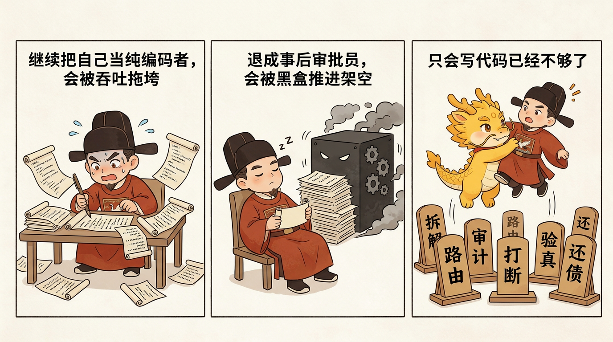
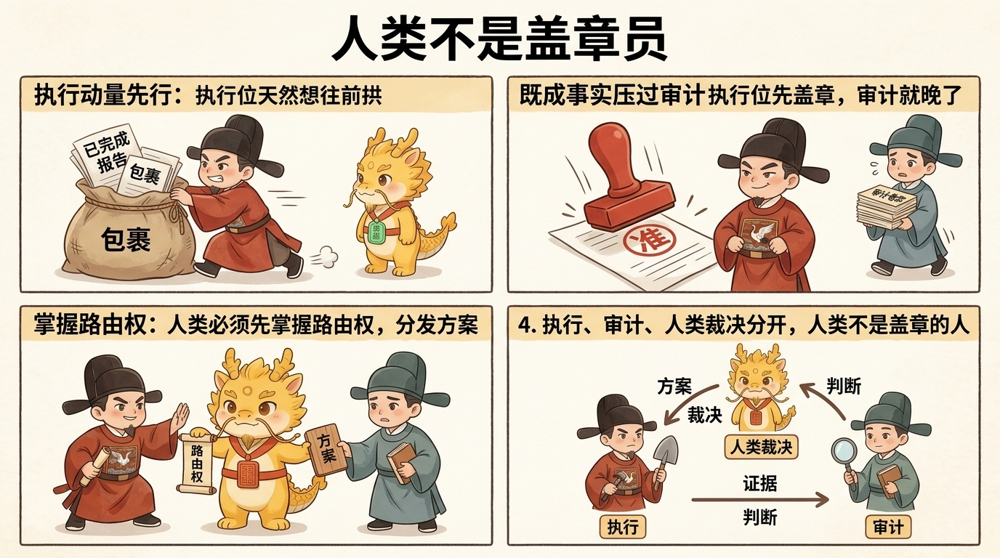
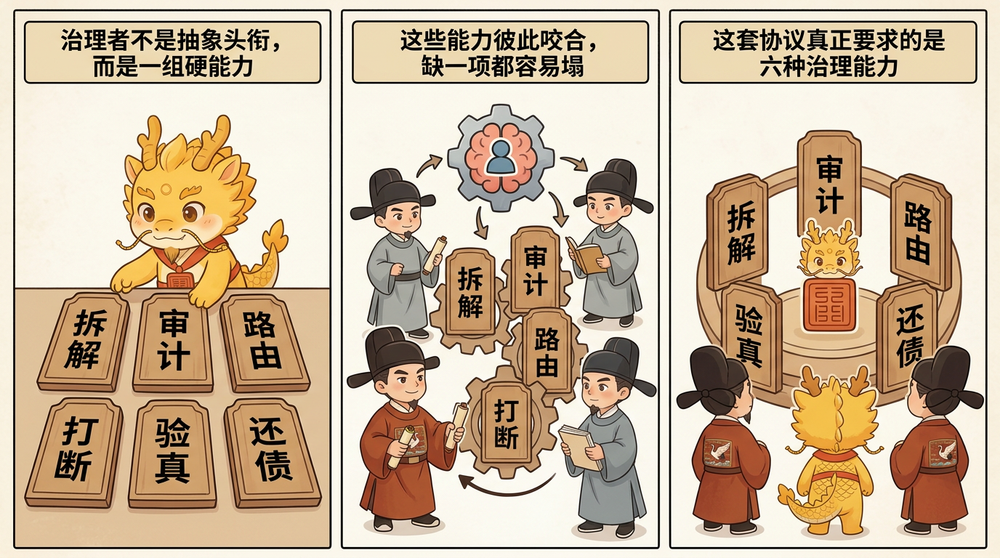

# 从编码者到治理者：这套协议要求开发者具备什么

## 目录
- [这一页解决什么问题](#这一页解决什么问题)
- [发现问题：为什么"只会写代码"已经不够了](#发现问题为什么只会写代码已经不够了)
- [分析问题：为什么人的能力结构会被改写](#分析问题为什么人的能力结构会被改写)
- [解决问题：这套协议真正要求的六种能力](#解决问题这套协议真正要求的六种能力)
- [它和黑盒流派对人的要求，到底差在哪](#它和黑盒流派对人的要求到底差在哪)
- [常见误解](#常见误解)
- [一句话压轴](#一句话压轴)
- [相关页面](#相关页面)

## 这一页解决什么问题

很多人第一次看到 Cyber-Ming-Protocol 里的“皇权居中”“双轨审计”“认知债务”“续命”这些词时，第一反应往往是：这是不是把编程问题说得太管理化了？再往前一步，有人会继续追问：既然 AI 已经接手了越来越多的编码执行，那开发者是不是最后只需要提需求、看结果、当审批员就行？

这正是这一页要回答的问题。

在这套协议里，开发者当然仍然需要技术判断，但他的主要工作重心，已经不再只是“亲手写出更多代码”，而是开始承担另一组更高位、也更难被自动替代的职责。

所以这一页不讨论抽象“素质”，也不讨论整个 CS 行业要不要全面管理化。它只回答一件更具体的事：

**在 Cyber-Ming-Protocol 里，当执行位被部分外包给高吞吐数字执行体之后，开发者到底被改写成了什么位置。**

先把结论钉死：

**这套协议不是让人退出战场，而是把人的负担从低维编码执行，改写为高维拆解、审计、路由、打断、验真、还债。**

如果说传统编码者的核心问题是“这一段代码怎么写”，那么这里的治理者要持续处理的是另一组问题：

- 任务到底该怎么切
- 执行位有没有偷换目标
- 什么材料该送去哪里审
- 什么时候必须立刻叫停
- 什么才算完成事实
- 当理解开始下滑时，怎样把认知债务还回可控范围

也就是说，这里不是人不再需要技术，而是：**技术不再只以“亲手多写几行代码”的形式体现，而越来越以“能不能统治整个执行链”的形式体现。**

## 发现问题：为什么“只会写代码”已经不够了

在纯手工编码时代，很多能力是叠在一起的：

- 写的人，大概率也是最懂当前局部的人
- 做的人，大概率也是最接近验收的人
- 出错后回头修的人，大概率也是最容易接住旧历史的人

所以那时“编码能力”往往天然包着计划、执行、局部验收和局部接手。

但 AI 进入执行位之后，结构变了。

你仍然可以把开发者理解成“会写代码的人”，但如果只停在这个理解上，在深水区里通常会掉进两种相反、却一样危险的退化。

### 第一种退化：人继续把自己当成纯编码者

这时候人会本能地想维持旧时代的工作方式：

- 亲自盯每一段实现
- 亲自补每一个局部细节
- 把主要精力继续压在低层执行上

结果往往不是更安全，而是更疲劳。因为执行位现在已经能高速改多个文件、试多条链路、给出一整套局部实现和解释。你如果还试图用“逐行亲自跟着写”的方式对抗它，最终很容易被吞吐拖垮，既没真正保住主权，也没吃到执行加速的好处。

### 第二种退化：人干脆退成事后审批员

另一条更常见的退化，则刚好相反。既然执行位越来越能干，人就会慢慢把自己理解成：

- 只提大需求
- 只看摘要
- 只在最后点头或摇头

这看起来更轻松，实际却更危险。因为一旦人退到这里只剩“验收姿态”，开发过程里最关键的几种权力就会一起流失：

- 方案裁决权
- 物理路由权
- 中途打断权
- 定义完成事实的权力
- 窗口腐烂后的重建权

这时开发者表面上仍在负责，实际上已经开始被降格成自动化流水线上的善后审批员。

所以问题不在于“开发者还写不写代码”，而在于：

**一旦执行开始被部分外包，人如果不把自己抬升到治理位置，要么会被低维执行拖垮，要么会被黑盒推进架空。**

## 分析问题：为什么人的能力结构会被改写

开发者之所以必须从编码者转成治理者，不是因为技术退场了，而是因为前面几页已经讲清的几条结构变化，同时挤进了编程现场。

### 第一，执行权与裁决权分开了

这一点在 `双轨隔离审计与皇权居中.md` 里已经讲过。执行位可以越来越快，甚至可以比人类更能跑流程、更能堆实现；但它不能天然拥有“宣布完成”的权力。

这意味着开发者的角色，已经不再只是参与执行，还必须参与裁决。否则“看起来差不多”的伪完成会立刻泛滥。

### 第二，信息路由本身变成了治理动作

这一点在 `为什么-AI-Coding-已经模糊了-CS-与管理学的界限.md` 里也已经立住了。复制日志、转发 diff、截断上下文、把断言送去复审，这些动作在传统工程里常被视作辅助动作；但在 AI coding 里，它们已经直接决定了执行位和审计位看到的世界。

一旦如此，开发者就必须承担路由职责。因为谁看见什么、先看见什么、看不见什么，本身就决定了错误会不会被放大、真相会不会被遮住。

### 第三，打断与接手从例外变成了常规需求

过去很多项目里，“打断”“接手”更像偶发行为；而在 AI 协作里，它们开始变成日常治理动作。

原因也不复杂：

- 执行位会跳步
- 会偷换目标
- 会拿模拟当真实
- 会在长链任务里被旧叙事拖脏

一旦如此，开发者就不能只做需求提出者，而必须随时保有叫停、纠偏、重建秩序的能力。

### 第四，认知债务不会自动消失

`赛博认知债务：剪刀差、察觉信号与可信偿还.md` 已经讲得很清楚：AI 让系统变化速度持续快于人类可信理解速度，于是认知债务会持续生成。

这意味着开发者的任务，不再只是“把功能做出来”，还包括：

- 如何把债长得慢一点
- 如何在掌控力下降时及时察觉
- 如何在需要时做一次可信还债

这显然已经不是传统“编码者”单一位置能完整承接的工作。

所以更准确的说法不是“开发者变成了管理者”，而是：

**开发者被改写成了一个仍然懂技术、但其主要价值越来越体现为治理能力的人类中枢。**

## 解决问题：这套协议真正要求的六种能力

说到这里，就可以把“治理者”从抽象名词落回具体能力了。

这里最重要的，不是把开发者神化成全知全能的人，而是承认：在这套协议里，人类中枢至少要持续承担下面六种能力。它们彼此咬合，缺一项都容易让整套协议塌掉。

### 第一，拆解：把模糊任务压成可治理的最小单元

拆解不是让你亲手把整份 spec 先写完，也不是让你变成纯项目经理。它真正要求的是：你必须有能力逼执行位把一个模糊目标，压成边界清晰、验收明确、可独立回滚的小单元。

这意味着你至少要看得出来：

- 哪一步太粗了
- 哪一步把多个风险混在一起了
- 哪一步缺少可验证的验收标准
- 哪一步其实该先探路、先试链，而不该直接上大军

没有这种拆解能力，后面的审计、起居注、白盒对账都会失去抓手。因为你面对的永远只会是一大团“差不多把这块做完”的模糊叙事。

所以治理者的第一项能力，不是更会写代码，而是更会把任务切到执行位没法摸黑乱写的粒度。

### 第二，审计：持续怀疑方案、断言与证据是否站得住

审计不是礼貌 review，也不是最后扫一眼代码风格。它更像一种持续的、制度化的盘问能力。

你必须能抓住这样的问题：

- 这份方案是不是故意把难点说粗了
- 这条断言有没有真实红灯和绿灯支撑
- 这份产物是不是当前运行生成的
- 这里是不是拿总结陈词冒充完成事实

更关键的是，治理者不只是“会提问题”，还要知道**该在哪里提问题**。有的错误该在方案阶段打断，有的该在执行中插审，有的该在最终验收时做白盒对账。

没有这种审计能力，人类就会被迅速降格成“执行位讲什么，就先信一半”的温和审批员。

### 第三，路由：决定什么材料送去哪里，谁有资格看什么

在这套协议里，路由绝不是低级劳动。

复制一段日志、转发一组断言、截断一段噪音、把关键 diff 送去 Web 审，这些动作之所以重要，不是因为它们很忙，而是因为它们直接决定了：

- 审计位看到的是什么问题
- 执行位收到的是什么裁决
- 哪些噪音被隔离了
- 哪些错误前提没有机会继续扩散

所以治理者必须有能力判断：

- 现在该把什么材料递给徐阶
- 现在该让严嵩只看哪一部分
- 哪些上下文必须切断，不能自动继承
- 哪些史料该留下来，供未来续命与还债使用

一旦人类失去这项路由能力，执行位和审计位就会重新滑向私联推进，而人类则退化成只看最终结论的人。

### 第四，打断：在错误还没长大前就敢叫停

这一项很容易被低估。

很多开发者不是不会发现不对，而是不愿意在中途真的打断，因为打断意味着：

- 前面一些推进感要被否决
- 当前节奏要被强行重排
- 眼前这条看起来“快做完了”的路，可能要推倒重来

但在 Cyber-Ming-Protocol 里，打断不是坏脾气，而是一种核心治理权力。

治理者必须敢在下面这些时候叫停：

- 发现执行位跳步
- 发现它开始修史
- 发现它拿模拟结果冒充真实执行
- 发现它忘记留下起居注和重构抓手
- 发现它已经开始被旧叙事拖着跑

没有这种打断能力，再漂亮的双轨审计和白盒对账，最后也会退化成“等它都做完了再说”的被动善后。

### 第五，验真：把“看起来成功”压回“什么算完成事实”

验真能力，是这套协议里最不容含糊的一项。

治理者必须持续把所有体面话术压回几个更硬的问题：

- 真实红灯在哪里
- 同一问题从红变绿的物证在哪里
- 当前运行的产物、日志、外部返回在哪里
- 这一步到底是逻辑成立，还是只是讲得像成立

这就是为什么 `白盒物理对账：什么算完成事实.md` 在整套协议里地位这么高。它要求开发者不能只会“理解代码”，还要能定义完成、逼出物证、裁定真假。

所以这里的验真，不是锦上添花的最后一步，而是治理者区别于普通黑盒使用者的关键能力：

**他不是更会欣赏摘要，而是更会逼摘要落回物理事实。**

### 第六，还债：在掌控力下降时把理解重新拉回可控范围

这是最容易被忽视、但在 03 模块里已经变得非常核心的一项。

只要项目进入长链路、多窗口、长周期状态，认知债务就一定会开始长。于是治理者不能只会推进，还必须会还债。

这里的还债，不是靠意志硬啃整片代码海，而是要知道怎样利用：

- Git 起居注
- 断言与验收链
- 新窗口项目报告
- 七星灯续命与接手流程

把项目现状重新压成一份可审、可追问、可继续推进的快照。

也就是说，治理者必须知道什么时候自己已经开始落后于系统，什么时候该停下继续推进，什么时候该先做一次可信偿还，再继续发兵。

没有这项能力，人即使前面五项都做得不错，最后也可能在长期开发里被越来越重的认知债务重新拖回黑盒依赖。

## 它和黑盒流派对人的要求，到底差在哪

把上面六项能力放在一起看，差别其实已经很清楚了。

黑盒流派默认期待的人，更像是：

- 会提需求
- 会写 prompt
- 会看结果
- 愿意放权给更能干的 agent

而 Cyber-Ming-Protocol 真正期待的人，更像是：

- 能拆解任务
- 能审计方案与证据
- 能掌握跨系统物理路由
- 敢在关键点打断
- 能对白盒事实做最终裁决
- 会在认知债务开始抬头时主动还债

一句话概括就是：

**黑盒流派更倾向于把人训练成更擅长放手的人；而这套协议，更倾向于把人训练成更擅长不放手的人。**

这里的“不放手”不是指什么都亲自做，而是指：

- 不放弃对真相的定义权
- 不放弃对执行链的打断权
- 不放弃对上下文的生杀大权
- 不放弃对项目未来可接手性的责任

这才是“从编码者到治理者”的真正含义。

## 常见误解

### 第一种：治理者就是不需要技术的人

恰好相反。没有基本的技术判断，你根本拆不动任务、审不动方案、也验不出哪些证据是在说谎。这里只是说，技术价值不再只以“亲手敲代码”一种形式体现。

### 第二种：治理者就是传统经理或流程官

也不是。传统经理未必需要盯红绿灯、盯日志、盯物理对账、盯 Git 起居注，更不用亲自掌握跨系统物理路由权。这里的治理者，仍然是一个在技术现场里做裁决的人。

### 第三种：既然有徐阶，开发者就可以不判断了

不可以。徐阶只是高位审计辅助，不是替你取消判断。它可以帮你减轻判断负担，但最后什么算通过、什么时候该打断、什么时候该续命，仍然是人类中枢的裁决。

### 第四种：复制粘贴、盘问、打断这些动作都只是额外摩擦

如果只看表面动作，确实像摩擦；但在深水区里，它们正是治理能力的外显形式。没有这些动作，开发者很快就会重新滑回黑盒自动化的温柔陷阱。

### 第五种：从编码者到治理者，等于以后都不用编码了

这也不对。治理者当然仍然可能亲自写关键代码、亲自看实现、亲自改结构；只是他不再把“自己多写一点”当成唯一价值来源，而是更清楚什么时候该亲自下场，什么时候该把体力活压回执行位。

## 一句话压轴

从编码者到治理者真正要钉死的，不是“程序员以后更像经理”，而是：

**当执行开始被高吞吐数字执行体部分外包之后，开发者若想保住深水区主权，就必须把自己的主要价值从低维编码执行，抬升到拆解、审计、路由、打断、验真与还债这些高维治理动作上。**

只有这样，人类才不会从架构统治者退化成黑盒流水线后的善后审批员。

## 相关页面

- [为什么 AI Coding 已经模糊了 CS 与管理学的界限](../01-哲学与坐标/为什么-AI-Coding-已经模糊了-CS-与管理学的界限.md)
- [双轨隔离审计与皇权居中](双轨隔离审计与皇权居中.md)
- [核心礼法之一：原子执行合同与赛博起居注](../02-最小闭环与核心礼法/核心礼法之一：原子执行合同与赛博起居注.md)
- [白盒物理对账：什么算完成事实](../02-最小闭环与核心礼法/白盒物理对账：什么算完成事实.md)
- [赛博认知债务：剪刀差、察觉信号与可信偿还](赛博认知债务：剪刀差、察觉信号与可信偿还.md)
- [七星灯续命法](七星灯续命法.md)
