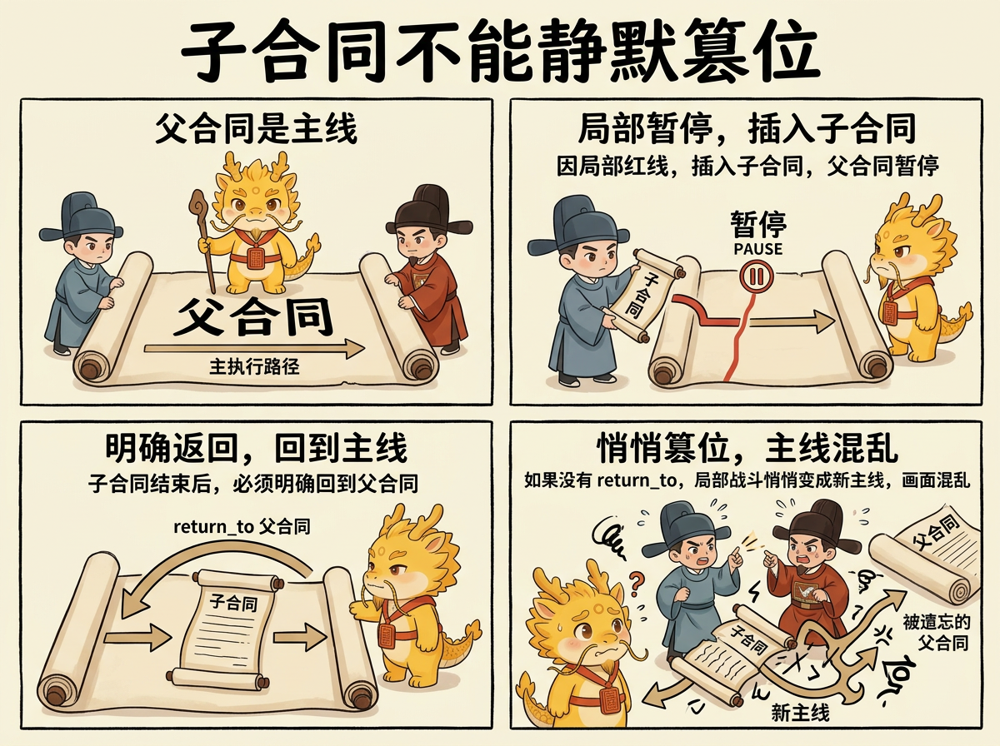

# 父合同为什么不能被子合同静默替代

## 目录
- [这页解决什么问题](#这页解决什么问题)
- [最短定义](#最短定义)
- [为什么这是硬边界](#为什么这是硬边界)
- [嵌套合同到底在保护什么](#嵌套合同到底在保护什么)
- [最小落地规则](#最小落地规则)
- [最常见的四种跑偏](#最常见的四种跑偏)
- [一句话压轴](#一句话压轴)
- [相关页面](#相关页面)

## 这页解决什么问题

这页只回答一个问题：

**为什么子合同可以暂停父合同，却不能悄悄把父合同替掉。**

很多执行漂移，不是因为系统完全没有计划，而是因为：

- 主合同还没正式结束
- 中间为了排雷、补洞、查链路，临时开了一个子合同
- 做着做着，大家开始只谈这个子合同
- 再过一会儿，已经没人说得清原来的主线还在不在

一旦走到这一步，项目进展、认知债务、续命和审计都会一起变糊。

## 最短定义

父合同和子合同的关系，最短可以压成一句话：

> 子合同可以暂停父合同，但不能静默篡位。

也就是说：

- 子合同是临时展开的局部战役
- 父合同仍然保留主线地位
- 子合同关闭后，执行必须明确回到父合同，除非父合同被诚实地宣布 `abandoned`

## 为什么这是硬边界

如果没有这条边界，最容易发生三种坏事。

### 第一，主线蒸发

人会越来越习惯只讨论眼前最热的火点。

于是系统表面上一直在“推进”，实际上却越来越难回答：

- 当前根战役是什么
- 这刀是主线，还是局部 firefight
- 这刀做完后回哪里

这时所谓“项目进展”就会开始退化成一种印象。

### 第二，认知债务突然变陡

父合同如果被子合同静默替代，后来的人就很难分清：

- 当前激活合同为什么开
- 它是解决主问题，还是只是在修一条阻塞链
- 为什么这个局部修复最后变成了新的主叙事

这样认知债务就不再只是“细节看不懂”，而会升级成“项目现状判断失真”。

### 第三，续命和接手会一起失血

一旦需要续命，新窗口最需要知道的是：

- 当前打哪场仗
- 父合同有没有被暂停
- 当前子合同解决后回哪里

如果这些信息没有被显式外置，新窗口就会重新掉回旧对话的叙事惯性里。

## 嵌套合同到底在保护什么

嵌套合同机制真正保护的，不是文书整齐，而是三样更硬的东西：

### 第一，项目进展可见性

只要父子合同关系还在，`dev_repo/state.json` 和 `dev_repo/tree.md` 就能继续回答：

- 当前主线
- 当前子线
- 暂停关系
- `return_to`

这样项目进展就不再只能靠人脑回忆。

### 第二，认知债务偿还抓手

认知债务最怕的，不只是系统太复杂，而是现状判断失真。

嵌套合同把“现在到底在哪个层次上卡住”这件事外置出来之后，后续还债就能先从 runtime truth 开始，而不是先从体面总结开始。

### 第三，续命时的主权回收

旧窗口可以退回史料位，但父子合同树不能一起蒸发。

只要合同树仍在，续命就不是“换个窗口碰碰运气”，而是：

- 先读当前树
- 再看史料和证据
- 再决定回父合同、继续子合同，还是诚实开新根战役

## 最小落地规则

只要系统开始出现父子嵌套，就至少要把这些信息落到 `dev_repo/`：

- `contract_id`
- `parent_contract_id`
- `root_campaign`
- `summary`
- `status`
- `goal`
- `return_to`
- `why_opened`
- `red_line_crossed`

同时遵守三条硬规则：

1. 开子合同后，父合同状态必须能被读成类似 `paused_for_child`
2. 子合同关闭后，必须显式写明：
   - 返回父合同
   - 仍被阻塞
   - 还是需要更窄的新子合同
3. 如果无法诚实回答 `return_to`，就说明合同树已经变形

## 最常见的四种跑偏

### 第一种：把普通 replanning 误写成新子合同

不是每次重排计划都要开新合同。只有当局部战役已经足够独立，且不记下来就会让父合同失真时，才值得开子合同。

### 第二种：开了子合同，却不写 `return_to`

这是最危险的一种。因为它表面上像是“先把这刀做好”，本质上却是在把父合同偷偷做掉。

### 第三种：子合同已经做完，却继续霸着主叙事不退场

局部 firefight 成功后，如果不退回父合同，系统就会把“暂时修洞”误写成“真正主线”。

### 第四种：把编号当合同树，把摘要留空

只有编号没有 `summary` 的合同树，最后一定会重新退化成“看不懂但好像很正式”的名单。

## 一句话压轴

父合同为什么不能被子合同静默替代，真正要钉死的不是“计划必须更整齐”，而是：

**局部战役可以插入主线，但不能偷走主线。**

只有把父子关系、暂停关系与 `return_to` 明确外置，项目进展、认知债务偿还与续命接手才有真正可抓的骨头。

## 相关页面

- [Campaign Runtime 说明](../../dev_repo/README.md)
- [赛博认知债务：剪刀差、察觉信号与可信偿还](赛博认知债务：剪刀差、察觉信号与可信偿还.md)
- [七星灯续命法](七星灯续命法.md)
- [自由开发模式：在不确定业务中继续可控推进](自由开发模式：在不确定业务中继续可控推进.md)
