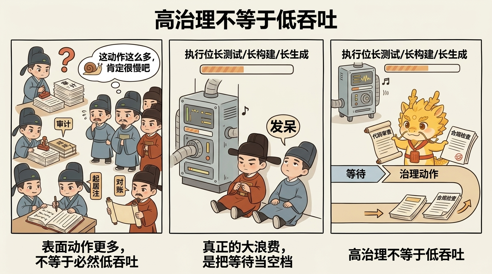
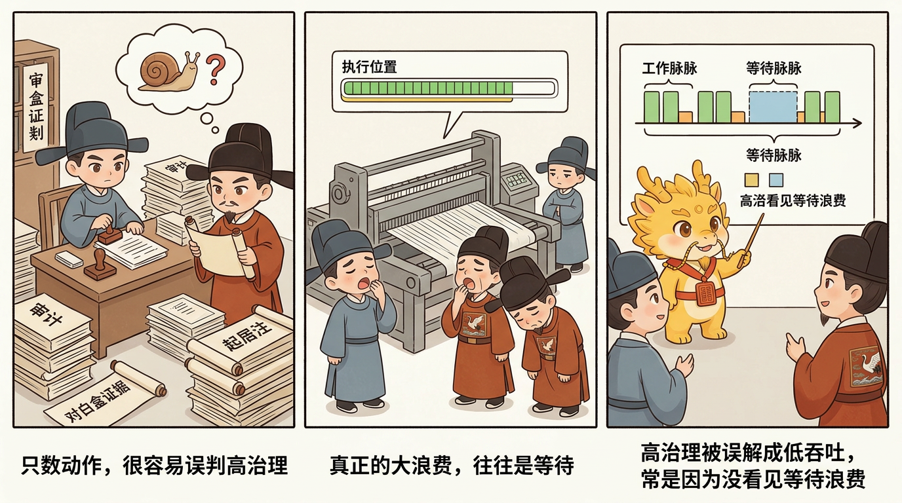
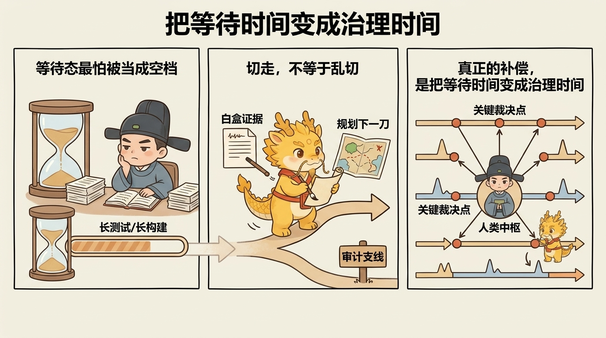

# 脉冲分封制：高治理下的吞吐补偿

## 目录
- [这一页解决什么问题](#这一页解决什么问题)
- [发现问题：为什么很多人会误以为高治理必然低吞吐](#发现问题为什么很多人会误以为高治理必然低吞吐)
- [分析问题：为什么 agent 时代的吞吐天然是"脉冲型"的](#分析问题为什么-agent-时代的吞吐天然是脉冲型的)
- [解决问题：脉冲分封制怎样把等待时间变成治理时间](#解决问题脉冲分封制怎样把等待时间变成治理时间)
- [常见误解](#常见误解)
- [一句话压轴](#一句话压轴)
- [相关页面](#相关页面)

## 这一页解决什么问题

很多人第一次接受 Cyber-Ming-Protocol 的高摩擦治理之后，紧接着就会冒出一个很现实的质疑：

- 要双轨审计
- 要人类物理路由
- 要高频起居注
- 要白盒对账
- 还要分封、续命、还债

这样一套流程当然更稳，但会不会也必然更慢？会不会最后把人类中枢拖成整套系统真正的瓶颈？

这正是这一页要回答的问题。

在 Cyber-Ming-Protocol 里，脉冲分封制不是第六根法柱，也不是对前面高治理礼法的反悔。它要解决的，是一个更实际的问题：

**当你已经决定不回到黑盒自动化时，怎样在不放弃白盒控制的前提下，把深水区吞吐重新补回来。**

所以这一页真正要讲清的是：

- 为什么高摩擦治理不等于低吞吐
- 为什么 agent 时代的开发节奏天然带有“脉冲”而不是匀速
- 为什么人类中枢可以利用等待时间切换窗口、切换封地、切换支线
- 什么情况下脉冲并进会带来高有效效率，什么情况下会直接乱政

先把最核心的判断钉死：

**脉冲分封首先是吞吐补偿机制，不是新法柱；它解决的是“高治理如何不被闲置时间拖慢”，而不是“怎样减少治理”。**

## 发现问题：为什么很多人会误以为高治理必然低吞吐

这种误解很自然，因为从表面看，Cyber-Ming-Protocol 确实在不断往开发流程里加动作：

- 多一次方案审计
- 多几次中途打断
- 多几次日志转发
- 多几次 Git 留痕
- 多几次白盒对账

如果只按动作数量算，高治理当然会显得低效。

但这个直觉里其实藏着一个更深的误判：它默认开发吞吐只取决于“流程动作有多少”，却没有看到 agent 时代真正大量存在的，是另一种更大的浪费——**等待浪费。**

### 第一种浪费：把等待当成空档

执行位在现实中并不是一直匀速产出。它经常会进入下面这些状态：

- 长生成
- 长测试
- 长搜索
- 长命令执行
- 长重构后编译与验证

如果此时人类中枢只能守着一个窗口原地发呆，那么吞吐确实会被流程摩擦拖慢。

### 第二种浪费：把高治理误解成只能单线推进

很多人潜意识里会把“人类必须保留裁决权”理解成“人类必须盯死一条线直到它完全结束”。

这就会把治理误读成一种僵硬的单线程劳动：

- 一条线没走完，不敢看别的
- 一个窗口没返回，不敢审别的
- 一个封地没闭环，不敢碰另一条支线

结果不是更稳，而是把本可利用的等待时间白白空耗掉。

### 第三种浪费：把并进和乱开窗口混为一谈

另一边，也有人看见这个问题后，直接滑回反方向：

- 既然一个窗口会等，那就同时多开很多窗
- 既然人会闲着，那就让所有支线一起跑
- 既然能并行，那就尽量并到更多

可如果主线不清、边界不明、封地未隔离，多窗并起就不是吞吐补偿，而会迅速变成军令混杂、上下文互扰、主权丧失的乱政。

所以真正的问题从来都不是“高治理会不会慢”，而是：

**你有没有把 agent 时代天然出现的等待脉冲，重新组织成治理时间。**

## 分析问题：为什么 agent 时代的吞吐天然是“脉冲型”的

要理解脉冲分封为什么成立，首先得承认一件事：agent 驱动的开发节奏，本来就不是均匀流速，而是脉冲流。

### 第一，执行位的工作天然会出现长短不一的波峰波谷

人类手写代码时，很多动作是连续可见的；而 agent 执行位经常会在一个阶段里持续跑很久，然后突然给你回一坨结果。

比如它可能：

- 连续改一批文件后再统一汇报
- 跑很长的测试与构建，再一起回传
- 做一段长链搜索和阅读，再给你一个方案包

这意味着，执行位不是在稳定“流”，而是在一阵一阵“冲”。

### 第二，人类真正值钱的时刻并不是全程陪跑，而是关键裁决点

前面几页已经说过，人类中枢最值钱的不是替执行位干体力活，而是：

- 设主线
- 做审计
- 决路由
- 做打断
- 做验真

这些动作并不要求你在每一秒都守着同一扇窗口。它们更像一组高价值裁决点：某个窗口脉冲返回了，你就审；另一扇窗口正在等，你就转去处理别处。

换句话说，人类治理工作的正确节奏，本来就不是“持续盯住一个执行位”，而是“在多个关键节点之间轮转裁决”。

### 第三，吞吐补偿来自等待时间再利用，而不是放松治理

这就是脉冲分封最关键的一点。

它并不是说：

- 既然流程严，就把审计省掉一点
- 既然高摩擦，就少留一些起居注
- 既然想快，就别再白盒对账了

它真正说的是：

**治理动作不减，但等待时间不闲。**

所以脉冲分封并不削弱前面那些礼法，反而默认你已经拥有了：

- 分封边界
- 主线判断
- 入京标准
- 起居注抓手
- 人类居中裁决

只有在这些东西已经存在时，等待时间才可能被安全地再利用。

## 解决问题：脉冲分封制怎样把等待时间变成治理时间

把前面的判断落回操作层，先要再钉死一个前提：现实吞吐的关键不是窗数，而是主线之明。

脉冲分封之先决，不在窗口之多，而在主线之明。

如果你不知道：

- 哪个是主战
- 哪个是支线
- 哪个只是等待态
- 哪个任务彼此可以并、哪个绝不能并

那么多窗并起不是治国，实为乱政。

也正因为如此，脉冲分封一上来做的不是“并”，而是“定主线”。

把这条前提收清之后，脉冲分封制就可以落成六个很清楚的动作。

### 第一步：先定主线，再谈并进

脉冲分封最忌讳的，就是主线未明先多窗并起。

所以在真正进入脉冲模式之前，人类中枢必须先回答清楚：

- 当前唯一主战是什么
- 哪些是可等待的支线
- 哪些是互不污染、可以并行的封地
- 哪些任务只是看起来可分，其实共享同一风险面

这一步决定的不是节奏，而是合法性。没有主线判断，后面的“并进”都没有法统基础。

### 第二步：一封地一军令，等待态才允许切走

这一步和 Worktree 分封制直接相连。

每一扇窗口、每一块封地、每一条支线，都必须先有：

- 明确边界
- 明确目标
- 明确验收之法

然后你才有资格在它进入等待态时切走。否则你离开时，留下的就不是一支可自主待命的部队，而是一团没人说得清到底在干什么的半成品叙事。

所以脉冲切换的前提，不是“这边暂时没动静了”，而是：

**这块封地已经有足够清晰的军令，可以在等待态里安全悬置。**

### 第三步：把等待时间转成另一条线上的治理时间

这才是脉冲分封的真正核心。

当一个执行位正在：

- 跑测试
- 跑构建
- 做长搜索
- 做长生成

人类中枢就不必原地空等，而可以切去另一条已经边界清楚的线，做另一种高价值动作，比如：

- 审另一块封地的项目报告
- 对另一条支线做白盒对账
- 规划下一波原子执行合同
- 复盘上一条线的证据链
- 在另一块封地里推进一个已洞明的小任务

这就是为什么 `README.md` 把它定义成“把等待时间变成治理时间”。吞吐补偿不是来自更少的治理，而是来自更少的发呆。

### 第四步：主线惟一，支线可众，但舒适上限很低

这一点要特别讲清。

脉冲分封不是鼓励无限并行。恰恰相反，它默认：

- 国本只能有一个主线
- 支线可以有多个
- 但人脑仍然只有一个

所以大多数人真正舒服、还能维持主权的范围，通常也就是 `2` 到 `3` 路并行。再多，往往就不再是并行，而是乱政。

这也是为什么脉冲分封首先是补偿机制，而不是默认姿态。它只在等待态出现、主线清楚、边界隔离已经成立时，帮你把吞吐抬回来；它不是对“多开越多越强”的礼赞。

### 第五步：诸侯无封禅权，所有脉冲成果仍须入京再审

这一点必须和上一页扣紧。

脉冲分封虽然允许多条支线在等待间隙里轮转推进，但没有任何一块封地因为“我这边推进得挺顺”就天然配入主线。

所有成果仍然必须：

- 带着 Git 起居注
- 带着物理证据
- 带着回滚抓手
- 带着最终审计

然后再入京奏对。

也就是说，脉冲补偿的是前线节奏，不是降低入京标准。它只让“多线轮转”变得可能，不让“主干纯度”变得松散。

### 第六步：团队场景里，脉冲不是所有人一起乱跑，而是各自治理节律后再主干会师

这一点对团队尤其重要。

在团队里，脉冲分封并不是“所有人同时多开很多窗”，而是：

- 每个封地主人根据自己的等待脉冲轮转治理
- 每条支线在自己的领地里完成局部推进与审计
- 最终在主干处按入京节奏会师

换句话说，Worktree 分封解决的是空间隔离，脉冲分封解决的是时间利用。前者告诉你“哪里能并”，后者告诉你“什么时候切换最值钱”。

现实开发里常见的高效节律，本来就不是所有人一起守着一个窗口到天黑，而更像：

- 这边一条线在跑长测试
- 那边一条线完成方案待审
- 另一边一条线等待合并前的最终对白

如果这些节律都已被边界和法统钉住，团队协作才会出现一种很值钱的状态：

**前线分路推进，京城按节奏会师。**

## 常见误解

### 第一种：脉冲分封就是多开几个窗口

不对。多开只是表象。真正值钱的是等待态识别、封地边界、主线判断和切换纪律。没有这些东西，多开窗口只会更快乱掉。

### 第二种：既然要补吞吐，就应该尽量多并行

也不对。超过人脑能稳定裁决的舒适上限后，并行就会从补偿机制变成主权流失机制。大多数人能稳住的通常也就是两到三路。

### 第三种：脉冲分封说明前面的高治理可以放松一点

恰恰相反。它之所以成立，恰好是因为前面的高治理已经把边界、证据链和入京标准钉住了。没有这些法统，所谓脉冲只会变成乱切。

### 第四种：只要某块封地在脉冲模式里跑得快，就可以直接并主线

不行。脉冲补的是前线吞吐，不是主干标准。诸侯依旧无封禅权，所有成果仍须入京再审。

### 第五种：脉冲分封和七星灯续命是一回事

也不是。七星灯处理的是“旧窗口已经带毒时怎么异步续命”；脉冲分封处理的是“窗口还清醒、只是正在等待时，怎么把等待时间重新利用”。一个解决去毒与重建，一个解决节奏与吞吐。

## 一句话压轴

脉冲分封制真正要钉死的，不是“高治理也能很快”，而是：

**在深水区里，真正的吞吐补偿不是回到黑盒自动化，而是在主线清楚、边界清楚、封地隔离和入京标准都已立住之后，把 agent 的等待脉冲重新编排成人类中枢的治理时间。**

只有这样，Cyber-Ming-Protocol 才不是“很稳但很慢”，而是“越到深水区，越能在不放弃主权的前提下把有效效率重新抬起来”。

## 相关页面

- [Worktree-分封制：封地、入京与主干纯度](Worktree-分封制：封地、入京与主干纯度.md)
- [双轨隔离审计与皇权居中](双轨隔离审计与皇权居中.md)
- [七星灯续命法](七星灯续命法.md)
- [从编码者到治理者：这套协议要求开发者具备什么](从编码者到治理者：这套协议要求开发者具备什么.md)
- [边界与未解决战场](边界与未解决战场.md)
