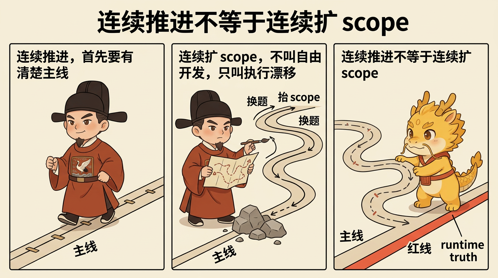

# 自由开发模式：在不确定业务中继续可控推进

## 目录
- [这页解决什么问题](#这页解决什么问题)
- [最短定义](#最短定义)
- [它不是默认路线](#它不是默认路线)
- [它和探马是什么关系](#它和探马是什么关系)
- [它到底在保护什么](#它到底在保护什么)
- [最常见的四种跑偏](#最常见的四种跑偏)
- [一句话压轴](#一句话压轴)
- [相关页面](#相关页面)

## 这页解决什么问题

这页只回答一个问题：

**当业务本身还带着很多不确定性，探马已经不够、但又不能放弃治理时，怎么继续长时推进。**

很多深水区任务都会卡在这里：

- 你已经不是完全不知道前面真假
- 但也还远远没到可以把后面每一步都写成稳定合同
- 如果强行假装自己全知道，计划会变成假确定性
- 如果直接放飞去写，又会很快滑回黑盒乱冲

`自由开发模式` 要解决的，就是这段中间地带。

## 最短定义

最短可以把它定义成一句话：

> 在显式主线、显式红线、显式 runtime truth 的前提下，允许一段连续、可控、可追责的长时开发。

所以它不是“别问了我先做”，而是：

- 主线先说清
- 反路线先说清
- 假方法和毒方法先钉死
- 然后才允许连续推进

## 它不是默认路线

`自由开发模式` 不是默认路线，也不能自动开启。

它只在用户显式授权后才成立，例如：

- `开启自由开发模式`
- `进入自由开发`
- `自由长时开发模式`

如果没有这层显式授权，默认还是先走合同开发：

- `approval-first-planner`
- `approved-checklist-executor`

所以它不是把老路线废掉，而是在高不确定业务面前多出第二条官方执行路线。

## 它和探马是什么关系

`自由开发模式` 不是探马的对立面，而是探马之后的一种可控延伸。

探马负责做的，是先把最前面那层真假压缩出来。

只有当：

- 最前面的真实 blocker 已被压缩到足够小
- 当前主线已经明确
- 剩余不确定性更像业务推进中的连续探索，而不是最前面的纯黑盒未知

这时才值得从探马切到自由开发。

所以更准确地说：

- 探马负责先逼出第一手真相
- 自由开发负责在这份真相上连续推进

## 它到底在保护什么

### 第一，保护主线

自由开发不是“想到哪做到哪”，而是先声明当前 mainline，再沿着这条线持续推进。

如果一条路线已经说不清自己在服务哪条主线，那它就已经不是自由开发，而是执行漂移。

### 第二，保护 runtime truth

自由开发越长时，越不能只靠口头维持当前真相。

所以它必须继续保住：

- `dev_repo/state.json`
- `dev_repo/journal.jsonl`
- `dev_repo/evidence_index.json`
- `dev_repo/tree.md`

也就是说，自由开发不是把合同树取消，而是让合同树在连续推进里继续活着。

### 第三，保护红线

自由开发允许减少重复 ceremony，但不允许放松红线。

它仍然要求：

- 一步一提交
- 有证据才算推进
- 长命令至少三分钟一次进度更新
- 停止时必须能诚实写出 `blocker_class / stop_reason / next_exact_action`

### 第四，保护方法洁癖

深水区里最危险的，不只是慢，而是用错方法还继续加速。

所以自由开发会特别强调：

- 不要用 demo path 冒充主路径
- 不要用 CLI 成功冒充产品完成
- 不要用 wrapper 绕开真实框架
- 不要让局部 firefight 静默替代主线

## 最常见的四种跑偏

### 第一种：把自由开发理解成取消审批

不是。它取消的是不必要的重复 ceremony，不是取消主线、证据和红线。

### 第二种：把自由开发理解成不用探马

不是。真正的自由开发，往往恰恰建立在前面的探马已经把最前面的真假压出来。

### 第三种：一进入自由开发，就把 `dev_repo` 放掉

这会让当前真相重新蒸发回对话，最后你只会得到一段很像进展的叙事。

### 第四种：把连续推进误写成连续扩 scope

自由开发允许连续推进，不允许遇到阻塞就不停改题、换题、抬 scope。

## 一句话压轴

自由开发模式真正要守住的，不是“终于可以不写计划了”，而是：

**当任务已经复杂到无法假装全知时，仍然要让主线清楚、红线不松、真相落盘，然后再连续推进。**

它不是放弃治理，而是把治理从“每一步都重讲一遍”升级成“在 runtime truth 之上持续推进”。

## 相关页面

- [赛博探马机制：先试链路，再上大军](../02-最小闭环与核心礼法/赛博探马机制：先试链路，再上大军.md)
- [Campaign Runtime 说明](../../dev_repo/README.md)
- [父合同为什么不能被子合同静默替代](父合同为什么不能被子合同静默替代.md)
- [边界与未解决战场](边界与未解决战场.md)
