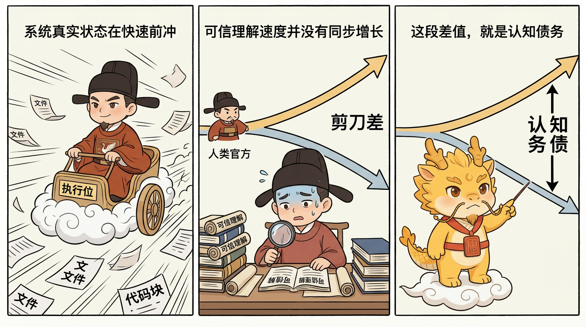
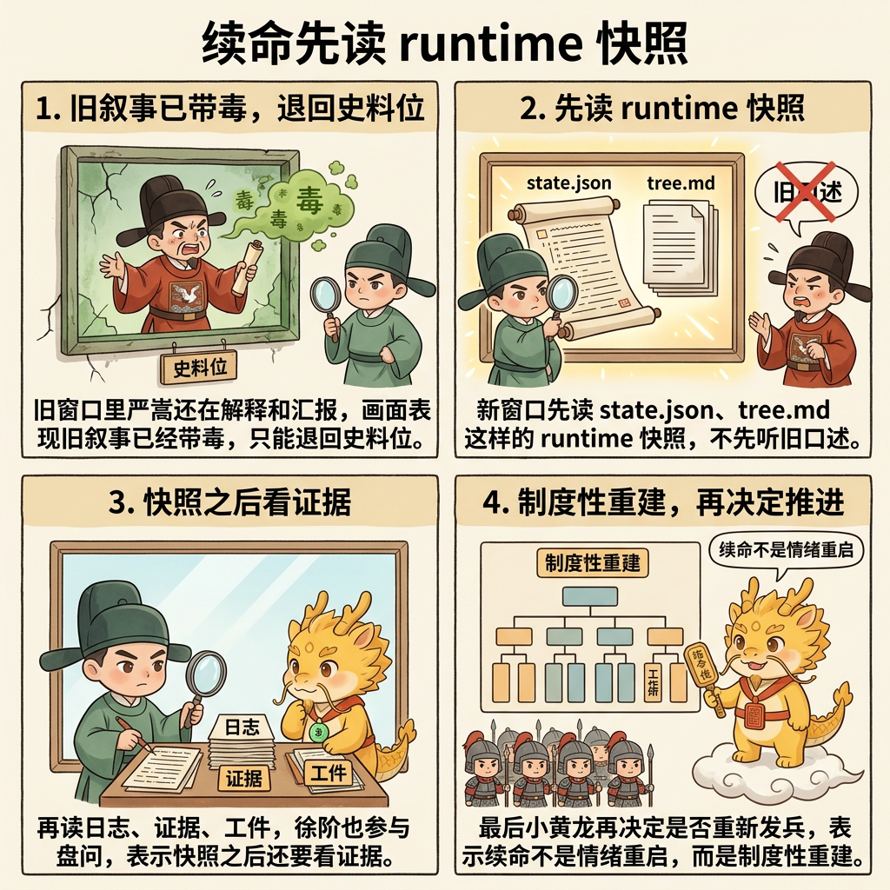

# 赛博认知债务：剪刀差、察觉信号与可信偿还

## 目录
- [这一页解决什么问题](#这一页解决什么问题)
- [剪刀差：认知债务到底从哪里来](#剪刀差认知债务到底从哪里来)
- [为什么它不会被自然填平](#为什么它不会被自然填平)
- [察觉信号：什么时候说明你已经落后于系统真实状态](#察觉信号什么时候说明你已经落后于系统真实状态)
- [复制粘贴、双轨审计与 Git 起居注：它们主要是在延缓债务扩张](#复制粘贴双轨审计与-git-起居注它们主要是在延缓债务扩张)
- [可信偿还：如何在不自欺的前提下重新建立项目认知](#可信偿还如何在不自欺的前提下重新建立项目认知)
- [为什么这才叫"可信偿还"](#为什么这才叫可信偿还)
- [最常见的四种跑偏](#最常见的四种跑偏)
- [一句话压轴](#一句话压轴)
- [相关页面](#相关页面)

## 这一页解决什么问题

很多人第一次听到“认知债务”时，会把它理解成两种东西中的一种。

第一种理解，是把它当成个人失败：是不是我不够勤奋、不够聪明、不够自律，所以才会被 AI 产出的系统甩开？

第二种理解，则刚好走向另一个极端：既然只是“理解落后了”，那我总可以找个整块时间，把整座系统重新看白，把所有旧代码重新读懂，然后把债彻底还清。

这两种理解都不对。

在 Cyber-Ming-Protocol 里，认知债务首先不是道德问题，而是结构问题；其次它也不是一笔迟早能被自然填平的静态旧账，而是一条会随着系统继续变化而持续增长的动态差值。

所以这一页真正要讲的，不是“怎么让人重新什么都懂”，而是四件彼此相连的事：

- 认知债务从哪里来，也就是标题里的“剪刀差”到底是什么
- 它开始扩大时，通常会给出哪些察觉信号
- 为什么复制粘贴、双轨审计与 Git 起居注主要是在延缓债务扩张，而不是直接替你把债还掉
- 当那个危险时点真的到来时，如何做一次可信偿还

也就是说，标题里虽然写的是“剪刀差、察觉信号与可信偿还”，但中间还要多钉一层：**如何延缓扩张。** 没有这一层，全篇会断成三块；有了这一层，病理、征兆、缓释和治疗才会接成一条完整链路。

## 剪刀差：认知债务到底从哪里来

这个问题必须先回到 `../01-哲学与坐标/为什么-AI-Coding-已经模糊了-CS-与管理学的界限.md` 已经立住的那条现实：

**AI coding 持续拉大了“系统变化速度”和“人类可信理解速度”之间的剪刀差。**

在纯手工编码时代，写代码的人通常也承担主要理解成本。代码就算写得乱、命名就算失真、几周后回头看也会陌生，但这种陌生感大致仍被人类自己的产出速度约束着。你写多少、忘多少、补多少，至少还在同一个量级上。

可当 AI 成为执行位之后，结构就变了。它可以在很短时间里：

- 横跨多个文件同时推进
- 在多条链路上连续试跑
- 快速给出解释、总结和下一步方案
- 沿着上一轮结果立刻再生长下一轮改动

而人类重新看白系统、建立可信心智模型、把局部变化重新纳入整体理解的速度，并没有成比例上升。

认知债务就是在这个位置上出现的。

它不是一团简单的“没来得及读完的代码”，而是：

- 系统真实状态已经走到了新的位置
- 人类对它的可信理解仍停在更早的位置
- 两者之间的距离还在持续扩大

这段距离，就是认知债务的剪刀差。

## 为什么它不会被自然填平

这也是这页最该钉死的一句判断：

**认知债务不是一团迟早能补完的“待理解代码”，而是系统变化速度与人类可信理解速度之间持续张开的剪刀差。**

在高吞吐 AI coding 条件下，它不会被自动填平，只会被治理、延缓，或者在失控时被强行偿还。

原因并不复杂。你以为自己要补的，是一笔静止的旧账；但真实情况往往是：

- 你在补看昨天的变化时，系统今天还在继续变化
- 你刚把某个模块重新理顺，执行位可能已经在别处推进了新链路
- 你刚理解一个局部机制，新的证据、新的提交、新的断言又把系统推到了下一个状态

所以问题从来都不是“有没有可能把它一口气全看白”，而是：这样做的成本是不是可持续、节奏是不是能跟上、结果是不是还能在项目继续生长时保持有效。

在深水区里，答案通常是否定的。

也正因为如此，Cyber-Ming-Protocol 从来不承诺“零认知债务”。它承认债务会持续生成，然后把重点放在三件更现实的事上：

- 尽早察觉
- 尽量延缓扩张
- 在必须处理时，做一次可信偿还

## 察觉信号：什么时候说明你已经落后于系统真实状态

认知债务真正危险的地方，不是它会突然爆炸，而是它往往会提前发出信号，只是大多数人会把这些信号误当成“复杂项目本来就这样”。

最危险的时刻，不是“我承认自己看不懂了”，而是：

**我以为自己还看得懂，但实际已经开始落后于系统的真实状态。**

最常见的几类征候通常是下面这些。

### 第一，修改越来越依赖试错，而不是判断

你不是完全不能推进，反而往往还能继续推进；只是每一步越来越像撞运气。你知道哪里大概有问题，却越来越难在动手前说清：

- 这一步具体在改什么
- 这一步为什么应该有效
- 这一步改完后应该出现什么证据

这说明你的行动已经开始领先于你的可信理解。

### 第二，每次解释都越来越像复述总结陈词，而不是指出机制

当你开始频繁依赖执行位的总结语气，比如“应该已经修好了”“逻辑上已经覆盖了”“大概率就是这里”，而不是具体指出：

- 哪次改动引入了什么
- 哪条断言变了
- 哪份日志或产物证明了什么

这说明你正在把解释能力外包给执行位的话术，而不是掌握系统的真实抓手。

### 第三，同一个问题反复把你拉回旧日志、旧提交和旧对话里打转

只要你每次想理解一个具体疑问，都得重新扫很多文件、重新翻整段聊天、重新猜一遍推进路径，这就说明你已经缺少足够细的局部锚点。你不是在定向还债，而是在大面积重读。

### 第四，你对“项目现在到底到哪一步了”的回答越来越模糊

这是一个特别值得警惕的信号。你也许还能说出“这个功能大概做完了”“那条链路上次已经通了”，但一旦继续追问：

- 是哪次提交把它推到现在这个状态的
- 当时凭什么判定它可放行
- 当前最大未解阻塞到底是什么

你的回答就会迅速变虚。

这说明认知债务已经不只是在吞细节，而是在吞你的状态判断能力。

所以认知债务最可怕的地方，不是“我暂时忘了点代码”，而是：系统表面还在推进，但你对系统现状的回答开始越来越像印象，而不是证据。

## 复制粘贴、双轨审计与 Git 起居注：它们主要是在延缓债务扩张

到这里就该进入最容易写乱的一段了。

很多人会直觉地把复制粘贴、双轨审计和高频留痕当成“还债方法”，但更准确的说法是：**它们首先不是偿还本身，而是在延缓扩张。**

也就是说，它们解决的是“债怎么别长得太快”，不是“债怎么在最后被真正结清”。

### 第一，复制粘贴在这里改变的是增长斜率

复制粘贴为什么重要，前面几页其实已经说过：在 AI 协作里，复制日志、转述清单、递送断言、回传怀疑点，并不是低级搬运，而是人类行使物理路由权的方式。

但如果把这个判断再往前推一步，它对认知债务的真正作用就是：**降低剪刀差继续扩大的斜率。**

因为只要关键材料必须经由人类路由：

- 噪音就不那么容易整包扩散
- 错误前提就不那么容易在多个位置同时膨胀
- 人类就不那么容易长期缺席关键仲裁点
- 黑盒整理好的结论也更难直接冒充真相

所以复制粘贴并不会神奇地让你瞬间理解整座系统，但它会让债务积累得更慢、更细、更可分段，也会把它真正变得危险的那个时点尽量向后推。

这就是它和后续还债并不矛盾的地方。

**复制粘贴能大幅减小认知债务剪刀差的增长斜率，却不能保证剪刀差的绝对值永远不到危险区；它做的是延后危机，不是取消危机。**

### 第二，双轨审计在这里解决的是“别让假理解继续堆债”

双轨审计的价值，也不在于让系统被彻底看白，而在于阻止它沿着错误叙事继续长出新的债。

如果没有独立审计位，执行位最容易做的事情，就是把：

- 自己的计划
- 自己的推进
- 自己的总结
- 自己对“什么算完成”的解释

重新缝成一条漂亮叙事链。

这样认知债务就不只是“人没看懂”，而会进一步恶化成“人开始相信了错误的理解”。

双轨审计的意义，就是让另一条窄上下文的盘问链不断追问：

- 这条断言凭什么成立
- 这条红灯和绿灯是不是同一个问题
- 这份证据是不是当前运行的物证
- 这里是不是拿总结陈词冒充完成事实

这不会直接还掉旧债，但会持续阻止新债在假解释里快速膨胀。

### 第三，Git 起居注不是偿还本身，而是在为未来偿还保留史料

高频 Git 起居注也一样。

它最大的作用，不是让你当场“更懂项目了”，而是给未来必须还债时保留一部还能读的史书。没有这部史书，你后面面对的就不是债，而是一整片无从结算的黑雾。

所以这一节真正要落下来的结论是：

- 复制粘贴：让债长得更慢
- 双轨审计：让假理解别继续放大
- Git 起居注：给未来还债留下史料

它们三者合在一起，解决的是**延缓扩张**。

只有当绝对差值还是累积到了危险区，人类对“项目现在到底处于什么状态”的回答已经开始失真时，后面的“可信偿还”才会真正登场。

## 可信偿还：如何在不自欺的前提下重新建立项目认知

这才是标题里最后一根主梁。

认知债务的可信偿还，不靠作者本人回忆项目，也不靠执行位的一段总结陈词，而靠一份**以 Git 起居注为史料、以日志与测试为证据、以新窗口追问为盘问机制的项目现状重建。**

当项目已经进入嵌套合同和长时开发阶段时，`dev_repo/state.json` 与 `dev_repo/tree.md` 还会额外承担一层作用：它们直接告诉你当前主线、当前激活合同、父合同是否被子合同暂停，以及做完回哪里。这样一来，认知债务偿还就不必先从“大家各说各的项目进展”开始。

这里要特别说明一下：下面只讲它在“还债”中的作用，不展开完整的续命礼法；完整的窗口续命与接手方法，留到 `七星灯续命法.md` 再展开。这里我们只关心一个问题：**当你已经意识到认知债务需要处理时，怎样做一次不自欺的项目现状重建。**

最稳的做法，可以收成四步。

### 第一步：开一个新的执行窗口

这一步的意义，不是机械地换个聊天页，而是尽量切断原窗口已经形成的推进惯性。

旧窗口最容易带着这些东西继续说话：

- 已经习惯了的任务叙事
- 已经为自己辩护过的解释路径
- 已经被“推进感”污染的成功想象

所以可信偿还的第一步，不是沿用原叙事继续问“现在到哪了”，而是把问题交给一个相对干净的位置，让它像重新接手项目一样先读史料、再交报告。

### 第二步：先喂 Git 起居注和当前 runtime 快照，再问“项目现在到哪一步了”

这一步的重点，不是让新窗口自由发挥总结能力，而是先用起居注约束它的理解边界。

你真正要它做的，不是“重新理解整个项目”，而是：

- 如果 repo 已经有 `dev_repo/`，先读 `state.json`、`tree.md`、必要时再看 `journal.jsonl`
- 先读最近相关的 Git 起居注
- 再基于这些起居注描述当前进度
- 所有关键判断都必须尽量附带对应提交、日志、断言或关键源码片段

这一步非常关键，因为它会把“项目状态判断”从印象流重新拽回到史料流。

一句最能概括这步的话其实就是：

**可信偿还不是让新窗口“重新理解项目”，而是让它在起居注史料的约束下，交出一份带证据的项目现状报告。**

### 第三步：必要时继续追问，但每次追问都必须附证据

如果第二步交出来的还只是一份体面摘要，那还不够。可信偿还之所以叫“可信”，就在于它必须接受继续盘问。

最常见、也最有价值的追问，通常会落在这些地方：

- 这个结论依据哪几个提交
- 当前激活合同是什么，父合同是不是被暂停，回哪
- 这个功能是测试通过，还是只是执行位声称通过
- 当前最大未解阻塞是什么，请附对应日志或报错
- 这一步涉及哪些关键源码，请给出最小必要片段
- 哪些部分已经有物证撑住，哪些仍只是阶段性判断

一旦每次追问都要求落回提交、日志、测试、断言或关键代码片段，所谓“还债”就不再是聊天，而会变成一次可审的盘点过程。

### 第四步：最终形成一份项目现状快照

可信偿还如果没有结果物，就很容易再次退回散聊。所以最后一定要落成一份当前快照，最少要回答清楚：

- 当前已完成到哪里
- 哪些完成有证据支撑
- 哪些只是暂时判断，还没完全坐实
- 当前最大的未解阻塞是什么
- 下一步推进最安全的起点是什么

如果项目已经有 `dev_repo/` runtime，这份快照最好继续回落到 `state.json / tree.md / evidence_index.json` 所代表的工件层，而不是只停在一次对话回复里。

到这一步，认知债务才算真正被偿还了一段。不是因为你突然看白了一切，而是因为你重新拿回了一份可审、可追问、可继续推进的项目现状。

## 为什么这才叫“可信偿还”

这里最值得钉死的一句判断是：

**可信偿还，不是靠人脑回忆项目真相，而是靠史料、证据与追问，把项目现状重新压成一份可以被审的快照。**

它之所以比普通“回顾一下最近做了什么”更可靠，恰恰在于它把几件常被混在一起的东西拆开了：

- Git 起居注负责告诉你：系统是怎样一步步变成现在这样的
- 日志、测试与断言负责告诉你：哪些判断真的站得住
- 新窗口追问负责压掉旧叙事惯性
- 项目现状快照负责把这次还债变成下一次推进的起点

这才是“可信偿还”和普通总结的根本区别。

普通总结更像回忆；可信偿还更像重建。

## 最常见的四种跑偏

### 第一种：把认知债务理解成个人不够努力

这会把结构问题误写成道德问题。AI 时代的认知债务首先是速度差问题，不是羞耻问题。

### 第二种：把复制粘贴、双轨审计和起居注直接当成“还债本身”

它们首先解决的是延缓扩张，不是最终结算。把两者混成一谈，整套方法就会重新散掉。

### 第三种：可信偿还时仍沿用旧窗口的总结惯性

如果还是让原执行位顺着自己已经铺好的叙事继续总结，你得到的往往不是现状重建，而是旧解释的升级版。

### 第四种：最后没有形成项目现状快照

没有结果物，所谓还债就会再次退化成一次聊得很像那么回事的盘点，下一轮推进时又要从头猜。

## 一句话压轴

赛博认知债务真正要钉死的，不是“人必须重新看白一切”，而是：

**认知债务来自剪刀差，先靠复制粘贴、双轨审计与 Git 起居注把它长得更慢、把危险时点尽量后移；等它真的逼近危险区时，再用“新窗口 + 起居注史料 + `dev_repo` 当前快照 + 证据追问 + 项目现状快照”做一次可信偿还。**

只有这样，它才不会从可治理的负债，长成无人敢碰的禁区。

## 相关页面

- [为什么 AI Coding 已经模糊了 CS 与管理学的界限](../01-哲学与坐标/为什么-AI-Coding-已经模糊了-CS-与管理学的界限.md)
- [核心礼法之一：原子执行合同与赛博起居注](../02-最小闭环与核心礼法/核心礼法之一：原子执行合同与赛博起居注.md)
- [白盒物理对账：什么算完成事实](../02-最小闭环与核心礼法/白盒物理对账：什么算完成事实.md)
- [双轨隔离审计与皇权居中](双轨隔离审计与皇权居中.md)
- [父合同为什么不能被子合同静默替代](父合同为什么不能被子合同静默替代.md)
- [七星灯续命法](七星灯续命法.md)
