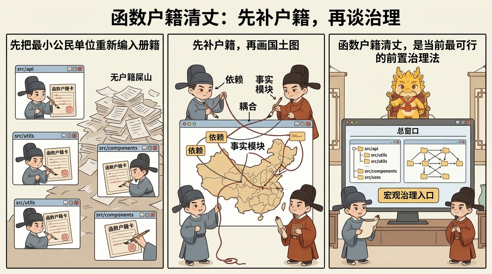

# 边界与未解决战场

## 目录
- [这一页解决什么问题](#这一页解决什么问题)
- [为什么"完全不规范的屎山接管"是另一类战争](#为什么完全不规范的屎山接管是另一类战争)
- [为什么前面的礼法在这里还不够](#为什么前面的礼法在这里还不够)
- [当前最可行的前置治理法：函数户籍清丈](#当前最可行的前置治理法函数户籍清丈)
- [成本与样本边界](#成本与样本边界)
- [常见误解](#常见误解)
- [一句话压轴](#一句话压轴)
- [相关页面](#相关页面)

## 这一页解决什么问题

写到这里，Cyber-Ming-Protocol 的大部分核心制度其实已经立住了：

- 为什么执行位与审计位必须分开
- 为什么人类必须保有物理路由权
- 为什么认知债务不会自动消失
- 为什么窗口腐烂后要异步续命
- 为什么主干不该成为共享脏上下文战场
- 为什么高治理并不必然低吞吐

但一套协议真正成熟，不是只会写它怎么赢，还要敢主动写它现在还没赢下哪些战场。

这页要讲的，正是这些边界。

如果要用一句话压住当前最大的未解决问题，那就是：

**Cyber-Ming-Protocol 现在最难、也最该诚实承认的战场，不是如何治理已经有基本抓手的复杂项目，而是如何接管一座长期失序、几乎没有户籍的屎山旧朝。**

所以这一页真正要回答的是：

- 这套协议目前更擅长什么，不擅长什么
- 为什么“完全不规范的遗留系统接管”不是把前面礼法照搬上去就能解决
- 当前有没有一个初步可行的前置治理法
- 这个前置治理法到底能解决什么，不能解决什么
- 成本、样本与成熟度的边界又在哪里

先把最重要的判断钉死：

**本协议目前更像一套中后期治理法，而不是一套已经完整成熟的混乱旧系统接管法。**

这不是退缩，而是法统诚实。

## 为什么“完全不规范的屎山接管”是另一类战争

前面几页默认你至少还拥有一些最基本的治理抓手，例如：

- 能看的 Git 历史
- 局部可信的起居注
- 至少没有完全失真的命名与目录
- 可以抽出来的局部边界
- 能跑出真红灯绿灯的链路

只要这些东西还在，哪怕项目已经很复杂、很深水、很难改，本协议都还能开始压制度：

- 可以拆原子执行合同
- 可以做双轨审计
- 可以做白盒对账
- 可以在必要时续命与还债

可一个真正难接的屎山项目，往往不是“复杂但还能治理”，而是连最小治理单元都还没站住。它常常同时具有这些特征：

- 长期缺乏细粒度提交
- 文档失序甚至几乎不存在
- 命名混乱，目录像地名却不是行政区
- 大量共享状态与隐藏副作用
- 职责漂移严重，函数和模块名义边界与事实边界完全错位
- 一旦开新窗口，AI 很容易被整座旧朝的脏语境带跑偏

这时你面对的已不只是“深水区项目”，而是“无户籍国土”。

真正的困难不在于某个 bug 有多难，而在于：

**你甚至还没有一张足够可信的疆域图，不知道天下有多少州县，不知道谁归谁管，不知道哪些边界只是地名，哪些边界才是真边界。**

这也是为什么这类问题不能被简单归入前面那些页面。因为前面的制度大多建立在一个前提上：系统至少还保留了某种可裁决、可留痕、可继续分封的基础秩序。

而完全不规范的屎山项目，很多时候连这层基础秩序都还没有。

## 为什么前面的礼法在这里还不够

这不是因为前面的礼法错了，而是因为它们默认的抓手，在这里经常不成立。

### 第一，双轨审计需要材料，但屎山常常先缺材料

双轨审计当然仍然重要，可问题在于：如果你连系统的最小地形图都没有，执行位和审计位拿到的就只会是一整片混沌代码海。

这时审计很容易退化成两种坏形态：

- 要么泛泛挑刺，抓不到真正结构点
- 要么被迫跟着执行位一起猜

也就是说，没有最小户籍时，双轨也会缺抓手。

### 第二，起居注最强，但屎山往往没有足够细的史册

高频 Git 起居注是本协议最强的赛博记忆装置之一。可一个长期失序的旧项目，往往恰恰缺这个东西。

于是你现在要做的，就不再是“沿着既有史册还债”，而更像“先为失史之地补一份最小可读的地方志”。

### 第三，续命能去毒，但不能凭空补户籍

七星灯续命法已经告诉我们：当上下文带毒时，要异步重开清醒位置。

可对完全不规范的遗留项目来说，问题往往不只是某个窗口有毒，而是：

- 整座项目本身就没有清晰边界
- 旧朝史册本身就极度残缺
- 任何新窗口一上来都可能被整片屎山语境拖进幻觉

续命能减少窗口污染，却不能替你自动生成一份可信国土图。

### 第四，真正缺的不是更强 agent，而是前置清丈

这也是这类问题和前面所有战场最根本的分野。

在普通深水区项目里，你常常是在治理执行；在屎山接管里，你首先是在治理“可治理性”本身。

换句话说，这时最缺的不是立即重构，不是立即排查，甚至也不是立即写新功能，而是：

**先把这座旧朝最小可治理的公民单位重新编入册籍。**

只有这一步做完，后面的探马、审计、还债、续命、分封才重新有地方着力。

## 当前最可行的前置治理法：函数户籍清丈

就目前可见的方法里，我还没有看到一种明显更稳定、同时又明显更低成本的前置接管法，能优雅地跳过这一步。

所以当前最接近可操作的思路，不是让一个强 agent 一口吞下整座屎山，而是先做一轮笨但必要的清丈：

**把函数当作项目的最小公民，先补户籍，再谈治理。**

如果要给这个思路一个名字，它最接近：

**函数户籍清丈法。**

它的精神很简单：新朝接旧朝，第一步不是立刻修宫殿，而是先清点天下户口与土地。遗留系统接手也是一样，第一步不是立刻优化，而是先把函数编户齐民。

### 第一步：按项目目录裂土，多窗口并行清查函数户籍

这里的第一层做法，非常像一次 `map`。

不是让一个窗口强吃整座项目，而是按项目目录、子系统或相对独立区域裂土分封，多开多个窗口，各自做局部普查。

每个窗口只负责一块领地，尽量把这块地里出现的函数先梳成最小户籍卡，例如：

- 函数名与所在路径
- 直接职责
- 主要输入输出
- 调用谁、被谁调用
- 是否有外部副作用
- 是否读写共享状态
- 名义归属模块与事实归属模块
- 当前理解置信度

这一层的目标不是“把项目看懂”，而是先逼混沌代码海里出现一批最小公民。

### 第二步：再开关系窗口，用双向链接整理依赖、耦合与职能划分

这一步开始进入 `shuffle` 与局部 `reduce`。

当前面那批函数户籍卡有了之后，再开一个更高位的窗口，不再按目录读代码，而是按关系整理：

- 哪些函数互相依赖
- 哪些调用链形成事实模块
- 哪些共享状态把看似独立的区域缠死在一起
- 哪些函数是热点、中枢、胶水层或上帝函数
- 哪些目录是地名，哪些才是真行政区

这里最适合用双向链接思路去压结构，因为它不是为了写漂亮文档，而是为了重新确定：

- 谁和谁耦合
- 谁其实越界履职
- 哪些边界只是幻觉
- 哪些才是真正可切的治理边界

### 第三步：最后再开总窗口，生成项目宏观文档与治理入口

等局部户籍和关系网都初步有了之后，才值得开最后那个总窗口，去写项目的宏观文档。

这一层更像最终 `reduce`：

- 当前项目的事实模块图是什么
- 哪些系统边界已经坍塌
- 哪些区域最适合先探马、先还债、先重构
- 哪些位置适合继续分封，哪些位置绝不能盲切
- 接下来哪条链路最值得先恢复成白盒可治理状态

到这一步，你才算第一次拿到了一份不那么像幻觉、而更像“国土图”的东西。

### 它真正改善的，首先是接手能力，不是直接排查能力

这一点必须说重。

函数户籍清丈法最大的价值，是让一座原本无户籍的旧朝，开始出现最小治理抓手。它最先改善的是：

- 接手能力
- 架构直觉
- 分治能力
- 继续分封的基础

但它并不直接保证你就更容易排查 runtime 真问题。

因为真正的排查最终仍然要落回：

- 探马
- 日志
- 白盒物理对账
- 真实红绿灯
- 外部系统返回

换句话说，户籍图能告诉你“谁住在哪里、谁和谁缠在一起、哪块地最可疑”，但它不自动告诉你“昨晚到底是谁行刺了主线”。

所以更准确的说法应该是：

**函数户籍清丈更方便接手，不直接保证方便排查。**

### 它的另一项价值，是训练人的初步治理直觉

这条很重要，而且不只是附带收益。

当你反复做函数户籍、关系汇总和宏观统册时，你其实在被迫训练一种过去很少被显性训练的能力：

- 什么才算最小治理单元
- 什么才算事实边界
- 什么耦合是假的，什么耦合是硬的
- 什么函数只是地名归属，什么函数才是事实归属

也就是说，这个过程不只是在整理项目，也在培养接手者本人的架构直觉和初步治理能力。

在完全失序的旧项目里，这种训练本身就是宝贵资产。因为很多时候，你真正缺的不是再多一个答案，而是第一次长出一个能稳定发问的脑子。

## 成本与样本边界

这套前置治理法之所以还只能被写成“当前最可行的初步方向”，而不能被写成成熟协议，原因也很清楚。

### 第一，它成本不低

多窗口裂土、函数普查、关系汇总、宏观统册，本身就是高成本工作。它并不丝滑，也不轻盈，更不像“扔给一个强 agent 自动搞定”那样省事。

### 第二，它目前更像前置治理法，不是完整接管法

它能解决的是：如何让无户籍之地开始出现最小治理抓手。

它还没有完整解决的是：

- 户籍补完后如何系统性恢复真实运行边界
- 跨区域共享状态如何进一步去毒
- 哪些目录重命名、模块重划是真重构而不是纸面整理
- 在大型团队里，这套清丈流程如何分配裁决负荷与组织成本

### 第三，它还缺更丰富的真实样本

这也是必须主动承认的边界。

就当前而言，这个想法已经足够有解释力、也足够有可操作性，但它还更像一种正在成形的前置治理模型，而不是已经在大量遗留系统接管中被充分验证过的稳定低成本答案。

所以这页最该守住的诚实就是：

**目前尚未发现明显更稳定、更低成本的前置接管法，但这不等于问题已经解决。**

## 常见误解

### 第一种：前面那些礼法已经足够直接接管任何屎山项目

并没有。前面的礼法很强，但大多默认系统还保留某种最小抓手。完全无户籍的旧朝，很多时候先得补前置治理层。

### 第二种：只要多开足够多窗口，就能自动看懂屎山

不对。多开窗口的价值，是降低单窗强吞整座屎山时的幻觉污染，不是自动生成理解。没有清丈目标与治理颗粒度，多窗只会多出几份互相冲突的猜测。

### 第三种：函数户籍图等于真实系统真相

也不对。户籍图首先是静态治理抓手，不是运行时真相本身。它帮助你接手、定位、分治，但最终排查仍然要回到探马、日志与物理对账。

### 第四种：既然函数是最小公民，就说明模块和目录都不重要了

不是。函数只是当前最容易重新编户齐民的起点，不是说更高层结构不重要。恰恰相反，函数户籍的目的之一，就是最后重新长出事实模块图。

### 第五种：这已经是一套成熟的遗留系统总解法

还不是。它目前更像当前最接近可操作的前置治理法之一，是边界上的探路，而不是终局法。

## 一句话压轴

边界与未解决战场真正要钉死的，不是“这套协议还有哪些地方不完美”，而是：

**Cyber-Ming-Protocol 当前最大的未解战场，是如何接管一座长期失序、几乎没有户籍的旧朝；在这种场景里，最先要恢复的不是功能，而是可治理性本身。**

而就目前可见的路径看，最接近可操作的前置治理法，仍然是先把函数编户齐民，再去慢慢恢复边界、证据与主权。

## 相关页面

- [从编码者到治理者：这套协议要求开发者具备什么](从编码者到治理者：这套协议要求开发者具备什么.md)
- [赛博认知债务：剪刀差、察觉信号与可信偿还](赛博认知债务：剪刀差、察觉信号与可信偿还.md)
- [七星灯续命法](七星灯续命法.md)
- [Worktree-分封制：封地、入京与主干纯度](Worktree-分封制：封地、入京与主干纯度.md)
- [脉冲分封制：高治理下的吞吐补偿](脉冲分封制：高治理下的吞吐补偿.md)
